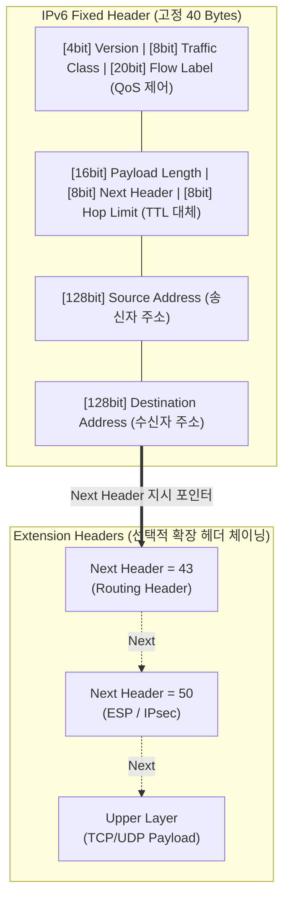

# IPv6 (Internet Protocol version 6)

---

## I. 무한한 주소 공간과 보안이 내재화된 차세대 프로토콜, IPv6의 개요

* **정의**: [[IPv4]]의 주소 고갈 문제를 근본적으로 해결하기 위해 IETF에서 개발한 128비트 기반의 차세대 인터넷 프로토콜로, 확장된 주소 공간과 단순화된 헤더를 통해 라우팅 효율성을 극대화한 [[네트워크 계층]](L3) 표준
* **등장 배경 및 필요성**:
* **IPv4 주소 완전 고갈**: IoT(사물인터넷), 스마트 디바이스 급증으로 인한 32비트(약 43억 개) 주소 한계 도달 (NAT/PAT 변환의 한계)
* **[[라우터]] 처리 오버헤드 증가**: IPv4의 가변적 헤더 및 중간 라우터 [[단편화]](Fragmentation) 수행으로 인한 패킷 포워딩 지연 발생
* **보안 및 [[QoS]] 요구**: 멀티미디어 트래픽 증가에 따른 실시간 품질 보장(QoS)과 단말 간 종단 보안([[IP Sec|IPsec]])의 기본 적용 필요성 대두

---

## II. IPv6의 헤더 아키텍처 및 핵심 기술 요소

### 가. IPv6의 고정 헤더 아키텍처 및 데이지 체인 확장 원리

* IPv6는 기존 IPv4의 복잡한 가변 필드(Options 등)를 제거하여 고정된 **40바이트 기본 헤더**로 라우팅을 고속화하며, 부가 기능은 **Next Header**를 활용한 데이지 체인 방식의 '확장 헤더(Extension Header)'로 처리함.

### 나. IPv6의 핵심 기술 요소

| 분류 | 요소기술(키워드) | 세부 설명 |
| --- | --- | --- |
| **주소 체계** | **128 Bit Address** | $2^{128}$(약 $3.4 \times 10^{38}$)개의 주소 공간 제공, 16비트씩 8부분으로 나누어 16진수 콜론(:) 표기 |
| **전송 방식** | **Anycast (애니캐스트)** | 그룹 내 가장 가까운 단일 노드(가장 짧은 라우팅 비용)에게 패킷을 전달 (브로드캐스트 대체) |
| **보안 강화** | **IPsec 내재화** | 네트워크 계층 수준의 [[암호화]](ESP) 및 인증(AH)을 확장 헤더로 기본 지원하여 종단 간 보안 확보 |
| **자동 설정** | **SLAAC** | 라우터 광고(RA) 메시지를 수신하여 호스트 스스로 상태 비저장(Stateless) 주소 자동 설정 수행 |
| **단편화** | **Source Fragmentation** | 경로 상의 중간 라우터가 아닌, 오직 **송신 호스트(Source)**에서만 패킷 단편화를 수행하여 부하 경감 |
| **서비스 품질** | **Flow Label** | 20비트 필드를 활용해 동일 스트림 트래픽을 식별, 음성/영상 등 지연 민감 데이터의 우선순위(QoS) 보장 |
| **헤더 단순화** | **Fixed Header** | Checksum 필드와 불필요한 옵션을 제거하고 40바이트로 고정하여 하드웨어 라우팅 고속화 달성 |
| **이동성** | **Mobile IPv6 (MIPv6)** | 단말 이동 시 위치(Care-of Address)와 식별자(Home Address)를 분리하여 삼각 라우팅 문제 해결 |

---

## III. IPv4와의 비교 및 차세대 네트워크 활용 전망

### 가. IPv4와 IPv6 핵심 항목 비교

| 비교 항목 | IPv4 | IPv6 |
| --- | --- | --- |
| **주소 공간 (크기)** | 32비트 (약 43억 개) | **128비트** (무한대에 가까운 공간) |
| **헤더 크기 및 구조** | 가변 길이 (20 ~ 60 Bytes), 구조 복잡 | **고정 길이 (40 Bytes)**, 구조 단순화 (처리 속도 향상) |
| **전송 통신 방식** | Unicast, Multicast, **Broadcast** | Unicast, Multicast, **Anycast** (Broadcast 완전 폐지) |
| **주소 할당 방식** | [[DHCP]](동적), 수동 설정 등 (Stateful) | **SLAAC (Stateless)**, DHCPv6 등 |
| **단편화 (Fragment)** | 송신 호스트 + **중간 라우터 모두 수행** | **송신 호스트(Source)에서만 단편화 수행** |
| **QoS 지원 한계** | ToS 필드 사용 (제한적 지원) | **Traffic Class + Flow Label** 사용 (강력한 실시간 QoS) |

### 나. 전환(Transition) 전략 및 향후 전망

* **단계적 전환 전략 (Transition Mechanisms)**: IPv4와 IPv6가 공존하는 듀얼 스택(Dual [[Stack]])을 기반으로, 망간 라우팅을 위한 터널링(Tunneling: 6to4, ISATAP 등) 및 이기종 간 통신을 위한 주소 변환(Translation: NAT64) 기술이 혼용되어 점진적 전환 진행 중임.
* **SRv6 (Segment Routing over IPv6) 기반 망 혁신**: IPv6 확장 헤더(Routing Header)를 활용한 SRv6 기술이 클라우드 엣지와 5G/6G 코어 망에 도입되어, 애플리케이션 요구에 맞춘 **네트워크 프로그래밍(Network Programming)** 및 초저지연 트래픽 엔지니어링의 핵심 표준으로 정착 중임.

---

### 🔗 연관 토픽

- **소속 도메인**: [[00_네트워크_MOC|🌐 네트워크]]
- **세부 분류**: `1. OSI 7계층 & 데이터링크 계층 (L1/L2)`
- **핵심 연관 토픽**:
  - [[네트워크 계층|네트워크 계층 (Network Layer)]]
  - [[IPv4]]
  - [[라우터]]
  - [[IP Sec]]
  - [[ICMP]]
