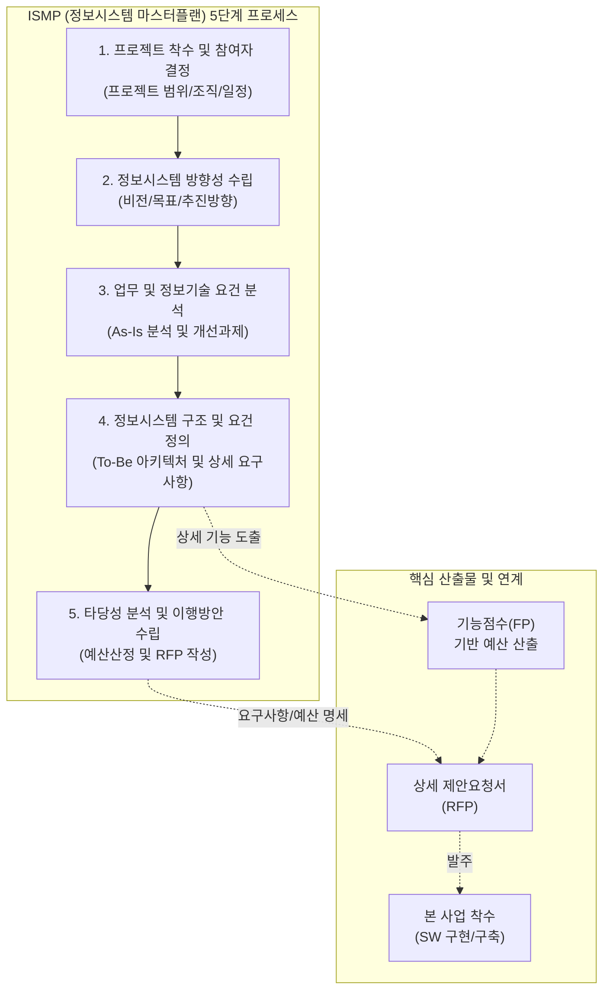

# ISMP (Information System Master Plan)

---

## I. 성공적인 SW 구축을 위한 상세 설계도, ISMP의 개요

* **정의**: 특정 소프트웨어 개발 사업에 대한 제안요청서(RFP)를 마련하기 위해, 구축할 정보시스템의 현황과 요구사항을 분석하여 기능점수(FP) 도출이 가능한 수준까지 상세히 기술하고 이행 계획을 수립하는 사전 설계 활동
* **등장 배경 및 필요성**:
* **[[ISP (Information Strategy Plan)|ISP]]의 한계 극복**: 조직 전체의 중장기 비전을 다루는 ISP만으로는 개별 사업의 상세 요구사항 정의 및 명확한 RFP 도출에 한계가 존재함
* **명확한 예산 산정**: 기능 및 비기능 요구사항의 모호성으로 인한 예산 부족 현상을 방지하고, 상세 요구사항 기반의 기능점수(FP) 산정을 통한 적정 대가 지급 필요
* **과업 변경 방지 및 분쟁 예방**: 불명확한 RFP로 인해 발생하는 프로젝트 기간 연장, 잦은 과업 변경, 발주자와 수주자 간의 갈등을 사전에 차단

---

## II. ISMP의 수행 절차 개념도 및 핵심 기술 요소

### 가. ISMP의 수립 절차 개념도

* ISMP는 업무 요건을 FP 단위로 측정할 수 있을 만큼 상세히 정의(4단계)하여, 분리발주 및 최적의 RFP를 도출([[PMBOK 프로세스 그룹 (5단계)|5단계]])하는 것이 핵심임.

### 나. ISMP의 단계별 핵심 기술 요소

| 분류 | 요소기술(키워드) | 세부 설명 |
| --- | --- | --- |
| **기획/방향성** | **환경 분석/벤치마킹** | 업무 환경, 법·제도, IT 트렌드 분석 및 선진 사례 벤치마킹을 통한 시사점 도출 |
| **기획/방향성** | **목표 모델(To-Be) 설정** | 구축될 정보시스템의 비전, 목표, 핵심 추진 전략 및 구현 방안 수립 |
| **요건 분석** | **As-Is [[프로세스]] 분석** | 현행 업무 프로세스 및 IT 인프라(H/W, S/W, 네트워크 등)의 현황 및 문제점 파악 |
| **구조/요건 정의** | **To-Be 아키텍처 정의** | 목표 시스템의 응용(AA), 데이터(DA), 기술(TA), 보안(SA) 아키텍처 구조 설계 |
| **구조/요건 정의** | **요구사항 상세화** | 본 사업 발주 시 **기능점수(FP) 측정이 가능하도록** 기능적/비기능적 요구사항 상세 정의 |
| **구조/요건 정의** | **UI/UX 요건 정의** | 사용자 중심의 업무 효율성 제고를 위한 화면 구조 기획 및 프로토타이핑 기준 수립 |
| **이행/타당성** | **적정 대가(FP) 산정** | 상세화된 요구사항을 바탕으로 소프트웨어 규모 산정(FP 방식) 및 H/W, 상용 S/W 예산 산출 |
| **이행/타당성** | **상세 RFP 및 분리발주** | 본 사업 발주를 위한 **상세 제안요청서(RFP)** 작성 및 상용 S/W 분리발주, 클라우드 도입 계획 수립 |

---

## III. ISP와 ISMP의 비교 및 향후 전망

### 가. ISP (정보화전략계획)와 ISMP (정보시스템 마스터플랜) 비교

| 비교 항목 | ISP (Information [[Strategy (알고리즘 교체)|Strategy]] Planning) | ISMP (Information System Master Plan) |
| --- | --- | --- |
| **핵심 목적** | 기관/기업 전체의 정보화 **중장기 비전 및 방향성** 수립 | 특정 단위 시스템 구축을 위한 **상세 요구사항 분석 및 RFP 도출** |
| **분석 대상** | 조직 전체의 비즈니스 및 정보화 마스터플랜 | 특정(단일/복합) 정보시스템 구축 사업 (신규 구축 및 고도화) |
| **요구사항 수준** | 단위 시스템 레벨의 개괄적(High-Level) 요구사항 도출 | **기능점수(FP) 산출이 가능한 수준의 상세 요구사항 도출** |
| **예산 산정 방식** | 시스템 규모 추정(유사 사업 참조 등)에 의한 개략적 예산 산정 | 상세 요구사항(기능/비기능)을 바탕으로 한 명확한 기초 금액 산정 |
| **주요 산출물** | 정보화 비전, 중장기 이행 로드맵, ISP 보고서 | 상세 요구사항 정의서, 하드웨어/소프트웨어 내역, **제안요청서(RFP)** |

### 나. 향후 전망 및 활용 시사점

* **공공 SW 발주 체계의 선진화**: 공공기관의 SW 구축 시 ISMP 수행이 의무화/권고되는 추세이며, 이를 통해 '과업 내용의 명확화'와 '제값 주기' 등 공정한 SW 생태계 조성이 가속화되고 있음.
* **애자일 및 [[클라우드 네이티브]](Cloud Native) 대응**: 향후 ISMP는 전통적인 [[워터폴]](Waterfall) 기반의 획일적 요구사항 도출에서 벗어나, 클라우드 인프라(IaaS/[[PaaS]]) 도입 타당성 검토와 애자일 방식의 유연한 과업 변경을 수용할 수 있는 하이브리드 형태의 기획 방법론으로 고도화되어야 함.

---

### 🔗 연관 토픽

- **소속 도메인**: [[00_경영전략_MOC|📈 경영전략]]
- **세부 분류**: `2. IT 거버넌스 & 엔터프라이즈 아키텍처 (EA/ISP)`
- **핵심 연관 토픽**:
  - [[ISP (Information Strategy Plan)]]
  - [[ISP 및 ISMP 수립 공통가이드 9판(2025.05)]]
  - [[PMBOK 프로세스 그룹 (5단계)]]
  - [[ITIL(IT Infrastructure Library) 4.0]]
  - [[SI]]
