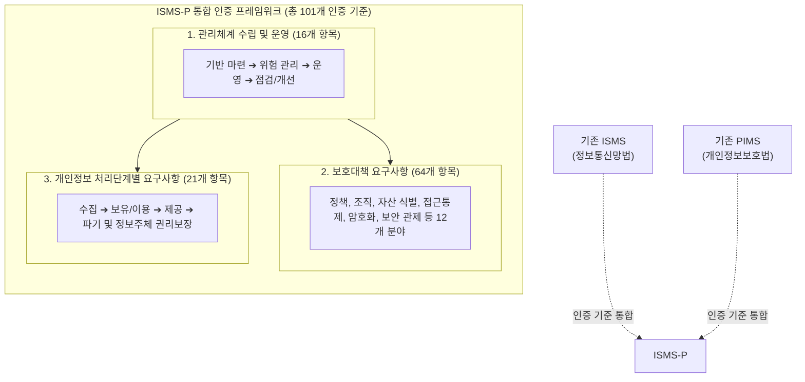

# ISMS-P

---

## I. 정보보호와 개인정보보호를 아우르는 통합 인증 체계, ISMS-P의 개요

* **정의**: 조직의 주요 정보자산 및 개인정보를 보호하기 위해 수립·관리·운영하는 체계의 적합성을 101개의 통합 인증 기준에 따라 평가하는 법정 의무 인증 제도
* **등장 배경 및 필요성**:
* **중복 규제 해소**: 기존 정보보호 관리체계(ISMS)와 개인정보보호 관리체계(PIMS)의 유사/중복 항목으로 인한 기업의 심사 부담 및 행정/비용 낭비 최소화
* **융합 보안 요구 증대**: 사이버 침해사고가 개인정보 유출로 직결되는 환경에서, 정보보안(Security)과 프라이버시(Privacy)를 통합적으로 관리하는 [[프레임워크]] 필요

* **특징**: [[PDCA(Plan-Do-Check-Act, Deming Cycle)|PDCA]](Plan-Do-Check-Act) 사이클 기반의 지속적 개선, 법적 준거성(정보통신망법, [[개인정보보호법]]) 충족, 총 3개 영역 101개 통제 항목으로 구성

---

## II. ISMS-P의 인증 체계 및 핵심 구성요소

### 가. ISMS-P의 인증 체계 및 동작 개념도

* 기존 ISMS(80개 항목)에 개인정보 처리단계별 요구사항(21개 항목)을 결합하여, 기업의 보안 거버넌스 수립부터 개인정보 생명주기 관리까지 원스톱으로 검증하는 체계임.

### 나. ISMS-P의 3대 영역 및 핵심 통제 요소

| 영역 (분류) | 핵심 기술 (키워드) | 세부 설명 |
| --- | --- | --- |
| **관리체계 수립/운영** | **최고책임자 지정** | 정보보호 최고책임자(CISO) 및 개인정보보호 책임자(CPO) 지정, 자원 할당 등 거버넌스 기반 마련 |
| **관리체계 수립/운영** | **위험 관리 (Risk Mgt.)** | 자산 식별 후 위협/취약점 분석을 통한 위험 평가 실시 및 DoA(수용 가능 위험 수준) 기준 수립 |
| **보호대책 요구사항** | **물리적/논리적 접근통제** | 최소 권한 원칙(Need-to-Know)에 따른 시스템 접근 권한 부여, 주요 통제구역에 대한 물리적 출입 통제 |
| **보호대책 요구사항** | **[[암호화]] 적용** | 패스워드, 바이오정보, 고유식별정보 등 중요 데이터 저장 및 네트워크 전송 시 안전한 [[암호 알고리즘]] 적용 |
| **보호대책 요구사항** | **침해사고 대응 체계** | 보안 사고 탐지, 초기 대응, 원인 분석, 복구 및 재발 방지 대책 수립과 주기적인 모의훈련 실시 |
| **개인정보 요구사항** | **생명주기 관리** | 목적에 맞는 최소한의 개인정보 수집, 안전한 이용/제공, 목적 달성 후 지체 없는 안전한 파기(복구 불가) |
| **개인정보 요구사항** | **정보주체 권리 보장** | 이용자의 동의 획득, 개인정보 처리방침 공개, 열람/정정/삭제/처리정지 요구에 대한 대응 체계 구축 |
| **개인정보 요구사항** | **위탁/제공 통제** | 개인정보 처리 업무 수탁자에 대한 보안 평가 및 관리 감독, 제3자 제공 시 적법성 검토 |

---

## III. ISMS와 ISMS-P 비교 및 향후 동향

### 가. ISMS와 ISMS-P 인증 제도 비교

| 비교 항목 | ISMS (정보보호 관리체계) | ISMS-P (정보보호 및 개인정보보호 관리체계) |
| --- | --- | --- |
| **보호 목적** | 주요 정보자산의 [[기밀성]], [[무결성]], [[HA(High Availability)|가용성]] 보장 | 정보자산 보호 + **개인정보 생명주기 및 권리 보호** |
| **인증 기준** | 총 **80개** 항목 (관리체계 16 + 보호대책 64) | 총 **101개** 항목 (ISMS 80개 + 개인정보 요구사항 21) |
| **관련 법령** | 정보통신망법 제47조 | 정보통신망법 제47조, 개인정보보호법 |
| **심사 대상** | [[ISP (Information Strategy Plan)|ISP]], IDC 및 연매출/이용자 수 일정 규모 이상 기업 | ISMS 의무대상 중 개인정보 보유량 및 처리 민감도가 높은 기업 |
| **도입 효과** | 사이버 침해사고 예방 및 비즈니스 연속성 확보 | 대규모 개인정보 유출 방지 및 과징금/과태료 등 컴플라이언스 리스크 경감 |

### 나. 향후 동향 및 심사 시사점

* **신기술 환경에 맞춘 인증 가이드라인 고도화**: 클라우드 인프라 확산에 대응하여 클라우드 서비스 사업자([[CSP]]/MSP)용 세부 점검 항목을 고도화하고, 가상자산 사업자(VASP) 대상 맞춤형 ISMS 통제 항목을 의무화하는 등 IT 환경 변화를 적극 반영 중임.
* **제로 트러스트 및 AI 프라이버시 대응**: 생성형 AI 활용 과정에서의 데이터 유출 및 저작권/프라이버시 침해를 방지하기 위해, AI 시스템 개발·운영 단계별 보안 모델과 제로 트러스트([[제로 트러스트 보안모델|Zero Trust]]) 아키텍처 관점의 접근통제 심사 기준이 점진적으로 편입될 전망임.

---

### 🔗 연관 토픽

- **소속 도메인**: [[00_보안_MOC|🛡️ 보안]]
- **세부 분류**: `1. 정보보안 원칙 & 거버넌스 · 인증`
- **핵심 연관 토픽**:
  - [[개인정보보호법]]
  - [[PDCA(Plan-Do-Check-Act, Deming Cycle)]]
  - [[암호화|암호화 (Encryption)]]
  - [[기밀성]]
  - [[암호 알고리즘]]
