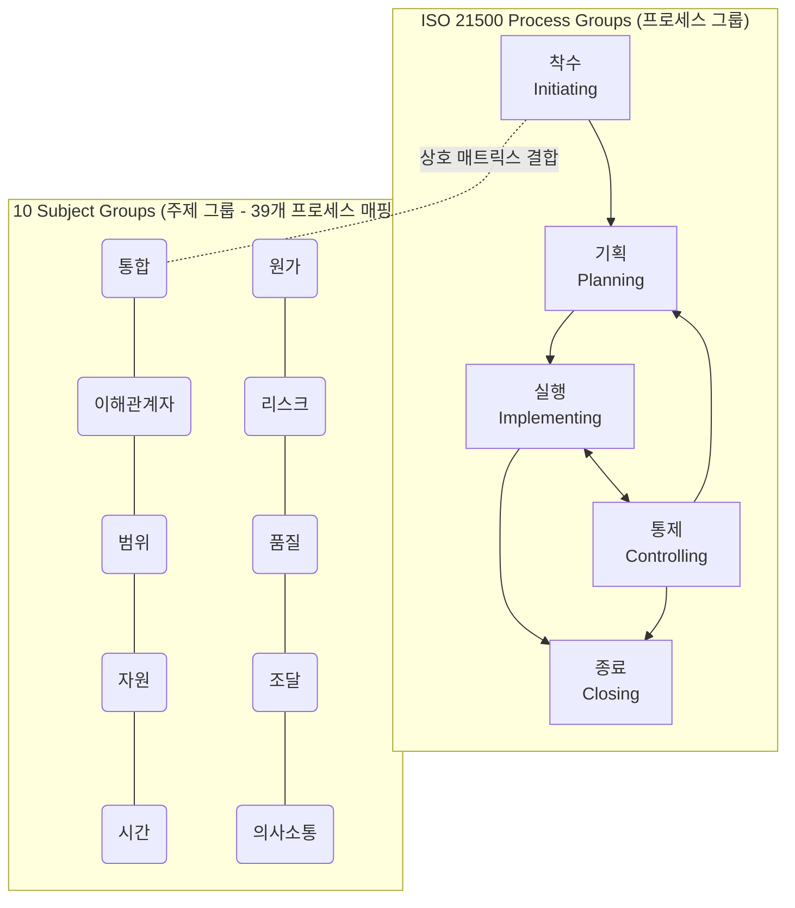

# ISO 21500

---

## I. 글로벌 프로젝트 관리의 국제 표준, ISO 21500의 개요

* **정의**: 국제표준화기구(ISO)에서 기존의 다양한 프로젝트 관리(PM) 방법론들을 통합하여, 프로젝트를 성공적으로 수행하기 위한 개념, [[프로세스]], 실무 지침을 정의한 글로벌 표준 지침
* **등장 배경 및 필요성**:
* **표준화 부족**: PMBOK, PRINCE2 등 국가별/기관별 PM 방법론의 난립으로 다국적 프로젝트 수행 시 의사소통 혼선 및 관리 체계 불일치 발생
* **글로벌 통일성 요구**: 조직의 규모나 프로젝트의 종류(IT, 건설, 제조 등)에 상관없이 범용적으로 적용할 수 있는 공통된 프로젝트 관리 [[프레임워크]] 및 용어 표준화 필요

* **특징**: 특정 프레임워크나 IT 도구에 종속되지 않는 범용성(Generic), 5개 프로세스 그룹과 10개 주제 그룹(Subject Groups) 기반의 39개 단위 프로세스로 구성

---

## II. ISO 21500의 프로세스 아키텍처 및 핵심 구성요소

### 가. ISO 21500의 아키텍처 및 상호작용 개념도

* 5개의 프로세스 그룹(Life-cycle)과 10개의 주제 그룹(Knowledge Area)이 2차원 매트릭스 형태로 교차하며 총 39개의 구체적인 관리 프로세스를 도출함.
* 기획, 실행, 통제 프로세스는 프로젝트 생명주기 동안 반복적(Iterative)으로 상호작용하여 목표 달성을 지원함.

### 나. ISO 21500의 핵심 프로세스 및 주제 그룹 요소

| 분류 | 요소기술(키워드) | 세부 설명 |
| --- | --- | --- |
| **프로세스 그룹** | **착수 (Initiating)** | 프로젝트 단계의 시작을 공식적으로 정의하고, 프로젝트 스폰서의 승인 및 헌장(Charter) 발행 |
| **프로세스 그룹** | **기획 (Planning)** | 프로젝트 목표 달성을 위한 상세 작업 범위, 일정, 원가, 자원 등의 베이스라인(Baseline) 수립 |
| **프로세스 그룹** | **실행 (Implementing)** | 기획된 계획서에 따라 자원을 투입하고 작업을 수행하여 프로젝트 인도물(Deliverables) 생성 |
| **주제 그룹** | **통합 (Integration)** | 변경 통제, 단계 종료 등 프로젝트 전반에 걸친 여러 활동을 식별, 정의, 결합 및 조정 |
| **주제 그룹** | **이해관계자 (Stakeholder)** | 프로젝트에 영향을 미치거나 받는 개인/조직을 식별하고, 이들의 기대사항과 참여를 관리 |
| **주제 그룹** | **범위 (Scope)** | 프로젝트가 수행해야 할 작업과 제외할 작업을 명확히 정의하고 [[WBS]](작업분류체계) 작성 |
| **주제 그룹** | **자원 (Resource)** | 인력, 장비, 자재 등 프로젝트 수행에 필요한 자원을 산정, 확보 및 통제 |
| **주제 그룹** | **리스크 (Risk)** | 긍정적 기회는 극대화하고 부정적 위협은 최소화하기 위한 리스크 식별, 평가, 대응 전략 수립 |

---

## III. ISO 21500과 PMBOK 비교 및 향후 동향

### 가. ISO 21500과 PMBOK 비교

| 비교 항목 | ISO 21500 | PMI PMBOK |
| --- | --- | --- |
| **주관 기관** | ISO (국제표준화기구) | PMI (미국 프로젝트 관리 협회) |
| **핵심 목적** | 글로벌 프로젝트 관리 **가이드라인(Guidance)** 및 원칙 제공 | 실무 중심의 프로젝트 관리 **지식 체계(Body of Knowledge)** 제공 |
| **구조 체계** | 5 프로세스 그룹, **10 주제 그룹, 39개 프로세스** | 5 프로세스 그룹, 10 지식 영역, 49개 프로세스 (6판 기준) |
| **초점 및 활용** | 용어 및 기본 원칙의 국제적 통일화, 인증 체계 연계 | 기법(Tool & Technique), 산출물(ITTO) 위주의 실무 적용 |
| **진화 방향** | 하이레벨 관점의 포트폴리오/프로그램 관리로 확장 | 애자일([[Agile]]) 수용 및 가치 전달(Value Delivery), 원칙 중심(7판) |

### 나. 향후 전망 및 활용 시사점

* **ISO 21500 시리즈의 개편 및 분화**: ISO 21500:2012 표준은 개편 과정을 거쳐 개념/컨텍스트 중심의 **ISO 21500:2021**로 개정되었으며, 상세 프로젝트 관리 실무 지침은 **ISO 21502:2020**으로 고도화 분리됨.
* **하이브리드 PM으로의 진화**: 급변하는 비즈니스 환경에 대응하기 위해, 전통적인 [[워터폴|폭포수]](Waterfall) 관리 기법인 ISO 21502 체계에 [[스크럼]]([[SCRUM|Scrum]]), 칸반(Kanban) 등 애자일(Agile) 실무를 결합한 하이브리드(Hybrid) 프로젝트 관리 방법론이 엔터프라이즈 환경의 표준으로 정착 중임.

---

### 🔗 연관 토픽

- **소속 도메인**: [[00_프로젝트관리_MOC|📋 프로젝트관리]]
- **세부 분류**: `1. PMBOK 표준 & 프로젝트 거버넌스`
- **핵심 연관 토픽**:
  - [[SCRUM]]
  - [[스크럼|스크럼 (SCRUM)]]
  - [[Agile]]
  - [[워터폴]]
  - [[PMBOK 프로세스 그룹 (5단계)]]
