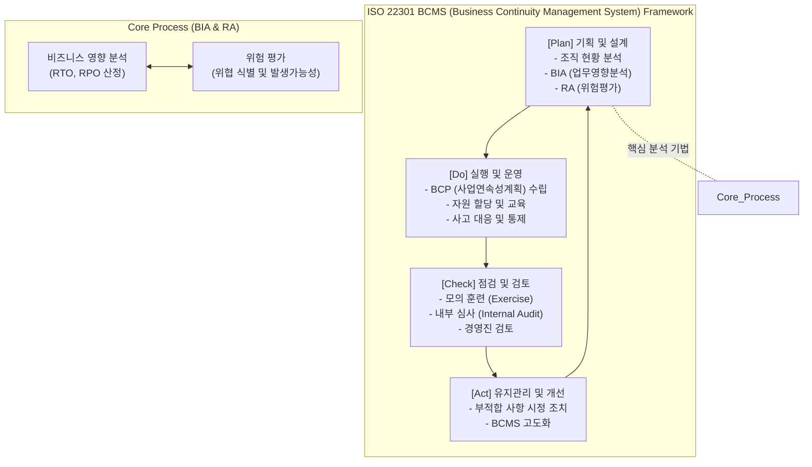

# ISO 22301

---

## I. 예측 불가능한 재난 대응과 비즈니스 연속성 확보의 국제 표준, ISO 22301의 개요

* **정의**: 자연재해, 테러, 해킹, 팬데믹 등 각종 업무 중단(Disruptive Incident) 상황에서 조직의 핵심 비즈니스를 지속하기 위한 요구사항을 규정한 국제표준화기구(ISO)의 비즈니스 연속성 경영시스템(BCMS) 인증 표준
* **등장 배경 및 필요성**:
* **불확실성 및 재난 규모 확대**: 기후 변화, 대규모 [[랜섬웨어]] 공격, 글로벌 공급망 마비 등 기업의 생존을 위협하는 대형 재난 빈도 증가
* **IT 종속성 심화 및 복원력(Resilience) 요구**: 단순한 IT 시스템 복구(DR)를 넘어, 인력·시설·프로세스를 포괄하는 전사적 업무 연속성([[BCP]]) 체계의 제도화 및 대외 [[신뢰성]] 확보 필요

* **특징**: [[PDCA(Plan-Do-Check-Act, Deming Cycle)|PDCA]](Plan-Do-Check-Act) 라이프사이클 기반의 지속적 개선, BIA(업무영향분석) 및 위험평가(RA) 기반의 사전 예방적 체계 구축

---

## II. ISO 22301의 BCMS 아키텍처 및 핵심 구성요소

### 가. ISO 22301의 PDCA 기반 BCMS 동작 개념도

* 조직의 비즈니스 목표를 바탕으로 BIA와 RA를 통해 복구 우선순위(RTO/RPO)를 도출하며, 모의 훈련과 심사를 통해 BCP 체계를 지속적으로 검증하고 개선함.

### 나. ISO 22301의 핵심 기술 및 구성 요소

| 구분 | 요소기술 (키워드) | 세부 설명 |
| --- | --- | --- |
| **핵심 분석기법** | **[[BIA (Business Impact Analysis)]]** | 재난 발생 시 업무 중단이 초래할 재무적/비재무적 영향을 분석하여 업무 중요도 및 복구 목표 시간(RTO, RPO) 산정 |
| **핵심 분석기법** | **RA (Risk Assessment)** | 비즈니스 연속성을 위협하는 취약점과 위협 요소를 식별하고 발생 가능성과 영향도를 수치화하여 우선순위 평가 |
| **운영 및 절차** | **BCP (Business Continuity Plan)** | 재난 상황 시 중단된 핵심 업무를 허용된 시간 내에 재개하고 복구하기 위한 단계별 행동 지침 및 자원 운영 계획 |
| **운영 및 절차** | **[[DRP(RTO, RPO 등)|DRP]] (Disaster Recovery Plan)** | BCP의 하위 개념으로, 중단된 IT 시스템(서버, 네트워크, 데이터 등)을 복구 센터를 통해 정상화하는 상세 기술 절차 |
| **운영 및 절차** | **IMP (Incident Management Plan)** | 사고 발생 초기 신속한 인지, 확산 방지, 비상 연락 체계 가동 및 비상대책위원회 소집 등을 위한 사고 대응 계획 |
| **검증 및 평가** | **Exercise (모의 훈련)** | 도상 훈련(Tabletop), 기능 훈련, 모의 복구 훈련 등을 통해 수립된 BCP의 실효성 검증 및 구성원 숙련도 향상 |
| **검증 및 평가** | **Internal Audit (내부 심사)** | 조직의 BCMS가 ISO 22301 요구사항 및 법적/규제적 요건을 지속적으로 준수하고 있는지 객관적으로 평가 |
| **유지 및 개선** | **Management Review** | 모의 훈련 및 심사 결과를 바탕으로 최고경영진이 BCMS의 적절성, 충족성, 효과성을 검토하고 시정 조치(CAPA) 지시 |

---

## III. ISO 22301과 ISO 27001 비교 및 향후 전망

### 가. ISO 22301(BCMS)과 ISO 27001(ISMS) 비교

| 비교 항목 | ISO 22301 (BCMS) | ISO 27001 (ISMS) |
| --- | --- | --- |
| **핵심 목적** | 비즈니스 중단 상황에 대한 **업무 복구 및 [[HA(High Availability)|가용성]](연속성)** 확보 | 정보 자산의 **[[기밀성]], [[무결성]], 가용성(CIA)** 유지 및 보안 통제 |
| **주요 위협 대상** | 자연재해, 테러, 대형 화재, 전면적인 인프라/공급망 마비 | 해킹, 정보 유출, 내부자 위협, 악성코드 감염 |
| **핵심 산출물** | BIA(업무영향분석), BCP/DRP 문서, 복구 훈련 결과 | 자산/위험 식별서, SoA(적용성보고서), 보안 정책 및 지침 |
| **핵심 지표** | MTPD(최대허용중단시간), RTO, RPO | 위험 수용 수준(DoA, Degree of Assurance) |
| **관리 [[프레임워크]]** | PDCA 기반 비즈니스 연속성 경영 | PDCA 기반 정보보호 관리체계 |

### 나. 향후 전망 및 활용 시사점

* **사이버 복원력(Cyber Resilience) 중심의 융합**: 최근 랜섬웨어 등 사이버 공격이 데이터 유출을 넘어 기업의 비즈니스 라인 전체를 마비시키는 형태로 진화함에 따라, ISO 27001(보안 예방)과 ISO 22301(사고 시 복원)을 결합한 통합 경영시스템(Integrated Management System) 구축이 기업의 핵심 생존 전략으로 대두됨.
* **디지털 공급망 거버넌스 확대**: 자사뿐만 아니라 협력사, 클라우드 서비스 제공자([[CSP]]) 등 공급망(Supply Chain) 전체의 복원력을 검증하기 위해, 외부 파트너 대상의 ISO 22301 인증 요구 및 제3자(Third-party) BIA 연계가 강화되고 있음.

---

### 🔗 연관 토픽

- **소속 도메인**: [[00_경영전략_MOC|📈 경영전략]]
- **세부 분류**: `3. 비즈니스 프로세스 혁신 & 디지털 전환 (DX)`
- **핵심 연관 토픽**:
  - [[BCP|BCP (Business Continuity Planning)]]
  - [[BIA (Business Impact Analysis)]]
  - [[BCM|BCM (Business Continuity Management)]]
  - [[DRP(RTO, RPO 등)]]
  - [[무결성]]
