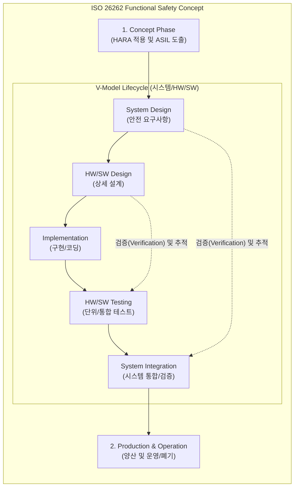

# ISO 26262

---

## I. 차량용 E/E 시스템의 기능안전성 확보 표준, ISO 26262의 개요

* **정의**: 자동차에 탑재되는 전기·전자(E/E) 시스템의 하드웨어 및 소프트웨어 결함으로 인한 사고를 미연에 방지하기 위해 국제표준화기구(ISO)에서 제정한 차량 기능안전(Functional Safety) 국제 표준
* **등장 배경 및 필요성**:
* **전장화 및 복잡도 증가**: [[Smart Car(자율주행)|자율주행]], 커넥티드 카 등 SDV(Software Defined Vehicle) 패러다임 전환으로 차량 내 SW/HW 제어 시스템의 복잡도 급증
* **안전 확보 및 책임 규명**: 시스템 오류로 인한 인명 사고 발생 시, 제조사(OEM) 및 부품사(Tier)의 법적 책임(PL) 대응 및 객관적인 안전성 입증 [[프로세스]] 필요

* **특징**: HARA(위험원 분석 및 리스크 평가) 기반의 목표 수준(ASIL) 설정, 시스템/HW/SW 전체를 아우르는 V-모델 생명주기 기반의 안전 요구사항 추적성(Traceability) 확보

---

## II. ISO 26262의 아키텍처 및 핵심 기술 요소

### 가. ISO 26262의 프로세스 개념도 (V-모델 기반)

* 기획 단계에서 HARA를 통해 ASIL 등급을 결정하고, V-모델의 좌측(설계)에서 우측(검증)으로 이어지는 생명주기 전반에 걸쳐 안전 목표(Safety Goal)의 달성 여부를 양방향으로 추적하고 검증함.

### 나. ISO 26262의 핵심 기술 및 구성 요소

| 분류 | 핵심 기술 (키워드) | 세부 설명 |
| --- | --- | --- |
| **안전 분석** | **HARA (Hazard Analysis & Risk Assessment)** | 차량의 잠재적 위험원을 식별하고, 심각도(Severity), 노출도(Exposure), 통제 가능성(Controllability)을 종합하여 리스크 평가 |
| **안전 등급** | **[[ASIL|ASIL (Automotive Safety Integrity Level)]]** | HARA 결과에 따라 A, B, C, D(가장 엄격)로 분류되는 자동차 안전 [[무결성]] 등급 (QM은 일반 품질 관리 대상) |
| **개발 모델** | **V-Model (V-모델)** | 시스템, 소프트웨어, 하드웨어 수준별로 설계와 검증이 대칭을 이루는 개발 생명주기 모델 |
| **HW 분석** | **FMEDA (고장 모드, 영향 및 진단 분석)** | 하드웨어 부품의 정량적 고장률을 분석하고, 안전 메커니즘의 진단 커버리지를 계산하는 [[신뢰성]] 분석 기법 |
| **SW 기법** | **결함 주입 (Fault Injection) 테스트** | 소프트웨어나 하드웨어에 고의로 오류를 주입하여, 시스템이 안전 상태(Safe State)로 정상 복귀하는지 검증 |
| **공급망 관리** | **DIA (Development Interface Agreement)** | 완성차 업체(OEM)와 부품 공급사(Tier) 간의 개발 책임, 역할, 산출물 등을 명확히 정의하는 개발 인터페이스 협약서 |
| **도구 검증** | **TCL (Tool Confidence Level)** | 컴파일러, [[정적 분석 도구]] 등 개발 및 검증에 사용되는 소프트웨어 도구 자체의 신뢰성 등급 (TCL 1 ~ 3) |
| **확장성** | **2nd Edition (2018년 개정)** | 승용차에 국한되었던 대상을 버스, 트럭, 모터사이클로 확대하고, 자율주행 핵심인 **반도체(Part 11)** 가이드라인 추가 |

---

## III. 차량용 3대 안전 표준 비교 및 향후 전망

### 가. ISO 26262, ISO 21448(SOTIF), ISO/SAE 21434 비교

| 비교 항목 | ISO 26262 (기능 안전) | ISO 21448 (SOTIF, 의도된 기능 안전) | ISO/SAE 21434 (사이버 보안) |
| --- | --- | --- | --- |
| **핵심 목적** | E/E 시스템의 **고장/결함**으로 인한 사고 방지 | 시스템 고장이 아닌 **성능 한계/오작동** 대응 | 악의적인 **해킹/사이버 공격**으로부터 차량 보호 |
| **주요 원인** | SW 버그, HW 단선, 메모리 오류 등 | 센서 인지 한계, AI [[알고리즘]] 오류, 악천후 등 | 외부 네트워크 침투, 악성코드, 무선 인터페이스 취약점 |
| **핵심 분석 기법** | HARA 기반 **ASIL** 도출 | 시나리오 기반 **알려지지 않은 위험(Unknown)** 최소화 | TARA(위협 분석 및 리스크 평가) 기반 CAL 도출 |
| **주요 대상** | 기존 전장 제어기 (ECU, MCU 등) | 자율주행 인지/판단 제어기 (카메라, 라이다, [[딥러닝]]) | 커넥티드 카 통신 제어기 (OTA, V2X, 인포테인먼트) |

### 나. 향후 전망 및 시사점

* **통합 안전(Integrated Safety) 거버넌스 구축**: 자율주행 3단계 이상 및 SDV(소프트웨어 중심 자동차) 환경에서는 시스템 결함(ISO 26262), 센서 한계(ISO 21448), 해킹([[차량 사이버 보안 국제 표준(ISO 21434)|ISO 21434]]) 위협이 복합적으로 발생하므로, 3대 표준을 아우르는 융합형 안전 아키텍처 및 엔지니어링 프로세스 구축이 필수적임.
* **AI 및 기계학습 적용 한계 극복**: 기존 ISO 26262 체계는 결정론적(Deterministic) SW 검증에 초점이 맞춰져 있어 확률적(Probabilistic) 동작을 하는 딥러닝 AI 검증에는 한계가 존재함. 이를 극복하기 위해 ISO-PAS 8800(차량용 AI 안전) 표준 제정이 활발히 진행 중임.

---

### 🔗 연관 토픽

- **소속 도메인**: [[00_디지털서비스_MOC|🚀 디지털서비스]]
- **세부 분류**: `3. 사물인터넷 (IoT) & 스마트 플랫폼 · 메타버스`
- **핵심 연관 토픽**:
  - [[ASIL|ASIL (Automotive Safety Integrity Level)]]
  - [[차량 사이버 보안 국제 표준(ISO 21434)]]
  - [[Smart Car(자율주행)]]
  - [[IEC 61508]]
  - [[CPS]]
