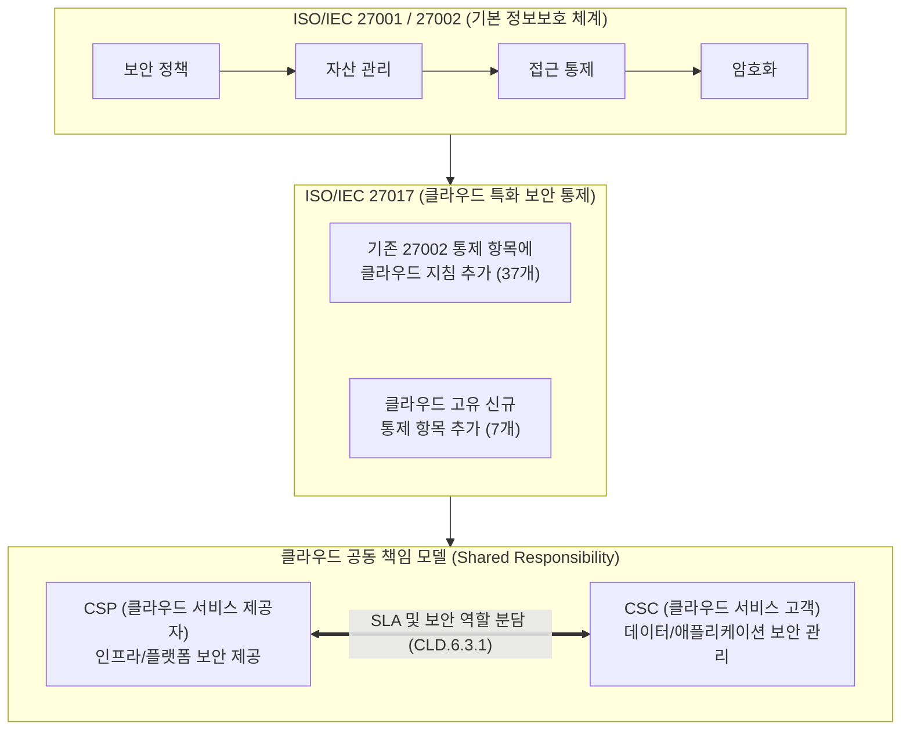

# ISO 27017

---

## I. 안전한 클라우드 서비스 제공 및 이용을 위한 보안 가이드라인, ISO 27017의 개요

* **정의**: ISO/IEC 27002를 기반으로 클라우드 서비스 환경(IaaS, [[PaaS]], SaaS)에 특화된 정보보호 통제 항목과 구현 지침을 제공하는 국제 표준
* 클라우드 서비스 제공자([[CSP]])와 클라우드 서비스 고객(CSC) 양측의 역할과 책임을 명확히 정의하여 클라우드 보안 신뢰성을 확보함
* 특징: ISO 27001 기반 확장(독립 인증 불가), 7개 클라우드 특화 통제 항목 추가, 공동 책임 모델(Shared Responsibility) 강조

---

## II. ISO 27017의 개념도 및 핵심 통제 항목

### 가. ISO 27017의 적용 개념도 및 역할 모델

* 기존 ISO 27001의 ISMS 체계를 기반으로 다중 입주(Multi-tenancy), [[가상화]] 등 클라우드 환경 특성을 반영한 신규 지침을 적용함
* CSP와 CSC 간의 명확한 보안 책임 소재(Shared Responsibility) 정의와 투명성 확보가 핵심임

### 나. ISO 27017의 7대 핵심 신규 통제 항목

| 분류 | 요소기술(키워드) | 세부 설명 |
| --- | --- | --- |
| 역할 분담 | 역할 및 책임 분담 (CLD.6.3.1) | 클라우드 환경 내 CSP와 CSC 간의 명확한 보안 역할 및 책임([[SLA]]) 정의 |
| 자산 관리 | 고객 자산의 제거 (CLD.8.1.5) | 계약 종료 시 고객 데이터 및 클라우드 자산의 안전한 삭제 및 반환 절차 마련 |
| 접근 통제 | 가상 컴퓨팅 환경 분리 (CLD.9.5.1) | 다중 입주 환경에서 테넌트 간 데이터 및 가상 환경의 논리적 격리 보장 |
| 접근 통제 | 가상 머신 강화 (CLD.9.5.2) | 가상 머신(VM) 취약점 최소화를 위한 안전한 시스템 설정 및 하드닝(Hardening) 적용 |
| 운영 보안 | 관리자의 운영 보안 (CLD.12.1.5) | 고권한 클라우드 관리자의 접근 통제, 작업 이력 관리 및 운영 보안 절차 수립 |
| 운영 보안 | 클라우드 서비스 모니터링 (CLD.12.4.5) | 고객이 자신의 클라우드 리소스 및 보안 관련 로그를 직접 모니터링할 수 있는 기능 제공 |
| 통신 보안 | 가상/물리 네트워크 연계 (CLD.13.1.4) | 가상 네트워크 환경과 물리적 네트워크 환경 간의 일관된 보안 정책 및 관리 체계 유지 |

---

## III. ISO 27017과 주요 클라우드 보안 표준 비교 및 활용 동향

### 가. 주요 클라우드 보안 표준(ISO 27017, ISO 27018, CSAP) 비교

| 비교 항목 | ISO/IEC 27017 | ISO/IEC 27018 | [[CSAP]] (클라우드 보안인증) |
| --- | --- | --- | --- |
| **목적** | 클라우드 서비스 전반의 정보보호 | 클라우드 환경 내 개인정보(PII) 보호 | 공공기관 제공용 민간 클라우드 보안성 검증 |
| **적용 대상** | CSP 및 CSC 모두 대상 | 공용 클라우드를 제공하는 CSP | 국가/공공기관에 클라우드를 제공하는 CSP |
| **핵심 내용** | 공동 책임 모델, 7개 클라우드 통제 추가 | 개인정보 처리 위탁, 데이터 [[암호화]], 동의 관리 | 상/중/하 등급제, 물리적/논리적 망분리 의무화 |
| **인증 방식** | ISO 27001의 확장 인증(독립 인증 불가) | ISO 27001의 확장 인증(독립 인증 불가) | KISA 주관의 독립적 국가 인증제도 |

* **활용 및 전망**: 기업은 ISO 27001(기본 ISMS) 인증 획득 시 적용성 선언서(SoA)에 ISO 27017(클라우드 보안) 및 [[ISO 27018]](클라우드 개인정보 보호) 통제 항목을 통합 반영하여 글로벌 수준의 보안 신뢰성을 입증하는 추세임.

---

### 🔗 연관 토픽

- **소속 도메인**: [[00_보안_MOC|🛡️ 보안]]
- **세부 분류**: `6. 개인정보보호 & 프라이버시 강화 기술`
- **핵심 연관 토픽**:
  - [[ISO 27018]]
  - [[CSAP|CSAP, CSAP(Cloud Security Assurance Program)]]
  - [[CSP|CSP (Cloud Service Provider)]]
  - [[암호화|암호화 (Encryption)]]
  - [[PaaS|PaaS (Platform as a Service)]]
