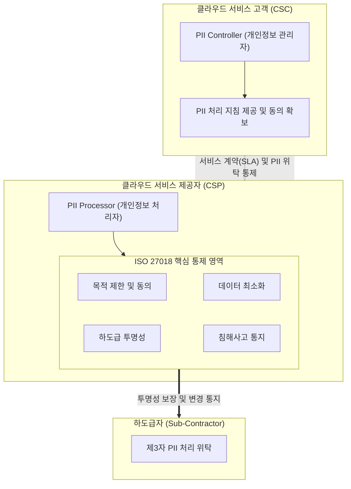

# ISO 27018

---

## I. 공용 클라우드 환경의 개인정보보호 국제표준, ISO 27018의 개요

* **정의**: 공용 클라우드(Public Cloud) 환경에서 개인식별정보(PII, Personally Identifiable Information) 처리자(Processor) 역할을 수행하는 클라우드 서비스 제공자([[CSP]])가 준수해야 할 개인정보보호 지침을 제공하는 국제 표준
* 기업의 데이터가 클라우드로 집중됨에 따라, 클라우드 환경 내 PII 유출을 방지하고 고객(PII 관리자)과 CSP 간의 프라이버시 보호 의무를 명확화하기 위해 제정됨
* **특징**: ISO 27001/27002 기반 확장 지침(독립 인증 불가), 정보주체의 권리 보장(동의, 투명성), 침해사고 통지 및 하도급자 공개 의무화

---

## II. ISO 27018의 개념도 및 핵심 통제 항목

### 가. ISO 27018의 아키텍처 및 PII 처리 프로세스 개념도

* 고객(PII Controller)의 명시적 지침 하에 CSP(PII Processor)가 데이터를 처리하며, 제3자 위탁 시 반드시 고객에게 사전 공개 및 동의를 구하는 구조임
* 데이터의 저장 위치 명시, 보안 사고 발생 시 즉각 통지 체계를 통해 클라우드 투명성을 확보함

### 나. ISO 27018의 핵심 통제 및 기술 요소

| 분류 | 요소기술(키워드) | 세부 설명 |
| --- | --- | --- |
| **권리 보장** | 동의 기반 처리 (Consent) | 고객(PII Controller)의 명시적 지침 및 사전 동의된 목적 내에서만 PII 처리 수행 |
| **투명성** | 하도급자 공개 (Transparency) | PII 처리를 위탁받는 하도급자(Sub-processor) 정보 사전 공개 및 변경 시 고객 통지 의무 |
| **사고 대응** | 침해사고 통지 (Breach Notification) | PII 유출, 훼손 등 침해사고 인지 시 지체 없이 고객에게 통지하여 신속한 대응 및 피해 최소화 지원 |
| **데이터 관리** | 안전한 반환/폐기 (Return & Deletion) | 계약 종료 시 PII의 안전하고 신속한 반환 또는 복구 불가능한 완전 삭제(Secure Erase) 절차 제공 |
| **데이터 주권** | 데이터 위치 명시 (Data Location) | PII가 저장, 백업, 처리되는 물리적 국가/지역(Region) 정보를 제공하고 임의적인 국경 간 데이터 이동 제한 |
| **[[기밀성]]** | [[암호화]] 적용 (Cryptography) | 퍼블릭 네트워크 전송 구간(In-Transit) 및 클라우드 저장소(At-Rest)의 PII 데이터 암호화 필수 적용 |
| **[[HA(High Availability)|가용성]]/[[무결성]]** | [[다중화]] 및 분리 (Isolation) | 논리적/물리적 망분리 및 접근 통제를 통해 다중 테넌트(Multi-tenant) 환경에서 타 고객 데이터와 PII 격리 |
| **책임 추적성** | 감사 로그 관리 (Audit Logging) | PII 접근, 수정, 삭제 등 모든 처리 내역에 대한 감사 로그 생성 및 위변조 방지 보장 |

---

## III. 클라우드 및 프라이버시 주요 보안 표준 비교 및 동향

### 가. 주요 클라우드 및 개인정보보호 표준 비교

| 비교 항목 | ISO/IEC 27018 | ISO/IEC 27017 | ISO/IEC 27701 |
| --- | --- | --- | --- |
| **주요 목적** | 공용 클라우드 내 **개인정보(PII) 보호** | 클라우드 환경 전반의 **정보보안** | 포괄적 **개인정보보호 관리체계(PIMS)** 수립 |
| **주요 대상** | 공용 클라우드 사업자 (CSP 중심) | CSP 및 클라우드 고객 (공동 책임) | 모든 형태의 조직 (Controller 및 Processor) |
| **핵심 키워드** | PII 처리자 역할, 위탁 투명성, 데이터 위치 | 공동 책임 모델(Shared Responsibility), [[가상화]] 격리 | GDPR 컴플라이언스, 프라이버시 통제(PIMS) |
| **인증 체계** | ISO 27001 기반 확장 인증 (Add-on) | ISO 27001 기반 확장 인증 (Add-on) | ISO 27001 기반 확장 인증 (단, 별도 인증서 발급 개념 강함) |

* **동향 및 전망**: 최근 글로벌 클라우드 벤더(AWS, Azure, GCP) 및 국내 주요 CSP들은 보안 및 프라이버시 [[신뢰성]] 확보를 위해 기본 ISMS인 **ISO 27001**을 바탕으로 [[ISO 27017]](클라우드 보안)과 ISO 27018(개인정보 보호)을 패키지로 통합 인증받는 것이 필수 요건으로 자리 잡고 있음. 나아가 유럽의 GDPR 등 강력한 규제에 대응하기 위해 [[ISO 27701]] 인증까지 확장하여 글로벌 컴플라이언스 역량을 입증하는 추세임.

---

### 🔗 연관 토픽

- **소속 도메인**: [[00_보안_MOC|🛡️ 보안]]
- **세부 분류**: `6. 개인정보보호 & 프라이버시 강화 기술`
- **핵심 연관 토픽**:
  - [[ISO 27017]]
  - [[기밀성]]
  - [[무결성]]
  - [[암호화|암호화 (Encryption)]]
  - [[ISO 27701]]
