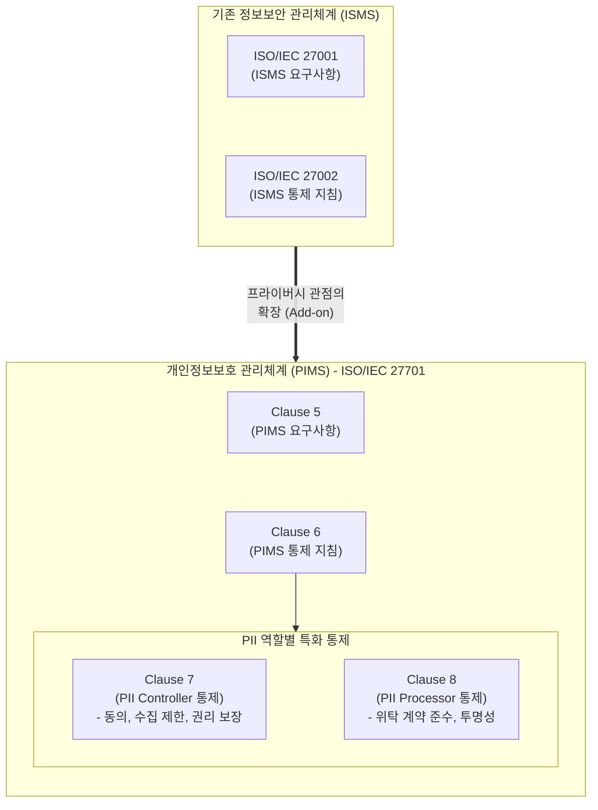

# ISO 27701

---

## I. 국제 표준 개인정보보호 관리체계, ISO 27701의 개요

* **정의**: 조직의 프라이버시 정보 관리체계(PIMS, Privacy Information Management System)를 수립, 구현, 유지 및 지속적 개선을 위해 기존 ISO/IEC 27001 및 27002를 확장한 개인정보보호 국제 표준
* 전 세계적으로 강화되는 개인정보보호 규제(EU GDPR, CCPA 등)에 대응하고, 기업의 프라이버시 관리 역량을 객관적으로 입증하기 위해 제정됨
* **특징**: ISO 27001 기반 확장(ISMS 통합), PII(개인식별정보) 관리자(Controller) 및 처리자(Processor) 역할별 맞춤형 통제 지침 제공, 글로벌 컴플라이언스 대응 기반

---

## II. ISO 27701의 아키텍처 및 핵심 구성요소

### 가. ISO 27701의 아키텍처 및 개념도

* 기본 정보보안 [[프레임워크]](ISO 27001/27002) 위에 프라이버시 요건(Clause 5, 6)을 덧붙이고, 역할(Controller/Processor)에 따른 특화 통제(Clause 7, 8)를 분리하여 적용함
* 조직은 자신의 역할(관리자, 수탁자 또는 둘 다)에 맞추어 선택적으로 통제 항목을 적용(SoA, 적용성 선언서)하여 인증을 수행함

### 나. ISO 27701의 핵심 통제 및 기술 요소

| 분류 | 요소기술(키워드) | 세부 설명 |
| --- | --- | --- |
| **체계 요구사항** | PIMS 수립 (Clause 5) | 조직 상황 분석, 개인정보 리스크 평가 및 프라이버시 관점의 관리체계 확립 |
| **보안 통제 확장** | PIMS 통제 (Clause 6) | 기존 ISMS 통제 항목에 PII 보호 목적의 [[암호화]], 접근통제, 보안 정책 등을 추가 반영 |
| **관리자 통제** | 합법적 수집/처리 (Clause 7) | PII Controller로서 적법한 근거 마련, 명시적 동의 획득 및 수집 목적의 제한 |
| **관리자 통제** | 프라이버시 내재화 (PbD) | 시스템 설계 및 기본 설정 단계부터 개인정보보호를 우선 고려([[개인정보보호 중심 설계|Privacy by Design]]/Default) |
| **관리자 통제** | 정보주체 권리 보장 | 열람, 정정, 삭제(잊힐 권리), 처리 정지 요구 등 정보주체의 권리 행사 절차 마련 |
| **처리자 통제** | 위탁 계약 준수 (Clause 8) | PII Processor로서 관리자의 지시 준수, 제3자(하도급자) 위탁 시 사전 통지 및 동의 확보 |
| **사고 대응** | 침해사고 통지 의무 | 개인정보 유출 등 침해사고 발생 시 규제 기관(예: 72시간 내) 및 정보주체에게 지체 없이 통지 |
| **데이터 주권** | 국경 간 데이터 이전 | 합법적 근거(SCC, 국외이전 동의 등)에 기반한 안전한 국가 간 개인정보 이전 통제 |

---

## III. 글로벌/국내 개인정보보호 인증 체계 비교 및 활용 전망

### 가. ISO 27701과 국내 ISMS-P 비교

| 비교 항목 | ISO/IEC 27701 | [[ISMS-P]] (정보보호 및 개인정보보호 관리체계) |
| --- | --- | --- |
| **주관 및 성격** | ISO(국제표준화기구) / 글로벌 자율 인증 | KISA(한국인터넷진흥원) / 국내 법정 인증 (의무/자율) |
| **기반 표준** | ISO 27001 (기존 인증 필수) | 자체 기준 (정보통신망법, [[개인정보보호법]] 기반) |
| **대응 규제** | EU GDPR, CCPA 등 글로벌 프라이버시 법률 | 대한민국 개인정보보호법, 정보통신망법 |
| **역할 구분** | Controller(관리자)와 Processor(처리자) 명확히 구분 | 개인정보처리자 중심 (수탁자 통제 포함) |
| **통제 항목 수** | ISO 27001/27002 확장 + 49개 통제항목 | 총 101개 통제항목 (관리 16, 보호 64, 개인정보 21) |

* **활용 및 전망**: 글로벌 서비스를 제공하는 기업(게임, 이커머스, [[CSP]] 등)은 파편화된 각국의 프라이버시 규제(GDPR 등) 컴플라이언스 비용을 줄이기 위해 ISO 27701을 통합 프레임워크로 적극 채택 중임
* 향후 국내 ISMS-P 인증 기업도 해외 진출 시 이중 인증 부담을 완화하기 위해 ISO 27701과의 매핑 가이드를 활용한 크로스 인증이 활성화될 것으로 전망됨

---

### 🔗 연관 토픽

- **소속 도메인**: [[00_보안_MOC|🛡️ 보안]]
- **세부 분류**: `1. 정보보안 원칙 & 거버넌스 · 인증`
- **핵심 연관 토픽**:
  - [[ISMS-P]]
  - [[암호화|암호화 (Encryption)]]
  - [[개인정보보호법]]
  - [[개인정보보호 중심 설계|개인정보보호 중심 설계(Privacy by Design)]]
  - [[ISO 27018]]
