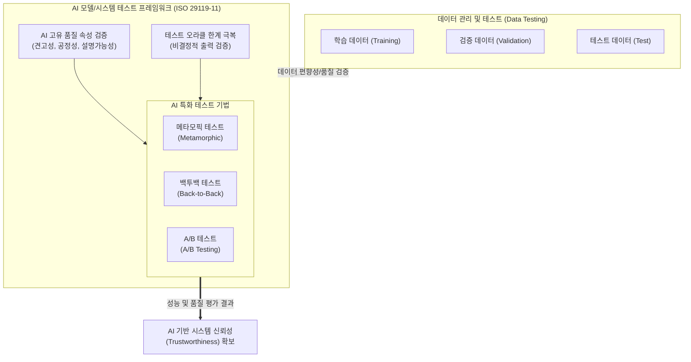

# ISO 29119-11

---

## I. AI 기반 시스템을 위한 소프트웨어 테스트 국제 표준, ISO 29119-11의 개요

* **정의**: 의사결정의 불투명성(블랙박스)과 비결정적(Non-deterministic) 결과를 도출하는 [[인공지능]](AI) 기반 시스템의 특성을 반영하여, 효과적인 테스트 방법론과 가이드라인을 제공하는 국제 표준(Technical Report)
* 전통적인 규칙 기반(Rule-based) 시스템과 달리, 데이터 주도(Data-driven) 및 지속적 학습 특성을 갖는 AI 시스템은 명확한 참/거짓 판단(Test Oracle)이 어려워 새로운 테스트 접근법이 필요함
* **특징**: [[테스트 오라클]] 문제 극복 기법(메타모픽 테스트 등) 제시, 데이터 품질 및 파이프라인 검증 강조, AI 고유 품질 속성(설명성, 견고성, 공정성) 검증 포함

---

## II. ISO 29119-11의 개념도 및 핵심 테스트 요소

### 가. ISO 29119-11 기반 AI 시스템 테스트 프로세스 개념도

* AI 모델의 학습에 사용되는 데이터 세트의 분리 및 품질 검증에서 시작하여, AI 시스템의 고유한 블랙박스 특성과 비결정성을 극복하기 위한 특화된 테스트 기법을 적용함
* 테스트 결과를 통해 시스템의 [[신뢰성]], 안전성 및 윤리적 공정성을 확보하는 것이 핵심임

### 나. ISO 29119-11의 핵심 기술 및 테스트 기법

| 분류 | 요소기술(키워드) | 세부 설명 |
| --- | --- | --- |
| **품질 특성 검증** | 투명성/설명가능성 (Explainability) | 블랙박스 모델의 의사결정 과정에 대한 해석 가능성 및 인과관계 검증 ([[XAI]] 기법 활용) |
| **품질 특성 검증** | 견고성 (Robustness) | 노이즈 데이터, 예외 상황 및 [[적대적 공격]](Adversarial Attack)에 대한 시스템 내성 평가 |
| **품질 특성 검증** | 공정성 (Fairness) | 훈련 데이터에 내재된 윤리적, 성별/인종 등 사회적 [[편향]](Bias) 식별 및 완화 검증 |
| **AI 테스트 기법** | 메타모픽 테스트 (Metamorphic) | 명확한 기댓값(Oracle)을 알 수 없을 때, 입력값의 변화에 따른 출력값 간의 관계(MR)를 정의하여 결함을 도출하는 기법 |
| **AI 테스트 기법** | 백투백 테스트 (Back-to-Back) | 동일한 입력에 대해 기존 버전(또는 레퍼런스 모델)과 새로운 AI 모델의 출력 결과를 비교하여 회귀 오류 검증 |
| **AI 테스트 기법** | A/B 테스트 (A/B Testing) | 실제 운영 환경(Production)에서 두 가지 모델 버전을 동시 배치하여 사용자 반응과 실성능을 통계적으로 비교 |
| **데이터 검증** | 데이터 파이프라인 테스트 | 데이터 수집, 전처리, 증강 단계에서의 정합성 및 훈련/검증/테스트 데이터 세트 간의 데이터 누수(Data Leakage) 방지 |
| **구조 기반 검증** | 뉴런 커버리지 (Neuron Coverage) | [[딥러닝]] 테스트 시 기존의 [[코드 커버리지]](구문, 분기)를 대신하여, 활성화된 인공 뉴런의 비율을 측정 |

---

## III. 전통적 테스트와 AI 시스템 테스트 비교 및 동향

### 가. 전통적 SW 테스트(ISO 29119-1~4)와 AI 시스템 테스트(ISO 29119-11) 비교

| 비교 항목 | 전통적 SW 테스트 ([[ISO 29119]]-1~4) | [[AI 시스템 테스트]] (ISO 29119-11) |
| --- | --- | --- |
| **검증 대상** | 코드 및 비즈니스 로직 (Rule-based) | 데이터 품질 및 학습된 모델 (Data-driven) |
| **테스트 오라클** | 결정적 (명확한 참/거짓 판단 기준 존재) | **비결정적** (확률적 결과, 대체 오라클 필요) |
| **주요 한계점** | 시스템 복잡도 증가에 따른 경로 폭발 | 블랙박스 특성으로 인한 동작 원리 추적의 어려움 |
| **핵심 기법** | 경계값 분석, 동등 분할, 구문/분기 커버리지 | 메타모픽 테스트, 적대적 예제 테스트, 뉴런 커버리지 |
| **[[유지보수]] 관점** | 요구사항 변경 시 테스트 케이스 수정 | 데이터 드리프트(Data Drift) 발생 시 모델 재학습 및 재검증 |

* **활용 및 전망**: 유럽연합의 AI 법(EU AI Act) 등 글로벌 AI 규제가 본격화됨에 따라, 고위험 AI 시스템에 대한 적합성 평가 기준이 요구되고 있음. 이에 따라 기업들은 AI 시스템의 신뢰성(Trustworthiness)을 입증하기 위해 ISO/IEC 42001([[인공지능 경영시스템]])과 연계하여 **ISO 29119-11**을 필수 테스트 컴플라이언스로 채택하고 있는 추세임.

---

### 🔗 연관 토픽

- **소속 도메인**: [[00_소프트웨어공학_MOC|🏗️ 소프트웨어공학]]
- **세부 분류**: `6. 소프트웨어 테스팅 & 품질 보증 (QA/QC)`
- **핵심 연관 토픽**:
  - [[코드 커버리지|코드 커버리지(Code Coverage)]]
  - [[인공지능]]
  - [[XAI]]
  - [[적대적 공격]]
  - [[인공지능 경영시스템|인공지능 경영시스템(ISO 42001:2023)]]
