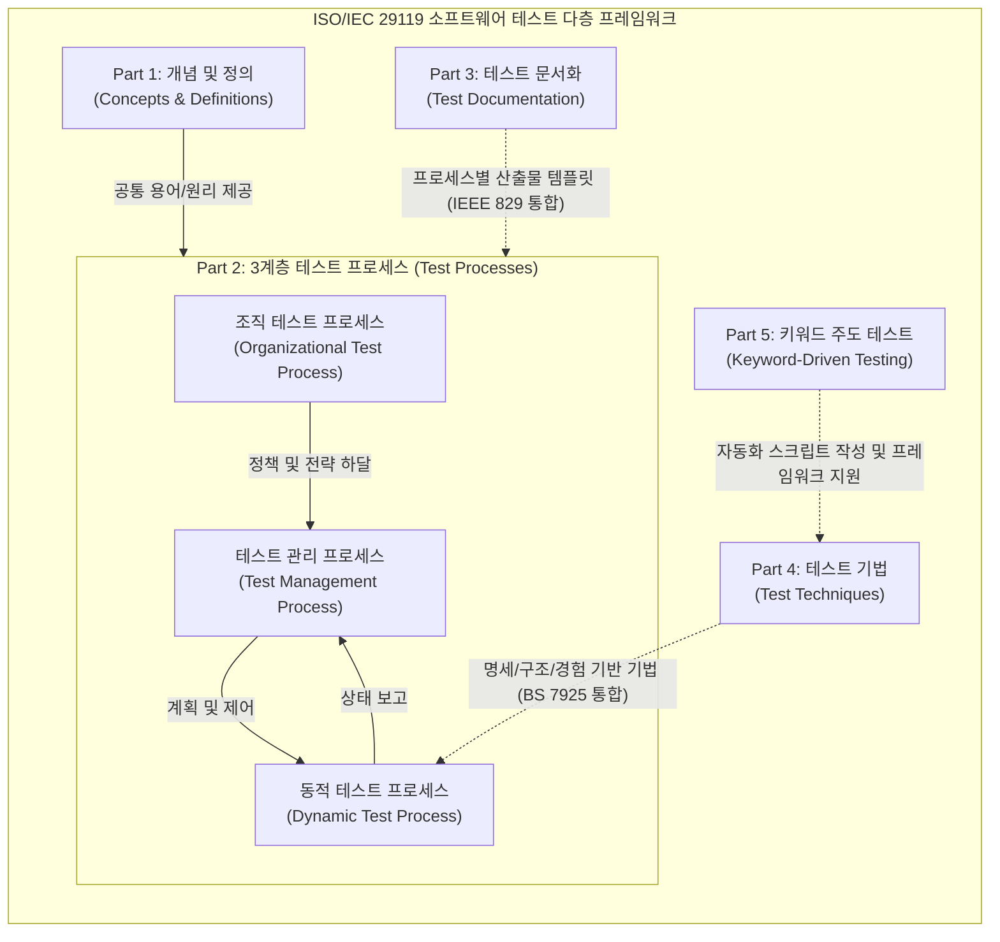

# ISO 29119

---

## I. 소프트웨어 테스트 글로벌 통합 표준, ISO/IEC 29119의 개요

* **정의**: IEEE 829, BS 7925 등 기존에 파편화되어 있던 [[소프트웨어 테스트]] 관련 표준들을 하나로 통합하여 테스트 개념, [[프로세스]], 문서화, 기법을 총망라한 소프트웨어 테스트 국제 표준
* **등장배경**: 기존 표준들의 중복 및 충돌 문제 해결, 애자일([[Agile]]) 등 다양한 최신 소프트웨어 개발 생명주기([[SDLC]])를 수용할 수 있는 유연한 테스트 프레임워크의 필요성 대두
* **특징**: [[위험 기반 테스트]](Risk-Based Testing) 중심 접근, 3계층 프로세스 모델 제시, 프로젝트 특성에 맞춘 테일러링(Tailoring) 지원

---

## II. ISO 29119의 전체 구조 및 핵심 구성 요소

### 가. ISO 29119의 아키텍처 및 연관 관계 개념도

* 기초 개념(Part 1) 위에서 3계층 프로세스(Part 2)가 작동하며, 프로세스의 각 단계는 문서화 표준(Part 3)과 테스트 기법(Part 4, 5)의 지원을 받아 일관된 테스트 수행을 보장함

### 나. ISO 29119의 핵심 구성 요소 (Part 1 ~ Part 5)

| 구분 | 요소기술(키워드) | 세부 설명 |
| --- | --- | --- |
| **Part 1** | 개념 및 정의 (Concepts) | 소프트웨어 테스트의 공통 어휘, 원리 및 다층 프로세스 모델의 기본 개념 정의 |
| **Part 2** | 테스트 프로세스 (Processes) | 조직, 관리, 동적 테스트의 **3계층 구조** 제시 및 위험 기반 테스트(RBT) 수행 절차 정의 |
| **Part 3** | 테스트 문서화 (Documentation) | 테스트 정책서, 계획서, 설계서, 결과 보고서 등 테스트 프로세스 전반의 표준 산출물 양식 |
| **Part 4** | 테스트 기법 (Techniques) | 명세 기반(블랙박스), 구조 기반(화이트박스), 경험 기반 등 구체적인 테스트 설계 및 도출 기법 |
| **Part 5** | 키워드 주도 (Keyword-Driven) | 테스트 케이스를 키워드(액션) 단위로 추상화하여 유지보수성 및 **테스트 자동화** 효율성 극대화 |
| **공통** | 위험 기반 테스트 (RBT) | 소프트웨어 고장 시의 영향도와 발생 가능성을 평가하여 자원을 우선순위에 따라 차등 할당 |
| **공통** | [[테일러링|테일러링 (Tailoring)]] | 프로젝트의 규모, 도메인 규제, 방법론(Agile, [[DevOps]] 등)에 따라 표준을 취사선택하여 최적화 |

---

## III. ISO 29119의 3계층 프로세스 모델 및 활용 전망

### 가. Part 2의 핵심: 3계층 테스트 프로세스 모델 상세

| 계층 구분 | 프로세스 명칭 | 핵심 활동 및 산출물 (Part 3 연계) |
| --- | --- | --- |
| **1계층 (조직)** | 조직 테스트 프로세스 | - 전사적 테스트 정책 및 전략 수립, 테스트 가이드라인 배포 

 - 산출물: 조직 테스트 정책서, 조직 테스트 전략서 |
| **2계층 (관리)** | 테스트 관리 프로세스 | - 프로젝트 [[단위 테스트]] 계획 수립, 진행 상황 모니터링 및 제어, 완료 보고 

 - 산출물: 테스트 계획서, 테스트 상태/완료 보고서 |
| **3계층 (동적)** | 동적 테스트 프로세스 | - 테스트 설계 및 구현, 환경 구축, 실행 및 결함(Incident) 보고 

 - 산출물: 테스트 명세서, 결함 보고서, 테스트 로그 |

* **활용 및 동향**: ISO 29119는 V-모델 같은 전통적 방법론뿐만 아니라 애자일(Agile), CI/CD 중심의 DevOps 환경에서도 테일러링을 통해 쉽게 적용됨. 최근에는 Part 5(키워드 주도 테스트)를 기반으로 AI를 결합한 스크립트리스(Scriptless) 테스트 자동화 도구들이 해당 표준을 적극 준용하여 상호운용성과 신뢰성을 확보하고 있음.

---

### 🔗 연관 토픽

- **소속 도메인**: [[00_소프트웨어공학_MOC|🏗️ 소프트웨어공학]]
- **세부 분류**: `1. 소프트웨어 개발 생명주기(SDLC) & 방법론`
- **핵심 연관 토픽**:
  - [[SDLC]]
  - [[Agile]]
  - [[단위 테스트]]
  - [[테일러링|테일러링 (Tailoring)]]
  - [[소프트웨어 테스트|소프트웨어 테스트 (Software Test)]]
