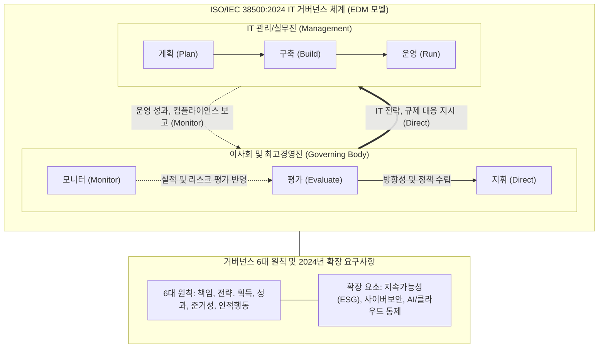

# ISO 38500:2024

---

## I. 지속가능성과 신기술 통제가 강화된 IT 거버넌스 국제표준, ISO 38500:2024의 개요

* **정의**: 조직의 비즈니스 목적 달성을 위해 이사회 및 최고경영진이 전사적 IT 자원을 평가(Evaluate), 지휘(Direct), 모니터(Monitor)하기 위한 거버넌스 원칙을 제공하는 국제 표준의 최신(2024년) 개정판
* **등장배경**: 클라우드, [[인공지능]](AI) 등 파괴적 신기술 도입에 따른 리스크 급증과 글로벌 ESG(환경·사회·지배구조) 규제 대응을 위한 이사회 차원의 IT 통제 체계 요구 증대
* **특징**: 상위 조직 거버넌스 표준(ISO 37000)과의 완벽한 정렬(Alignment), 지속가능성(Sustainability) 기반 의사결정 내재화, 사이버 보안 및 신기술 거버넌스에 대한 경영진 책임 명문화

---

## II. ISO 38500:2024의 개념도 및 핵심 기술 요소

### 가. ISO 38500:2024의 아키텍처 및 동작 원리

* 경영진(Governing Body)이 거버넌스 6대 원칙과 신기술 통제 요건을 기반으로 IT 환경을 평가(E), 지휘(D), 모니터(M)하고, 관리진(Management)은 이를 바탕으로 IT 서비스를 계획, 구축, 운영함

### 나. ISO 38500:2024의 핵심 기술/구성 요소

| 구분 | 요소기술(키워드) | 세부 설명 |
| --- | --- | --- |
| **거버넌스 체계** | [[EDM]] [[프레임워크]] | 현재/미래 IT 자원 활용 방안 평가(Evaluate), 조직 목표 달성을 위한 지시(Direct), 성과 및 정책 모니터링(Monitor) 체계 가동 |
| **6대 원칙 (1/2)** | 책임, 전략, 획득 | IT 투자와 권한의 명확한 책임 할당, 비즈니스 전략과 IT의 정렬(Alignment), 투명한 비용/편익 분석 기반의 자산 획득 |
| **6대 원칙 (2/2)** | 성과, 준거성, 인적행동 | 서비스 가치 극대화, 법규 및 내외부 정책 준수, 인간/시스템 간 상호작용 이해 및 윤리적 기반의 조직 문화 반영 |
| **'24 개정 특징** | ISO 37000 정렬 | 전사적 조직 거버넌스 국제표준(ISO 37000) 프레임워크와 IT 거버넌스의 개념, 어휘 및 아키텍처 동기화 |
| **'24 개정 특징** | 지속가능성 (ESG) 반영 | IT 의사결정 과정에서 탄소 배출 저감(Green IT), 자원 효율성 등 환경적·사회적 책임(Sustainability) 필수 고려 |
| **'24 개정 특징** | 신기술 거버넌스 내재화 | 인공지능, [[클라우드 컴퓨팅]] 등 파괴적 혁신 기술의 편향성, 데이터 종속성 리스크에 대한 이사회 차원의 투명성 확보 |
| **'24 개정 특징** | 사이버 보안(Cybersecurity) | 고도화되는 사이버 위협을 실무 리스크가 아닌 전사적 비즈니스 리스크로 격상하여 경영진의 직접 통제 및 책임 부여 |
| **도입 효과** | 가치 창출 및 리스크 최적화 | IT와 비즈니스의 전략적 일치를 통해 시장 경쟁 우위를 확보하고 재무적/운영적 리스크를 최소화함 |

---

## III. ISO 38500과 주요 IT 거버넌스 프레임워크 비교 및 향후 전망

### 가. 주요 IT 프레임워크 간 목적 및 적용 수준 비교

| 비교 항목 | ISO/IEC 38500:2024 | COBIT 2019 | ITIL 4 |
| --- | --- | --- | --- |
| **핵심 목적** | IT 거버넌스의 원칙 및 경영진 책임 제시 | [[IT 거버넌스]] 및 관리의 실무 구현 프레임워크 | IT 서비스의 라이프사이클 관리 및 가치 창출 |
| **초점 (Focus)** | What & Why (무엇을, 왜 해야 하는가) | How (어떻게 통제하고 관리할 것인가) | How to Service (어떻게 서비스할 것인가) |
| **타겟 독자** | 이사회, 최고경영진 (Governing Body) | IT/비즈니스 관리자, 내부 감사인 (Management) | IT 서비스 운영자, [[ITSM(Information Technology Service Management)|ITSM]] 실무자 |
| **핵심 체계** | EDM 모델, 6대 원칙, 신기술/ESG 통제 | 40개 거버넌스/관리 목표, 7개 핵심 컴포넌트 | 4차원 모델, SVS(서비스 가치 시스템) |

* **전망 및 동향**: 기업은 ISO 38500:2024를 통해 이사회 차원의 거버넌스(Governance) 지향점을 확립하고, 실무 구현을 위해 COBIT 2019(관리 통제)나 ITIL 4(서비스 운영)를 결합(Tailoring)하여 실행력을 확보하는 **하이브리드 거버넌스 체계**를 선호함
* 특히, AI 도입이 가속화됨에 따라 고위험 AI 리스크 통제를 위해 ISO/IEC 42001([[인공지능 경영시스템]])과 ISO 38500:2024를 통합 적용하여 컴플라이언스 대응력을 높이는 추세가 두드러짐

---

### 🔗 연관 토픽

- **소속 도메인**: [[00_경영전략_MOC|📈 경영전략]]
- **세부 분류**: `2. IT 거버넌스 & 엔터프라이즈 아키텍처 (EA/ISP)`
- **핵심 연관 토픽**:
  - [[ITSM(Information Technology Service Management)]]
  - [[IT 거버넌스]]
  - [[인공지능]]
  - [[데이터 거버넌스|데이터 거버넌스 (Data Governance)]]
  - [[인공지능 경영시스템|인공지능 경영시스템(ISO 42001:2023)]]
