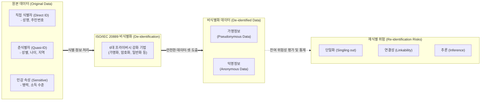

# ISO/IEC 20889

---

## I. 안전한 데이터 활용을 위한 프라이버시 강화 기술, ISO/IEC 20889의 개요

* **정의**: 빅데이터 및 [[인공지능]](AI) 환경에서 개인정보의 안전한 활용을 위해 데이터 [[비식별화]](De-identification) 관련 용어를 정립하고, 프라이버시 강화 기법을 분류한 국제 표준
* 전 세계적으로 데이터 활용 요구와 프라이버시 보호 규제(EU GDPR 등)가 충돌함에 따라, 안전한 데이터 결합 및 분석을 지원하기 위한 기술적 기준점을 제공하기 위해 제정됨
* **특징**: 프라이버시 보호 모델 제시, 재식별(Re-identification) 위험의 3대 요소(단일화, 연결성, 추론) 정의, 6대 비식별화 기법의 체계적 분류

---

## II. ISO/IEC 20889의 개념도 및 핵심 비식별화 기법

### 가. ISO/IEC 20889의 비식별화 처리 및 재식별 위험 개념도

* 원본 데이터의 식별 속성(ID, QID)에 프라이버시 강화 기법을 적용하여 가명정보 또는 익명정보를 생성하며, 생성된 데이터는 반드시 3가지 재식별 위험 요소에 대한 통제 평가를 거쳐야 함

### 나. ISO/IEC 20889의 6대 비식별화 처리 기법 및 핵심 요소

| 분류 | 요소기술(키워드) | 세부 설명 |
| --- | --- | --- |
| **비식별화 기법** | 1. 가명화 (Pseudonymization) | 직접 식별자를 임의의 값(가명, Token)으로 대체하여 추가 정보 없이는 식별할 수 없도록 조치 |
| **비식별화 기법** | 2. [[암호화]] (Cryptographic tools) | 데이터를 형태보존암호화(FPE), 동형암호 등을 사용하여 인가된 키 없이 복호화가 불가능하도록 변환 |
| **비식별화 기법** | 3. 통계적 도구 (Statistical tools) | 개별 레코드 값이 아닌 데이터 집합에 대한 평균, 분산, 총합 등 집계값(Aggregation) 형태로 변환하여 제공 |
| **비식별화 기법** | 4. [[일반화]] (Generalization) | 데이터의 정밀도를 낮추어 더 넓은 범주(예: 32세 → 30대, 라운딩, 상/하단 코딩)로 치환하여 K-익명성 확보 |
| **비식별화 기법** | 5. 무작위화 (Randomization) | 원본 데이터에 노이즈를 주입하거나 배열을 섞어(Permutation) 변형 ([[차분 프라이버시]] 기법 포함) |
| **비식별화 기법** | 6. 억제/삭제 (Suppression) | 재식별 위험이 높은 특정 속성값(컬럼)이나 레코드(행) 자체를 삭제하거나 마스킹(Masking) 처리 |
| **재식별 위험** | 단일화 (Singling out) | 데이터셋 내에서 특정 개인을 식별해 낼 수 있는 유일한 레코드를 분리해 낼 수 있는 위험 |
| **재식별 위험** | 연결성 (Linkability) / 추론 | 두 개 이상의 서로 다른 데이터셋을 결합(Link)하거나, 배경지식을 통해 특정 속성을 추론(Inference)해내는 위험 |

---

## III. ISO/IEC 20889 기반 국내 프라이버시 규제 비교 및 활용 동향

### 가. ISO/IEC 20889와 국내 데이터 규제(가명정보 처리 가이드라인) 비교

| 비교 항목 | ISO/IEC 20889 | 국내 [[가명정보 처리 가이드라인]] (KISA) |
| --- | --- | --- |
| **목적** | 프라이버시 강화 기술 및 비식별화 용어의 글로벌 표준화 | 국내 데이터 3법에 따른 가명정보의 안전한 처리 및 활용 법적 가이드 |
| **적용 범위** | 가명화 및 익명화 기법 전반 포괄 | 가명정보의 처리 단계(사전준비→가명처리→적정성 검토→사후관리)에 집중 |
| **기법 분류 체계** | 6대 도구(가명화, 일반화, 억제, 무작위화, 통계화, 암호화) 체계 | 데이터 삭제, 가명처리, 총계처리, 데이터 범주화, 데이터 마스킹 등으로 분류 |
| **주요 특징** | 재식별 위험(Singling out 등)에 대한 이론적 통제 모델 제시 | 이종 산업 간 '가명정보 결합전문기관'을 통한 데이터 결합 및 반출 실무 절차 명시 |

* **전망 및 동향**: ISO/IEC 20889는 [[마이데이터]] 산업과 보건의료 데이터 등 민감 정보가 융합되는 환경에서 안전한 데이터 결합을 위한 필수 기반 지식으로 활용되고 있음
* 최근에는 해당 표준의 기법을 넘어 인공지능(AI) 모델이 원본 데이터를 직접 학습하지 않도록 하는 **연합학습(Federated Learning)** 및 원본의 통계적 특성만 유지하는 **합성데이터(Synthetic Data)** 생성 기술 등 차세대 PET(Privacy Enhancing Technologies)로 진화하며 발전 중임

---

### 🔗 연관 토픽

- **소속 도메인**: [[00_보안_MOC|🛡️ 보안]]
- **세부 분류**: `6. 개인정보보호 & 프라이버시 강화 기술`
- **핵심 연관 토픽**:
  - [[비식별화]]
  - [[가명정보 처리 가이드라인]]
  - [[차분 프라이버시]]
  - [[암호화|암호화 (Encryption)]]
  - [[개인정보보호법]]
