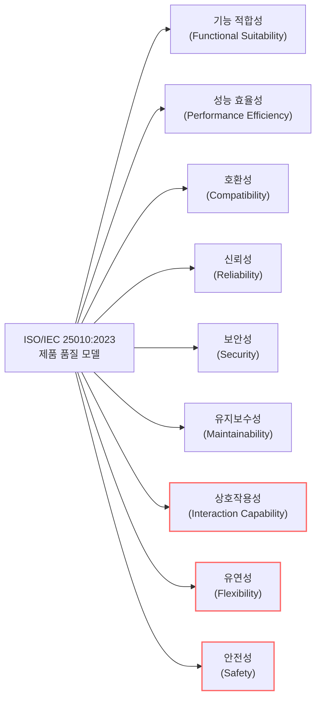

# ISO/IEC 25010:2023

---

## I. 최신 디지털 환경을 반영한 SW 제품 품질 모델, ISO/IEC 25010:2023의 개요

* **정의**: 소프트웨어 제품 및 시스템이 만족해야 할 품질 특성과 부특성을 정의한 국제 표준으로, 기존 2011년 버전을 최신 IT 환경(AI, IoT, 클라우드 등)에 맞게 개정한 최신 품질 모델
* **등장배경**: 기존 '사용성'과 '이식성'의 개념적 한계 극복 필요, SW 결함이 물리적/인명적 피해로 직결되는 환경([[Smart Car(자율주행)|자율주행]], 의료기기 등) 증가에 따른 '안전성' 요건 강화
* **특징**: 9대 제품 품질 특성으로 확장, 상호작용성(Interaction Capability) 및 안전성(Safety) 신설, 유연성(Flexibility) 개념 확대 적용

---

## II. ISO/IEC 25010:2023의 개념도 및 핵심 구성 요소

### 가. ISO/IEC 25010:2023 제품 품질 모델 구성도

* 기존 8대 특성(2011)에서 기능이 재편되어 9대 특성으로 확장되었으며, 특히 붉은색 테두리로 표시된 상호작용성, 유연성, 안전성이 2023년 모델의 핵심 변경 및 신설 요소임

### 나. ISO/IEC 25010:2023의 9대 핵심 품질 특성

| 구분 | 특성(키워드) | 세부 설명 및 주요 부특성 |
| --- | --- | --- |
| **기본** | 기능 적합성 (Functional Suitability) | 명시적/묵시적 요구를 충족하는 기능을 제공하는 정도 (완전성, 정확성, 적절성) |
| **기본** | 성능 효율성 (Performance Efficiency) | 명시된 조건에서 사용된 자원량 대비 달성된 성능 (시간 동작, 자원 활용, 용량) |
| **기본** | 호환성 (Compatibility) | 환경/자원을 공유하며 타 제품과 정보를 교환하는 정도 (공존성, 상호운용성) |
| **개정** | 상호작용성 (Interaction Capability) | 사용자가 목표 달성을 위해 시스템과 상호작용하는 정도 (구 사용성 대체, 포용성 등) |
| **운영** | [[신뢰성]] (Reliability) | 규정된 조건/기간 동안 명시된 기능을 오작동 없이 수행하는 정도 (무결함, [[HA(High Availability)|가용성]] 등) |
| **운영** | 보안성 (Security) | 권한 수준에 맞게 정보와 데이터를 보호하는 정도 ([[기밀성]], [[무결성]], 부인방지 등) |
| **유지** | 유지보수성 (Maintainability) | 제품이나 시스템이 효과적/효율적으로 수정될 수 있는 정도 (모듈성, 재사용성 등) |
| **개정** | 유연성 (Flexibility) | 변화하는 HW, SW, 운영 환경에 적응할 수 있는 정도 (구 이식성 대체, 확장성, 시험성 등) |
| **신설** | 안전성 (Safety) | 인명, 비즈니스, 재산 및 환경에 대한 위해(Harm)를 회피하는 정도 (페일 세이프 등) |

---

## III. ISO/IEC 25010 2011 vs 2023 비교 및 향후 전망

### 가. 2011년 모델과 2023년 모델의 핵심 변경사항 비교

| 비교 항목 | ISO/IEC 25010:2011 | ISO/IEC 25010:2023 |
| --- | --- | --- |
| **품질 특성 수** | 8대 주특성 | 9대 주특성 |
| **사용자 인터페이스** | 사용성 (Usability) | 상호작용성 (Interaction Capability) |
| **환경 적응성** | 이식성 (Portability) | 유연성 (Flexibility) - 시험성(Testability) 편입 |
| **안전성(Safety)의 위치** | 사용 품질(Quality in Use)의 하위 특성 | **제품 품질(Product Quality)의 독립 주특성으로 승격** |
| **핵심 포커스** | 독립형 시스템의 기능/성능/신뢰성 중심 | AI, IoT 등 복잡한 상호작용 및 생명/안전 직결 환경 반영 |

* **전망 및 동향**: 자율주행, 의료기기 SW, 산업용 로봇 등의 발전으로 SW의 오작동이 물리적 위해나 인명 피해로 직결되는 사례가 증가함에 따라, 안전성(Safety)이 필수 제품 품질 요건으로 격상됨
* 또한, 글로벌 접근성 요구(포용성, Inclusivity)와 [[클라우드 네이티브]]/[[MSA (Micro Service Architecture)|MSA]] 아키텍처 환경의 요구(확장성, Scalability)가 새롭게 부특성으로 편입되면서, 현대적인 소프트웨어 검증 체계의 글로벌 스탠다드로 빠르게 대체되고 있음

---

### 🔗 연관 토픽

- **소속 도메인**: [[00_소프트웨어공학_MOC|🏗️ 소프트웨어공학]]
- **세부 분류**: `6. 소프트웨어 테스팅 & 품질 보증 (QA/QC)`
- **핵심 연관 토픽**:
  - [[신뢰성]]
  - [[무결성]]
  - [[클라우드 네이티브]]
  - [[MSA (Micro Service Architecture)]]
  - [[기밀성]]
