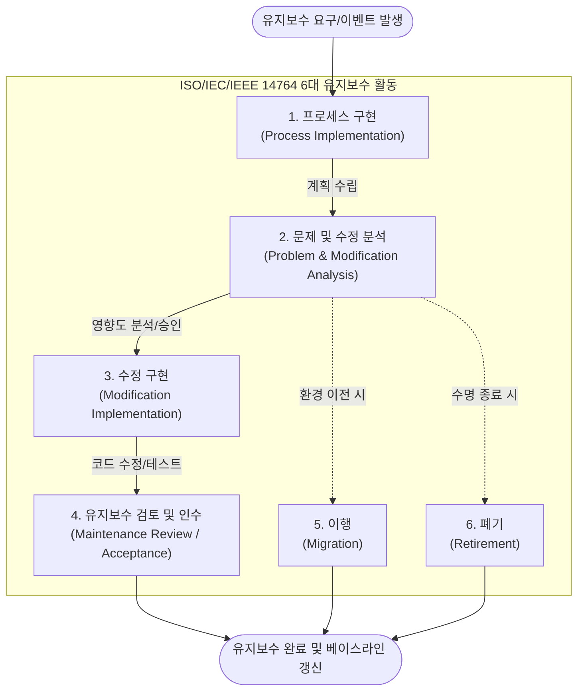

# ISO/IEC/IEEE 14764

---

## I. 체계적인 SW 유지보수 국제표준, ISO/IEC/IEEE 14764의 개요

* **정의**: 소프트웨어 인도(Delivery) 이후 발생하는 요구사항 변경, 운영 환경 변화, 결함 해결을 위해 수행해야 할 [[유지보수]] 프로세스의 활동, 작업 및 유형을 명확히 정의한 SW 생명주기 국제 표준
* **필요성/등장배경**: 전체 SW 생명주기([[SDLC]]) 총소유비용(TCO) 중 유지보수 비용이 60~80% 이상을 차지함에 따라, 유지보수 절차의 표준화 및 SW 노후화(Software Decay) 방지 필요
* **특징**: 상위 표준인 ISO/IEC/IEEE 12207의 유지보수 프로세스를 상세화, 4대 유지보수 유형(수정, 적응, 완전, 예방) 제시, 단순 수정을 넘어 마이그레이션(Migration)과 폐기(Retirement) 활동까지 포괄

---

## II. ISO/IEC/IEEE 14764의 개념도 및 핵심 프로세스

### 가. ISO/IEC/IEEE 14764의 유지보수 프로세스 흐름도

* 단순 결함 수정의 선형적 프로세스뿐만 아니라, 시스템 환경의 이전(이행) 및 수명 종료(폐기) 등 전체 생애주기에 걸친 관리 프로세스를 통합적으로 제시함

### 나. ISO/IEC/IEEE 14764의 핵심 활동 및 구성 요소

| 분류 | 요소기술(키워드) | 세부 설명 |
| --- | --- | --- |
| **[[프로세스]]** | 프로세스 구현 (Implementation) | 유지보수 계획 수립, 절차 마련, 형상관리(CM) 체계 구축 및 문제 해결 조직 구성 |
| **프로세스** | 문제 및 수정 분석 (Analysis) | 식별된 문제점 파악, 대안 도출, 변경에 따른 시스템 영향도 분석(Impact Analysis) 및 승인 |
| **프로세스** | 수정 구현 (Modification) | 요구사항 분석, 설계, 코딩, 단위/[[통합 테스트]] 등 실제 코드를 수정하고 시스템에 반영 |
| **프로세스** | 검토 및 인수 (Review/Accept) | 수정된 시스템의 [[무결성]] 확인, 사용자 [[인수 테스트]](UAT) 수행 및 기준선(Baseline) 갱신 |
| **생애주기** | 이행 (Migration) | 기존 운영 환경에서 신규 인프라/OS 환경으로 SW 및 데이터를 이전하고 병행 운영 수행 |
| **생애주기** | 폐기 (Retirement) | 더 이상 사용되지 않는 SW의 안전한 폐기 절차, 기존 데이터 보존 처리 및 사용자 통지 |
| **유지보수 유형** | 교정형(Corrective)/예방형(Preventive) | **교정형**: 식별된 결함과 오류 수정 / **예방형**: 잠재적 오류 대비 및 코드 리팩토링 |
| **유지보수 유형** | 적응형(Adaptive)/완전형(Perfective) | **적응형**: OS/DB 등 운영 환경 변화 수용 / **완전형**: 사용자 요구에 의한 성능 및 기능 향상 |

---

## III. ISO 14764 기반 4대 유지보수 유형 비교 및 최근 동향

### 가. ISO/IEC/IEEE 14764의 4대 유지보수 유형 비교

| 비교 항목 | 교정형 (Corrective) | 적응형 (Adaptive) | 완전형 (Perfective) | 예방형 (Preventive) |
| --- | --- | --- | --- | --- |
| **주요 목적** | 시스템 오류 및 버그 수정 | 외부 운영 환경 변화 대응 | 성능 향상 및 신규 기능 추가 | 잠재적 장애 예방 및 구조 개선 |
| **대응 성격** | 사후 대응 (수동적) | 환경 대응 (필수적) | 사전 대응 (적극적 가치 창출) | 사전 대응 (가장 적극적/선제적) |
| **발생 시점** | 운영 중 장애/결함 발생 시 | OS, H/W, 법제도 등 변경 시 | 비즈니스 요구사항 변경/추가 시 | 노후화에 따른 시스템 리팩토링 시 |
| **비중(일반)** | 약 20% 수준 | 약 25% 수준 | **약 50% (가장 큰 비중)** | 약 5% 수준 |

* **최근 동향 및 전망**: 과거에는 장애 해결 중심의 교정형 유지보수가 주를 이루었으나, 최근에는 애자일([[Agile]]) 및 [[DevOps]] 환경이 정착됨에 따라 **완전형(기능 개선)** 유지보수 활동이 '지속적 배포(CI/CD)' 형태로 상시 수행됨.
* 또한, AIOps 등 [[인공지능]] 기반 로그 분석 및 소스코드 취약점 진단 도구의 발전으로 시스템 장애를 사전에 예측하고 선제적으로 대응하는 **예방형(Preventive) 유지보수**의 중요성이 급격히 부각되고 있음.

---

### 🔗 연관 토픽

- **소속 도메인**: [[00_소프트웨어공학_MOC|🏗️ 소프트웨어공학]]
- **세부 분류**: `1. 소프트웨어 개발 생명주기(SDLC) & 방법론`
- **핵심 연관 토픽**:
  - [[SDLC]]
  - [[Agile]]
  - [[유지보수]]
  - [[인수 테스트]]
  - [[DevOps|데브옵스 (DevOps)]]
