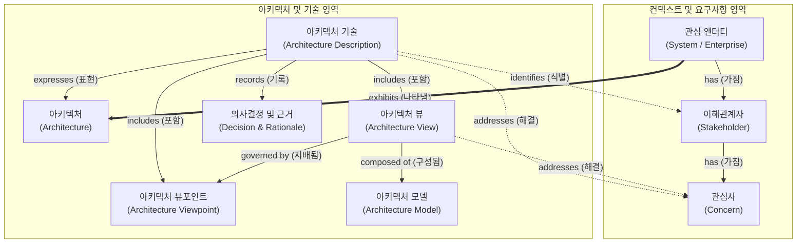

# ISO/IEC/IEEE 42010:2022

---

## I. 소프트웨어, 시스템 및 엔터프라이즈 아키텍처 기술 국제표준, ISO 42010:2022의 개요

* **정의**: 소프트웨어, 시스템뿐만 아니라 엔터프라이즈 전반의 아키텍처를 명확하게 기술(Description)하기 위한 개념적 메타 모델과 공통 어휘를 제공하는 국제 표준
* **등장배경**: 기존 2011년 버전(ISO/IEC/IEEE 42010:2011)을 개정하여, 복잡해지는 현대 IT 환경에 맞춰 적용 범위를 '엔터프라이즈(Enterprise)' 영역까지 확장하고 타 시스템 엔지니어링 표준(ISO 15288 등)과의 정합성을 확보하기 위해 제정됨
* **특징**: 이해관계자(Stakeholder) 중심의 관심사(Concern) 도출, 뷰(View) 및 뷰포인트(Viewpoint) 분리, 아키텍처 의사결정(Decision) 및 근거(Rationale)의 명시적 기록 체계화

---

## II. ISO/IEC/IEEE 42010:2022의 개념도 및 핵심 구성 요소

### 가. ISO/IEC/IEEE 42010:2022의 아키텍처 기술(AD) 개념 모델

* 특정 시스템이나 엔터프라이즈(Entity)가 가지는 아키텍처를 문서화(AD)할 때, 다양한 이해관계자의 관심사를 식별하고, 이를 해결하기 위해 정해진 관점(Viewpoint)에 따라 뷰(View)와 모델을 작성하는 일련의 프레임워크를 정의함

### 나. ISO/IEC/IEEE 42010:2022의 핵심 기술/구성 요소

| 분류 | 요소기술(키워드) | 세부 설명 |
| --- | --- | --- |
| **대상** | 관심 엔터티 (Entity of Interest) | 아키텍처가 적용되는 대상 객체 (소프트웨어, 시스템, 시스템-오브-시스템즈, 엔터프라이즈 등) |
| **핵심 자산** | 아키텍처 (Architecture) | 엔터티가 환경 속에서 나타내는 근본적인 개념이나 속성 (컴포넌트, 관계, 설계 원칙 등) |
| **핵심 자산** | 아키텍처 기술 (AD) | 아키텍처를 표현하기 위해 작성된 작업 산출물(문서, 모델, 저장소 등)의 집합 |
| **요구 식별** | 이해관계자 (Stakeholder) | 아키텍처 및 시스템에 대한 권리, 몫, 지분을 가지는 개인, 팀 또는 조직 (사용자, 개발자, 경영진 등) |
| **요구 식별** | 관심사 (Concern) | 시스템의 목적, 성능, 보안, 유지보수성 등 이해관계자에게 중요한 아키텍처적 요건 |
| **명세 구조** | 뷰포인트 (Viewpoint) | 특정 관심사를 프레이밍(Framing)하기 위한 규약, 규칙, 작성 기준 및 모델링 방법론 |
| **명세 구조** | 뷰 (View) | 특정 뷰포인트의 규칙에 따라 전체 아키텍처 중 일부를 구체적으로 표현한 결과물 |
| **추적성** | 의사결정 및 근거 (Decision/Rationale) | 대안 중 특정 아키텍처를 선택한 의사결정 내역과 이를 뒷받침하는 기술적/비즈니스적 근거 |

---

## III. ISO 42010 개정(2011 vs 2022) 비교 및 향후 활용 전망

### 가. ISO/IEC/IEEE 42010의 2011년 및 2022년 버전 핵심 비교

| 비교 항목 | ISO/IEC/IEEE 42010:2011 | ISO/IEC/IEEE 42010:2022 |
| --- | --- | --- |
| **표준 명칭** | **Systems and software** engineering 

 — Architecture description | **Software, systems and enterprise** 

 — Architecture description |
| **관심 대상(Scope)** | 시스템 (System of Interest) | 소프트웨어, 시스템 및 **엔터프라이즈(Enterprise)** |
| **타 표준 정합성** | 초기 통합 수준 | **ISO/IEC/IEEE 15288(시스템 생명주기), ISO 15704(엔터프라이즈)** 등과 완벽한 정렬 |
| **의사결정 관리** | AD 내 개념적 존재 | **아키텍처 의사결정(Decision)과 근거(Rationale)**의 추적성 및 기록 의무 강화 |

* **활용 및 실무 동향**: 2022년 개정을 통해 엔터프라이즈 아키텍처(EA, TOGAF 등)와의 개념적 호환성이 크게 향상됨.
* 특히 최근 애자일([[Agile]]) 및 마이크로서비스 아키텍처([[MSA (Micro Service Architecture)|MSA]]) 환경에서 아키텍처의 지속적인 변화를 관리하기 위해 사용하는 실무 기법인 ADR(Architecture Decision Record)이 ISO 42010:2022의 '의사결정 및 근거(Decision & Rationale)' 모델과 직접적으로 매핑되어, 현대적 SW 개발 파이프라인의 필수적인 거버넌스 도구로 확산되고 있음.

---

### 🔗 연관 토픽

- **소속 도메인**: [[00_소프트웨어공학_MOC|🏗️ 소프트웨어공학]]
- **세부 분류**: `4. 아키텍처 스타일 & 객체지향 설계 원리`
- **핵심 연관 토픽**:
  - [[MSA (Micro Service Architecture)]]
  - [[Agile]]
  - [[CBAM|CBAM(Cost Benefit Analysis Method)]]
  - [[ARID]]
  - [[성능 테스트 도구]]
