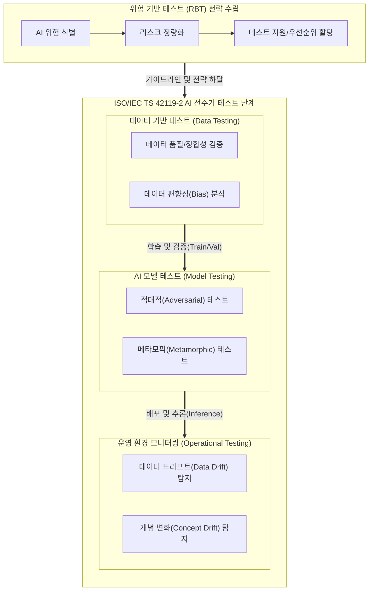

# ISO/IEC TS 42119-2

---

## I. 신뢰할 수 있는 AI 구현을 위한 전주기 테스트 국제표준, ISO/IEC TS 42119-2의 개요

* **정의**: [[인공지능]](AI) 시스템의 신뢰성과 안전성을 입증하기 위해 데이터 품질, 모델 성능, 편향성 등 AI 전주기에 걸친 테스트 방법론과 절차를 규정한 최초의 AI 테스트 전용 국제 표준 (2025년 제정)
* **등장배경**: 비결정적이고 블랙박스 특성을 가진 AI 시스템에 기존 전통적 SW 테스트([[ISO 29119]])를 적용하는 것의 한계 노출, EU AI Act 및 인공지능 기본법 등 고위험 AI 규제에 대응하기 위한 글로벌 검증 체계 요구 증대
* **특징**: 리스크 기반 테스트(RBT) 도입, AI 고유의 위험 요소(데이터 드리프트, [[적대적 공격]] 등)에 대한 정량적 평가 기준 제시, 지속적 품질 모니터링 체계 내재화

---

## II. ISO/IEC TS 42119-2의 개념도 및 핵심 테스트 요소

### 가. ISO/IEC TS 42119-2 기반 AI 시스템 전주기 테스트 프로세스 개념도

* AI 시스템의 고유한 리스크를 선제적으로 식별(RBT)하고, 훈련 데이터 수집부터 모델 구축, 실운영 환경까지 전 생애주기에 걸친 AI 특화 테스트 기법을 일관되게 적용함

### 나. ISO/IEC TS 42119-2의 핵심 테스트 및 검증 요소

| 분류 | 요소기술(키워드) | 세부 설명 |
| --- | --- | --- |
| **테스트 전략** | 리스크 기반 테스트 (RBT) | AI 모델의 비즈니스적/윤리적 위험도를 정량화하여 한정된 테스트 자원을 효율적으로 할당 |
| **데이터 검증** | 데이터 품질 테스트 | 학습/검증 데이터셋의 대표성, [[무결성]], 노이즈를 검증하여 잘못된 학습(GIGO) 사전 방지 |
| **데이터 검증** | 편향성(Bias) 검증 | 데이터 및 모델 추론 결과에 내재된 인종/성별 등 사회적 [[편향]] 식별 및 [[알고리즘]] 공정성 확보 |
| **모델 검증** | 적대적(Adversarial) 테스트 | 악의적으로 조작된 미세 노이즈(적대적 예제) 주입 시 AI 모델의 회피 내성 및 견고성 평가 |
| **모델 검증** | 메타모픽 테스트 (MT) | 정답(Test Oracle)을 알 수 없는 경우, 입력 변환에 따른 출력 간의 논리적 관계(MR)로 결함 탐지 |
| **운영 검증** | 드리프트(Drift) 테스트 | 실운영 단계에서 학습 환경과 데이터 분포가 달라지거나(Data Drift) 예측 목표가 변하는 현상 탐지 |
| **품질 속성** | 투명성 (설명가능성, [[XAI]]) | [[딥러닝]] 모델의 복잡한 추론 과정 및 결과 도출 근거를 사용자가 이해할 수 있도록 인과관계 입증 |
| **품질 속성** | 안전성 (Safety) 검증 | [[Smart Car(자율주행)|자율주행]], 의료 등에서 AI 시스템의 오작동 및 환각 현상이 인명/재산에 미치는 위해 요소를 제어 |

---

## III. 전통적 SW 테스트와 AI 전용 테스트 표준의 진화 및 향후 전망

### 가. 전통적 테스트 표준(ISO 29119)과 AI 전용 테스트 표준(ISO 42119) 비교

| 비교 항목 | 전통 SW 테스트 (ISO 29119) | AI 테스트 보고서 ([[ISO 29119-11]]) | AI 전주기 테스트 표준 (ISO/IEC TS 42119-2) |
| --- | --- | --- | --- |
| **표준 성격** | 기본 SW 테스트 [[프로세스]] 규격 | AI 테스트 가이드라인 (Technical Report) | **AI 컴포넌트 전주기 독립 테스트 표준 (TS)** |
| **검증 중심** | 소스코드 구조 및 비즈니스 로직 | AI 시스템의 비결정성 및 한계 극복 가이드 | **데이터, 모델 성능, 운영 모니터링의 엔드투엔드 통제** |
| **주요 기법** | 구문/분기 커버리지, 경계값 분석 | 메타모픽 테스트, 뉴런 커버리지 초기 도입 | **RBT, 적대적 공격 방어, 편향성/드리프트 검증 정례화** |
| **규제 대응** | 일반 SW 품질 컴플라이언스 | 초기 AI 모델 [[신뢰성]] 참조 목적 | **EU AI Act 등 고위험 AI 규제 대응 법적/인증 근거** |

* **동향 및 전망**: ISO/IEC TS 42119-2의 제정을 기점으로 AI 테스트 표준이 기존 SW 생명주기(ISO 29119)의 종속성에서 완전히 벗어나 독립적인 평가 체계로 고도화되었음.
* 향후 AI 레드팀 테스팅(ISO/IEC 42119-7) 및 생성형 AI 전용 테스팅(ISO/IEC 42119-8) 등 심화된 후속 표준 세트가 연속으로 개발·발표될 예정이며, 국내외 기업은 이를 기반으로 글로벌 수준의 AI 신뢰성(Trustworthiness) 인증 체계를 필수적으로 갖추어 무역 장벽 및 규제 리스크에 대응해야 함.

---

### 🔗 연관 토픽

- **소속 도메인**: [[00_인공지능_MOC|🤖 인공지능]]
- **세부 분류**: `6. 설명가능한 AI (XAI) & AI 윤리 · 거버넌스`
- **핵심 연관 토픽**:
  - [[편향]]
  - [[XAI]]
  - [[인공지능]]
  - [[알고리즘]]
  - [[딥러닝]]
