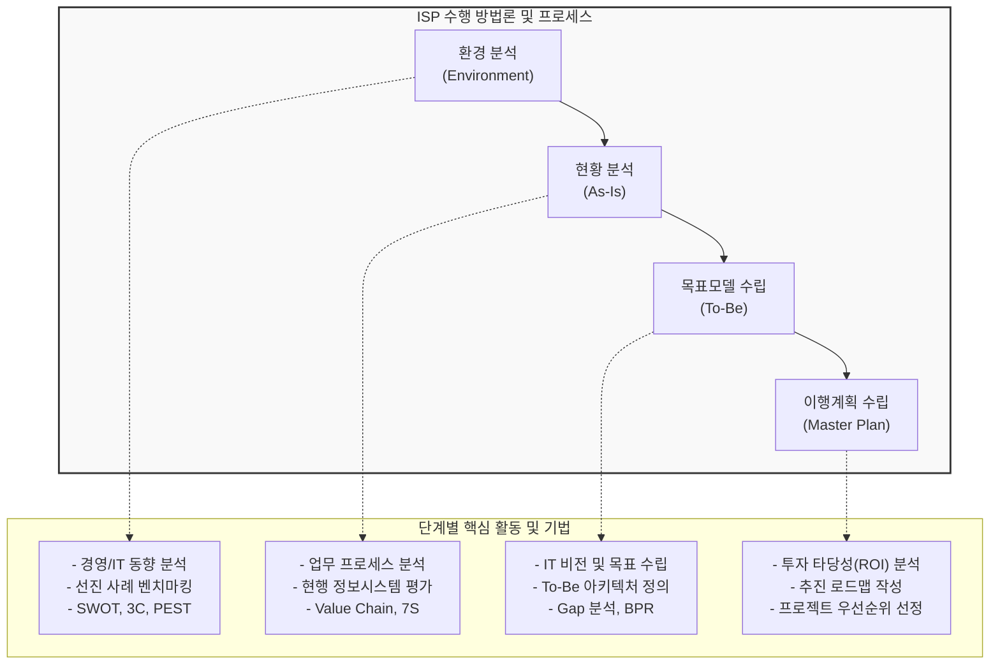

# ISP (Information Strategy Planning)

---

## I. 비즈니스 목표 달성을 위한 정보화 마스터플랜, ISP의 개요

* **정의**: 조직의 경영 목표 및 비전 달성을 위해 내·외부 비즈니스 환경과 IT 환경을 분석하여, 최적의 시스템 아키텍처(To-Be)와 중장기 정보화 추진 전략 및 실행 계획을 수립하는 체계적인 과정
* **필요성**: 비즈니스와 IT의 연계(Alignment) 강화, 정보화 투자에 대한 ROI 극대화, 부서 간 시스템 중복 투자 방지 및 정보 자원의 효율적 할당
* **특징**: Top-Down 방식의 접근, 전사적(Enterprise-wide) 관점 적용, 경영진의 강력한 스폰서십(Sponsorship) 필수, 비즈니스 전략(경영전략)이 IT 전략을 주도함

---

## II. ISP의 수행 방법론 및 핵심 기술 요소

### 가. ISP의 수행 프로세스 개념도

* 내외부 환경분석을 통해 기회와 위협을 식별하고, As-Is 분석과 To-Be 모델 간의 Gap(차이)을 도출하여 구체적인 이행 로드맵과 투자 계획을 수립함

### 나. ISP의 단계별 핵심 기법 및 구성 요소

| 구분 | 요소기술(키워드) | 세부 설명 |
| --- | --- | --- |
| **환경 분석** | 3C 분석 | 고객(Customer), 자사(Company), 경쟁사(Competitor) 중심의 미시적 환경 분석 |
| **환경 분석** | [[PEST 분석]] | 정치(P), 경제(E), 사회(S), 기술(T) 측면의 거시적 비즈니스 환경 분석 |
| **현황 분석** | Value Chain ([[가치사슬]]) | 기업 활동을 주 활동과 지원 활동으로 분류하여 부가가치 창출 요인을 분석 |
| **현황 분석** | CSF (핵심 성공 요인) | 조직이 목표를 달성하기 위해 반드시 수행해야 하는 핵심적인 필수 요건 식별 |
| **목표 수립** | EA (엔터프라이즈 아키텍처) | 비즈니스, 데이터, 애플리케이션, 기술(TRM/SRM) 관점의 전사 청사진 수립 |
| **목표 수립** | Gap Analysis (차이 분석) | 현행 아키텍처(As-Is)와 목표 아키텍처(To-Be) 간의 차이를 식별하여 과제 도출 |
| **이행 계획** | McFarlan Grid (맥팔란 그리드) | 전략적 중요도와 운영 결함의 위험도를 기준으로 IT 프로젝트의 포트폴리오를 평가 |
| **이행 계획** | ROI / TCO | 총소유비용(TCO) 대비 투자수익률(ROI)을 분석하여 정보화 사업의 경제적 타당성 검증 |

---

## III. 유사 방법론과의 비교 및 최근 ISP 동향

### 가. ISP, BPR, ISMP의 비교

| 비교 항목 | ISP (Information [[Strategy (알고리즘 교체)|Strategy]] Planning) | BPR (Business Process Reengineering) | [[ISMP|ISMP (Information System Master Plan)]] |
| --- | --- | --- | --- |
| **핵심 목적** | 전사적 중장기 **정보화 마스터플랜** 수립 | 비용/품질/서비스 극대화를 위한 **업무 [[프로세스]] 혁신** | 특정 정보시스템 구축을 위한 **상세 요구사항 및 이행계획** 수립 |
| **접근 시각** | 경영 전략 중심 (Business-IT 연계) | 프로세스 최적화 중심 (급진적 재설계) | 시스템 구현 중심 (SW 공학/EA 연계) |
| **주요 산출물** | 정보화 추진 전략, 목표 아키텍처, 로드맵 | To-Be 프로세스 모델, 조직 재설계도 | 시스템 구축 제안요청서(RFP), 기능 명세서 |
| **수행 범위** | 전사(Enterprise) 수준 | 특정 사업부 또는 핵심 비즈니스 프로세스 | 특정 정보화(SI) 프로젝트 범위 |

### 나. 최근 ISP 추진 동향 (Digital ISP)

* **클라우드 전환 전략 (Cloud ISP)**: 단순 시스템 재구축을 넘어, [[MSA (Micro Service Architecture)|MSA]](마이크로서비스 아키텍처) 및 [[클라우드 네이티브]] 환경으로의 전환을 위한 전략 수립 집중
* **AI 및 [[데이터 거버넌스]] 통합 (AI-Driven ISP)**: AI 도입 전략 수립, [[초거대 언어 모델|LLM]] 활용 인프라 구축, 전사 데이터 파이프라인 정비 등 데이터 중심의 DX(디지털 트랜스포메이션) 가속화를 위한 마스터플랜 수립으로 진화 중

---

### 🔗 연관 토픽

- **소속 도메인**: [[00_경영전략_MOC|📈 경영전략]]
- **세부 분류**: `1. 경영 환경 분석 & 전략 수립 프레임워크`
- **핵심 연관 토픽**:
  - [[ISMP|ISMP (Information System Master Plan)]]
  - [[가치사슬|가치사슬(Value Chain)]]
  - [[CIO]]
  - [[PEST 분석]]
  - [[환경분석]]
