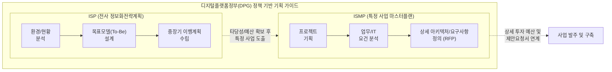

# ISP 및 ISMP 수립 공통가이드 9판

---

## I. 디지털플랫폼정부 구현 기틀, ISP 및 ISMP 수립 공통가이드 9판의 개요

* **정의**: 공공 정보화 사업의 적정성 검토 및 예산 편성 효율화를 위해, 디지털플랫폼정부(DPG) 원칙과 [[클라우드 네이티브]] 등 최신 기술 트렌드를 반영하여 행정안전부와 한국지능정보사회진흥원(NIA)이 개정한 정보화 사전 기획([[ISP (Information Strategy Plan)|ISP]]/[[ISMP]]) 통합 실무 지침
* **필요성**: 무분별한 정보시스템 구축 및 중복 투자 방지, 국가 예산 낭비 최소화, 클라우드 등 신기술 도입의 타당성 및 정책 부합성 사전 검증
* **특징**: 클라우드 네이티브 최우선(Cloud Native First) 적용 권고, 국민 중심의 공공 UI/UX 가이드라인 준수 의무화, 정보화 사업 기획 단계의 내실화를 통한 상세 제안요청서(RFP) 도출 체계화

---

## II. 공통가이드 9판의 기본 체계 및 핵심 점검 요소

### 가. 공통가이드 9판의 기본 수행 체계 및 프로세스

* 전사적 관점의 비전과 로드맵을 수립하는 ISP 단계 이후, 개별 사업의 구체적 실행 요건(기능/비기능/예산)을 도출하는 ISMP로 이어지는 계층적 기획 수행 체계 확립

### 나. 공통가이드 9판의 핵심 기술 및 점검 요소

| 구분 | 요소기술(키워드) | 세부 설명 |
| --- | --- | --- |
| **정책 동인** | DPG 기본원칙 | '민관 협력', '국민 중심', '하나의 정부' 등 디지털플랫폼정부 실현계획 부합성 검토 의무화 |
| **목표 아키텍처** | 클라우드 네이티브 우선 | 기존 레거시 인프라 중심에서 [[MSA (Micro Service Architecture)|MSA]], [[컨테이너]], CI/CD 기반 클라우드 네이티브 설계 최우선 검토 |
| **서비스/UX** | 공공 UI/UX 공통가이드 | 국민 편의성 극대화를 위한 '국민 중심 공공 웹·앱 UI/UX 공통가이드' 준수 및 사용자 여정 기반 설계 |
| **신기술 활용** | AI/데이터 지능화 기반 | 민간 AI 모델([[초거대 언어 모델|LLM]] 등) 도입 타당성 선행 분석 및 [[공공데이터]] 개방·공동활용(API) 전략 수립 |
| **보안 체계** | 제로 트러스트 적용 | 클라우드 전환에 따른 [[CSAP]](클라우드 보안인증) 준수 및 제로 트러스트([[제로 트러스트 보안모델|Zero Trust]]) 기반 동적 접근 제어 적용 |
| **예산 관리** | 클라우드 예산 산출 연계 | '행정·공공기관 클라우드 서비스 이용 요금 산출 가이드'를 반영한 구체적인 TCO/ROI 타당성 분석 |
| **수행 체계(ISP)** | To-Be 아키텍처 및 로드맵 | 조직 전체의 내·외부 환경 분석을 통한 목표 아키텍처(EA 관점) 및 중장기 사업 과제별 추진일정 수립 |
| **수행 체계(ISMP)** | 상세 요구사항 정의서(RFP) | 특정 시스템 구축 사업의 명확한 범위(Scope) 산정 및 기능·데이터·인터페이스 등 구체적 요구사항 도출 |

---

## III. 공통가이드 9판 기반 ISP와 ISMP 비교 및 고려사항

### 가. ISP와 ISMP의 상세 비교

| 비교 항목 | ISP (정보화전략계획) | ISMP (정보시스템 마스터플랜) |
| --- | --- | --- |
| **핵심 목적** | 기관/조직의 **전사적 중장기 정보화 비전 및 방향성** 수립 | 특정 정보화 구축 사업 발주를 위한 **상세 요구사항 및 예산 정의** |
| **추진 범위** | 전사(Enterprise) 범위의 전체 조직 및 비즈니스 [[프로세스]] | 개별(단위) 시스템 또는 특정 시스템 구축을 위한 연관 업무 프로세스 |
| **주요 산출물** | To-Be 아키텍처 설계서, 중장기 정보화 이행 로드맵 | [[요구사항 명세서]], 상세 시스템/데이터 구조도, **제안요청서(RFP)** |
| **적용 시점** | 중장기 전략 갱신 및 비즈니스 환경 변화 시 (통상 3~5년 주기) | 대규모 정보화 사업 기획 시(통상 50억 원 이상) 또는 신규 시스템 구축 전 |

### 나. 성공적인 공공 정보화 사업 추진을 위한 고려사항

* **실효성 있는 클라우드 전환 검토**: 단순 시스템 마이그레이션(Lift & Shift) 지양 및 마이크로서비스 아키텍처(MSA) 기반의 근본적 리팩토링 타당성 집중 검토
* **명확한 과업 범위 통제 체계 마련**: 정보화 사업 부실 방지를 위한 ISMP 요구사항 내실화 및 전문 [[PMO]](프로젝트 관리 조직) 조기 투입을 통한 일관된 품질 통제 체계 확립 필요

---

### 🔗 연관 토픽

- **소속 도메인**: [[00_경영전략_MOC|📈 경영전략]]
- **세부 분류**: `2. IT 거버넌스 & 엔터프라이즈 아키텍처 (EA/ISP)`
- **핵심 연관 토픽**:
  - [[ISMP|ISMP (Information System Master Plan)]]
  - [[ISP (Information Strategy Plan)]]
  - [[클라우드 네이티브]]
  - [[컨테이너|컨테이너 (Container)]]
  - [[CSAP|CSAP, CSAP(Cloud Security Assurance Program)]]
