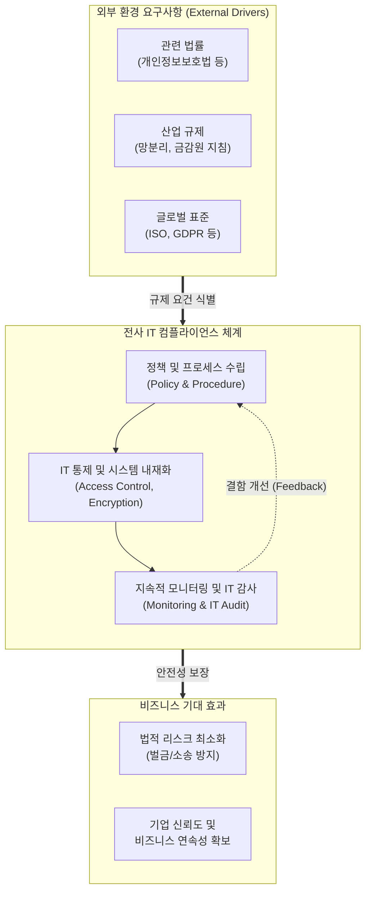

# IT 컴플라이언스 (IT Compliance)

---

## I. 지속 가능한 경영과 법적 리스크 통제를 위한 필수 요건, IT 컴플라이언스의 개요

* **정의**: 기업이 비즈니스 목표를 달성하기 위해 IT 시스템을 구축, 운영, 관리하는 전 과정에서 요구되는 관련 법규, 산업 표준, 사내 규정 등을 철저히 준수하고 리스크를 통제하는 체계 및 활동
* **필요성**: 대내외 규제 강화(개인정보, 금융보안, AI 등)에 따른 법적 처벌 및 과징금 방지, 기업의 신뢰도 및 투명성 제고, 정보 유출 등 사이버 보안 위협으로부터의 기업 자산 보호
* **특징**: IT 거버넌스의 핵심 영역인 '위험 관리(Risk Management)'를 실현하는 구체적 수단이며, 법률적 요구사항을 IT 시스템 아키텍처와 프로세스에 내재화(Compliance by Design)하는 특징을 가짐

---

## II. IT 컴플라이언스의 체계도 및 핵심 규제/기술 요소

### 가. IT 컴플라이언스 체계도 및 동작 원리

* 외부의 다양한 법률과 규제 요건을 식별하여 내부 IT 정책으로 수립하고, 이를 시스템에 내재화한 후 지속적인 감사(Audit)를 통해 피드백하는 선순환 통제 구조임

### 나. IT 컴플라이언스의 핵심 규제 및 기술 요소

| 분류 | 요소기술(키워드) | 세부 설명 |
| --- | --- | --- |
| **핵심 법규/규제** | GDPR / [[개인정보보호법]] | EU의 강력한 일반 개인정보보호 규정 및 국내 데이터 3법에 따른 정보 수집/이용/파기 규제 |
| **핵심 법규/규제** | SOX / 내부회계관리제도 | 기업 재무/회계 투명성 강화를 위한 미국 사베인스-옥슬리법 및 국내 IT 통제 기준 |
| **표준 및 인증** | [[ISMS-P]] / ISO 27001 | 국내 [[정보보호 및 개인정보보호 관리체계 인증]] 및 글로벌 정보보안 경영시스템 표준 |
| **지원 기술 (RegTech)** | RegTech (레그테크) | 규제(Regulation)와 기술(Technology)의 합성어로, AI/빅데이터를 활용한 자동화된 규제 준수 시스템 |
| **지원 기술 (RegTech)** | e-Discovery | 법적 분쟁 시 전자적 형태의 정보(ESI)를 식별, 수집, 보존, 분석하여 법정 증거로 제출하는 절차 및 기술 |
| **지원 기술 (RegTech)** | [[IAM]] (계정 및 접근 관리) | 강력한 접근 권한 통제 및 계정 생명주기 관리를 통해 비인가자의 정보 접근을 원천 차단 |
| **통제 및 감사** | 컴플라이언스 by Design | 시스템 기획 및 설계 초기 단계부터 법적 요구사항을 소프트웨어 아키텍처에 내재화하는 기법 |
| **통제 및 감사** | IT Audit (정보시스템 감사) | IT 시스템이 조직의 목표를 달성하고 법적 규제를 준수하는지 독립적으로 평가하고 보증하는 활동 |

---

## III. IT 컴플라이언스의 패러다임 변화 및 최신 동향

### 가. 기술 발전 및 규제 환경 변화에 따른 IT 컴플라이언스 대응 동향

| 구분 | 주요 트렌드 및 과제 | 핵심 키워드 및 대응 방안 |
| --- | --- | --- |
| **AI 컴플라이언스 의무화** | 생성형 AI 도입에 따른 데이터 무단 학습, 편향성, 저작권 침해 등의 법적 리스크 급증 | **EU AI Act, [[AI 기본법]]**, 설명 가능한 AI([[XAI]]) 도입 및 [[AI 윤리]] 가이드라인 내재화 |
| **클라우드 규제 완화/재편** | 공공/금융권의 획일적 망분리 규제 완화 및 클라우드 도입 확대에 따른 새로운 보안 통제 요구 | **[[CSAP]](클라우드 보안인증) 등급제**, 논리적 망분리, 제로 트러스트([[제로 트러스트 보안모델|Zero Trust]]) 아키텍처 적용 |
| **규제 준수 자동화** | 복잡해지는 글로벌 규제에 인력 중심 대응 한계 도달, 실시간 모니터링 요구 증대 | **RegTech, SupTech**(감독기술), 머신러닝 기반 이상 징후 자동 탐지 및 보고 자동화 체계 구축 |

* 최근 IT 컴플라이언스는 단순한 사후 규제 준수를 넘어, 비즈니스 기획 단계부터 법적 요건을 통합하는 **사전 예방적 통제 체계(Proactive Compliance)** 로 빠르게 진화하고 있음

---

### 🔗 연관 토픽

- **소속 도메인**: [[00_경영전략_MOC|📈 경영전략]]
- **세부 분류**: `3. 비즈니스 프로세스 혁신 & 디지털 전환 (DX)`
- **핵심 연관 토픽**:
  - [[ISMS-P]]
  - [[개인정보보호법]]
  - [[AI 윤리]]
  - [[IAM]]
  - [[AI 기본법]]
