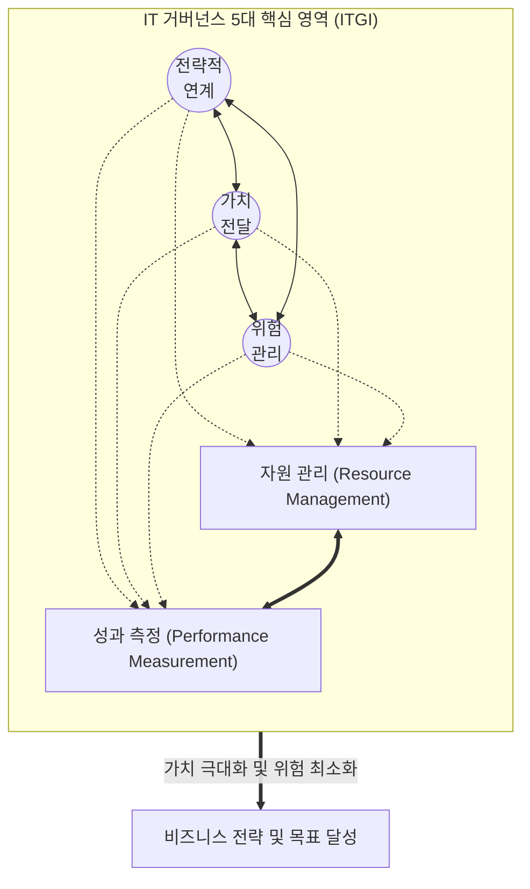

# IT 거버넌스 (IT Governance)

---

## I. 비즈니스 가치 창출과 리스크 통제를 위한 경영진의 책임, IT 거버넌스의 개요

* **정의**: 기업의 비즈니스 목표를 달성하기 위해 IT 자원을 효율적으로 활용하고, 관련 위험을 통제하여 IT 투자 가치를 극대화하기 위한 최고경영진 중심의 조직, [[프로세스]], 리더십 통제 체계
* **필요성**: 비즈니스와 IT 전략의 연계(Alignment) 필수, 대규모 IT 투자에 대한 가치 입증(ROI) 요구, 컴플라이언스(법적 규제) 및 사이버 보안 [[위험 대응]] 강화
* **특징**: 최고경영진 및 이사회의 책임(Accountability), 비즈니스 중심의 하향식(Top-Down) 의사결정 체계, IT 관리(Management)와 명확히 분리된 지배구조([[EDM]]) 확립

---

## II. IT 거버넌스의 핵심 영역 개념도 및 구성 요소

### 가. IT 거버넌스의 5대 핵심 도메인 개념도 (ITGI 기준)

* 비즈니스 전략과 IT의 연계(Strategic Alignment)를 중심으로 가치(Value)를 전달하고 위험(Risk)을 관리하며, 이를 뒷받침하기 위해 자원(Resource)을 투입하고 성과(Performance)를 지속적으로 측정하는 선순환 구조

### 나. IT 거버넌스의 핵심 기술 및 프레임워크 요소

| 분류 (구분) | 요소기술 (키워드) | 세부 설명 |
| --- | --- | --- |
| **핵심 영역 (Focus Area)** | 전략적 연계 (Strategic Alignment) | 비즈니스 전략과 IT 전략의 정렬, IT 기능이 기업의 목표와 비전에 부합하도록 계획 수립 |
| **핵심 영역 (Focus Area)** | 가치 전달 (Value Delivery) | IT 투자 예산 내에서 비즈니스 요구사항을 충족시키며, 약속된 최적의 경제적 이익(ROI) 창출 |
| **핵심 영역 (Focus Area)** | 위험 관리 (Risk Management) | IT 자산 보호, 재난 복구, 사이버 보안, 규제 준수(Compliance) 등 엔터프라이즈 리스크 통제 |
| **국제 표준 (Standard)** | ISO/IEC 38500 | IT 거버넌스의 글로벌 표준, 이사회의 3대 역할인 **EDM**(Evaluate, Direct, Monitor) 모델 제시 |
| **국제 표준 (Standard)** | 6대 원칙 (ISO 38500) | 책임(Responsibility), 전략([[Strategy (알고리즘 교체)|Strategy]]), 획득(Acquisition), 성과(Performance), 준수(Conformance), 인류 행동(Human Behavior) |
| **[[프레임워크]] (Framework)** | COBIT 2019 / COBIT 5 | ISACA에서 개발한 전사적 IT 통제 및 정보 및 기술 거버넌스 종합 프레임워크 |
| **프레임워크 (Framework)** | ITIL (IT Infrastructure Library) | IT 거버넌스의 전략 연계 및 가치 전달을 실무 수준에서 지원하는 IT 서비스 관리([[ITSM(Information Technology Service Management)|ITSM]]) Best Practice |
| **프레임워크 (Framework)** | EA (Enterprise Architecture) | 비즈니스, 데이터, 애플리케이션, 기술 인프라를 상호 연계하는 전사적 IT 구조화 도구 |

---

## III. IT 거버넌스 vs IT 관리 비교 및 최신 동향

### 가. IT 거버넌스(Governance)와 IT 관리(Management)의 비교 (COBIT 관점)

| 비교 항목 | IT 거버넌스 (Governance) | IT 관리 (Management) |
| --- | --- | --- |
| **핵심 목적** | 기업 목표 달성을 위한 **방향 제시 및 통제** | 방향성에 맞춘 IT 서비스의 **실행 및 운영** |
| **주요 주체** | 이사회 및 최고경영자 (BOD, CEO, [[CIO]]) | 실무 경영진 및 IT 관리자 (CIO, IT 부서장) |
| **핵심 프로세스 (COBIT)** | **EDM** (Evaluate, Direct, Monitor) | **PBRM** (Plan, Build, Run, Monitor) |
| **주요 활동** | 이해관계자 요구사항 평가, 지휘, 성과 모니터링 | IT 기획/조직(APO), 구축/도입(BAI), 운영/지원(DSS) |
| **관점(View)** | 전사적 비즈니스 중심 (Top-Down) | IT 프로세스 및 서비스 운영 중심 (Bottom-Up) |

### 나. 최근 IT 거버넌스 동향 및 향후 전망

* **애자일([[Agile]]) 거버넌스의 부상**: 기존의 무거운 통제 프로세스에서 벗어나, [[DevOps]] 및 [[클라우드 네이티브]] 환경에 맞춘 빠르고 유연한 경량화(Lightweight) 거버넌스로 전환
* **AI 및 신기술 거버넌스로의 확장**: [[초거대 언어 모델|LLM]] 등 생성형 AI 도입에 따른 데이터 프라이버시, 윤리, 편향성 문제를 통제하기 위한 AI 거버넌스([[AI 거버넌스|AI Governance]]) 체계 수립이 최우선 핵심 과제로 대두됨

---

### 🔗 연관 토픽

- **소속 도메인**: [[00_경영전략_MOC|📈 경영전략]]
- **세부 분류**: `1. 경영 환경 분석 & 전략 수립 프레임워크`
- **핵심 연관 토픽**:
  - [[CIO]]
  - [[ITSM(Information Technology Service Management)]]
  - [[IT 투자성과 평가]]
  - [[클라우드 네이티브]]
  - [[AI 거버넌스|AI 거버넌스 (AI Governance)]]
