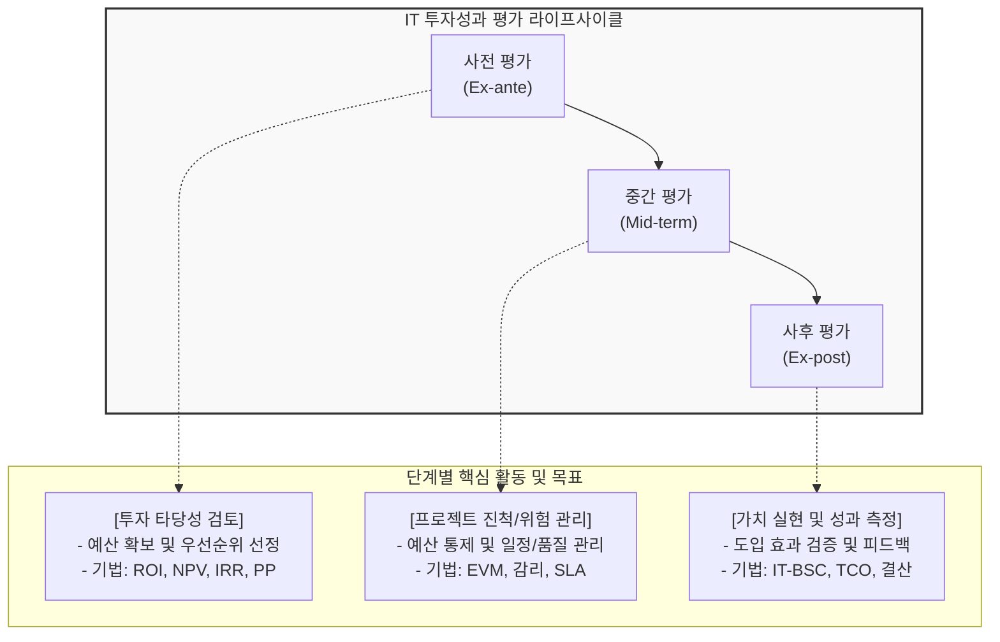

# IT 투자성과 평가

---

## I. 비즈니스 가치 입증을 위한 전략적 의사결정 도구, IT 투자성과 평가의 개요

* **정의**: 기업의 비즈니스 목표 달성을 위해 IT 투자의 타당성을 검토하고, 시스템 도입부터 운영, 폐기까지 전 과정에서 발생하는 비용 대비 효과를 정량적/정성적으로 측정하여 분석하는 지속적인 통제 활동
* **필요성**: 대규모 IT 투자의 불확실성 및 리스크 감소, 비즈니스와 IT의 전략적 연계(Alignment) 강화, 한정된 IT 자원의 최적 할당, 책임 투명성 확보([[IT 거버넌스]])
* **특징**: 사전/중간/사후에 이르는 전체 라이프사이클(Lifecycle) 관점 평가, 재무적(정량적) 지표와 비재무적(정성적) 지표의 균형적 활용

---

## II. IT 투자성과 평가의 라이프사이클 및 핵심 평가 기법

### 가. IT 투자성과 평가 라이프사이클 및 구성도

* 도입 전 타당성 분석(사전)부터 구축 과정의 위험 통제(중간), 완료 후 가치 실현 여부 확인(사후)까지 이어지는 순환적이고 지속적인 평가 [[프로세스]]

### 나. IT 투자성과 평가의 핵심 기법 및 구성 요소

| 구분 | 요소기술(키워드) | 세부 설명 |
| --- | --- | --- |
| **재무적 기법** | NPV (순현재가치) | 투자로 인해 발생할 미래의 모든 현금흐름을 현재 가치로 할인한 합 (NPV > 0 이면 타당) |
| **재무적 기법** | IRR (내부수익률) | 현금 유입의 현재가치와 유출의 현재가치를 같게(NPV=0) 만드는 이자율 (IRR > 자본비용 이면 타당) |
| **재무적 기법** | PP (투자회수기간) | 투자 원금을 완전히 회수하는 데 걸리는 시간 (짧을수록 위험도 감소 및 유리) |
| **재무적 기법** | ROI (투자수익률) | 총 투자비용 대비 총 누적수익의 비율 (단기적 타당성 지표로 널리 활용됨) |
| **비재무적 기법** | IT-[[BSC]] (균형성과표) | 기업 공헌, 사용자 관점, 운영 탁월성, 미래 지향성의 4가지 관점에서 전략적 정렬 평가 |
| **비재무적 기법** | 정보경제학 | 기존 재무적 분석에 무형의 위험(위험 프리미엄)과 가치를 점수화하여 계량화하는 평가 기법 |
| **종합 원가기법** | TCO (총소유비용) | 하드웨어/SW 도입 비용 외에 교육, [[유지보수]], 장애 등 숨겨진 간접비용까지 포함한 총 비용 |
| **불확실성 반영** | 실물옵션 (Real Option) | 불확실한 IT 환경에서 프로젝트를 지연, 확장, 포기할 수 있는 유연성에 대한 재무적 가치 산정 |

---

## III. 기존 평가 체계의 한계 및 최신 IT 투자 평가 동향

### 가. 전통적 평가 기법의 한계점과 대응 방안

| 구분 | 주요 한계점 | 극복 및 대응 방안 |
| --- | --- | --- |
| **단기/재무적 편중** | 재무적 수치(ROI 등)에만 집착하여 장기적 비즈니스 기여도 측정 불가 | 무형의 가치(고객 만족, 혁신성 등)를 반영하는 **IT-BSC 도입 및 확대** |
| **환경 변화 대응 부족** | 장기 프로젝트 진행 중 급변하는 기술/비즈니스 환경 반영 어려움 | 경영 유연성을 반영하는 **실물옵션(Real Option) 평가 기법** 활용 |

### 나. 클라우드 및 애자일 환경에서의 투자성과 평가 트렌드

* **FinOps (클라우드 재무 운영) 도입**: 단순 도입 비용이 아닌, 클라우드 종량제 환경에서의 지속적인 비용 최적화(Cost Optimization)와 비즈니스 가치 창출을 연계하는 FinOps 프레임워크가 필수 평가 지표로 부상
* **가치 스트림 기반 평가 (Value Stream Management)**: 전통적인 1회성 프로젝트 단위의 타당성 분석에서 벗어나, 애자일([[Agile]]) 조직 단위로 고객에게 지속적으로 전달되는 가치의 흐름(Lead Time, 품질 등)을 평가하는 방식으로 진화 중

---

### 🔗 연관 토픽

- **소속 도메인**: [[00_경영전략_MOC|📈 경영전략]]
- **세부 분류**: `1. 경영 환경 분석 & 전략 수립 프레임워크`
- **핵심 연관 토픽**:
  - [[IT 거버넌스]]
  - [[BSC|BSC (Balanced Scorecard), IT-BSC (IT-Balanced Scorecard)]]
  - [[IT-ROI 투자 성과평가 모델]]
  - [[Agile]]
  - [[디지털 전환|디지털 전환(DX)]]
