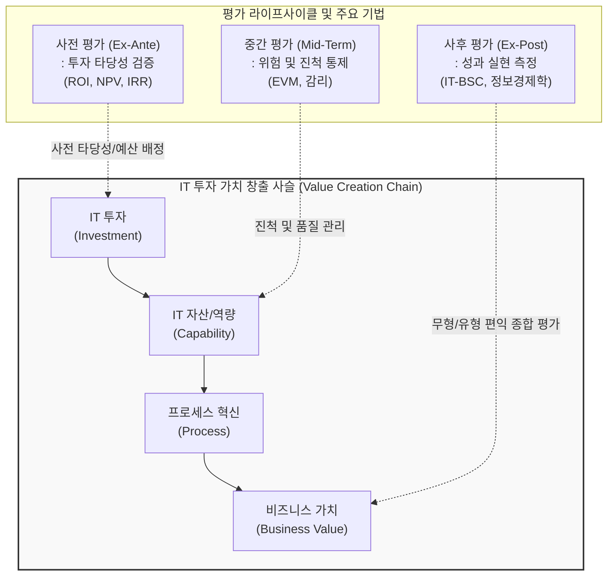

# IT-ROI 투자 성과평가 모델

---

## I. 비즈니스 가치 중심의 성과 측정 체계, IT-ROI 투자 성과평가 모델의 개요

* **정의**: IT 투자가 기업의 전략적 목표 달성과 비즈니스 가치 창출에 기여하는 정도를 사전/중간/사후에 걸쳐 재무적, 비재무적으로 계량화하여 측정하고 관리하는 종합 평가 [[프레임워크]]
* **필요성**: 대규모 IT 투자의 불확실성 통제, 단순 재무 지표(ROI)가 측정하지 못하는 무형자산 가치의 한계 극복, IT와 비즈니스 전략의 연계(Alignment) 증명
* **특징**: 전주기적(Lifecycle) 평가 수행, 정량적(비용절감, 매출증대) 지표와 정성적(고객만족도, 업무효율) 지표의 균형적 결합, 경영진의 합리적 의사결정 지원

---

## II. IT-ROI 투자 성과평가 모델의 개념도 및 핵심 평가 기법

### 가. IT-ROI 평가 라이프사이클 및 가치 창출 사슬 개념도

* IT 투자가 시스템 역량과 [[프로세스]] 개선을 거쳐 최종적인 재무적/비재무적 경영 성과로 이어지는 인과관계를 기반으로, 단계별로 적합한 기법을 적용하여 가치를 평가함

### 나. IT-ROI 투자 성과평가 모델의 핵심 기법 및 구성 요소

| 분류 (구분) | 평가 기법 / 요소기술 | 세부 설명 |
| --- | --- | --- |
| **정량적 (재무)** | 전통적 ROI / PP | 총투자비용 대비 총누적수익 비율(ROI) 및 투자원금 회수기간(PP) 측정 |
| **정량적 (재무)** | NPV / IRR | 화폐의 시간 가치를 고려하여 미래 현금흐름을 현재가치로 할인해 타당성 검증 |
| **비용 산출** | TCO (총소유비용) | SW/HW 초기 도입비뿐만 아니라 [[유지보수]], 교육, 장애 등 숨겨진 라이프사이클 전체 비용 |
| **정성적 (비재무)** | IT-[[BSC]] (균형성과표) | 재무, 고객, 내부프로세스, 학습 및 성장의 4대 관점에서 IT 투자의 다면적 성과 평가 |
| **종합 평가** | 정보경제학 (IE) | 전통적 재무 분석 결과에 무형의 비즈니스 가치(가점)와 IT 위험 요소(감점)를 계량화하여 합산 |
| **유연성 평가** | 실물 옵션 (Real Option) | 불확실한 비즈니스 환경에서 경영자가 프로젝트를 연기, 확대, 포기할 수 있는 전략적 유연성의 가치 산정 |
| **평가 거버넌스** | Val-IT | 기업의 IT 투자가 비즈니스 가치를 창출하도록 지원하는 ISACA의 IT 가치 거버넌스 프레임워크 |
| **성과 지표 체계** | CSF 및 KPI | 핵심 성공 요인(CSF)을 식별하고 이를 측정 가능한 구체적 핵심 성과 지표(KPI)로 연계 도출 |

---

## III. 기존 IT-ROI 평가의 한계점 극복 및 최신 동향

### 가. 클라우드 및 애자일 패러다임 전환에 따른 IT 성과평가 동향

| 구분 | 주요 트렌드 및 과제 | 핵심 키워드 및 대응 기법 |
| --- | --- | --- |
| **클라우드 재무 관리** | 자본지출(CapEx) 중심의 사전 ROI 평가 한계, 클라우드 종량제 환경(OpEx)에 맞춘 실시간 비용 최적화 요구 | **FinOps 프레임워크**, 클라우드 단위 경제(Unit Economics), 실시간 비용-편익 가시성 확보 |
| **애자일 성과 측정** | 1회성 프로젝트 단위의 평가에서 벗어나 지속적 배포 환경에서의 고객 가치 창출 흐름 평가 | **VSM (Value Stream Management)**, 리드타임 단축, 제품 기반(Product-led) 지속적 성과 평가 |
| **AI 투자 성과 입증** | 생성형 AI 등 신기술의 불확실한 ROI 한계 극복을 위한 비재무적 가치(직원 생산성, 창의성 등)의 정량화 필요 | **AI 실물 옵션 평가**, 마이크로 ROI(업무 단위의 미시적 생산성 향상 측정) 도입 |

* 최근의 IT-ROI 평가는 단순한 재무적 타당성 통과 목적을 넘어, 지속적인 비즈니스 가치 전달 속도와 클라우드 비용 효율성을 실시간으로 모니터링하는 동적 가치 관리 체계로 진화하고 있음

---

### 🔗 연관 토픽

- **소속 도메인**: [[00_경영전략_MOC|📈 경영전략]]
- **세부 분류**: `1. 경영 환경 분석 & 전략 수립 프레임워크`
- **핵심 연관 토픽**:
  - [[BSC|BSC (Balanced Scorecard), IT-BSC (IT-Balanced Scorecard)]]
  - [[IT 투자성과 평가]]
  - [[IT 거버넌스]]
  - [[비즈니스 연속성 계획]]
  - [[고객여정지도|고객여정지도 (Customer Journey Map)]]
