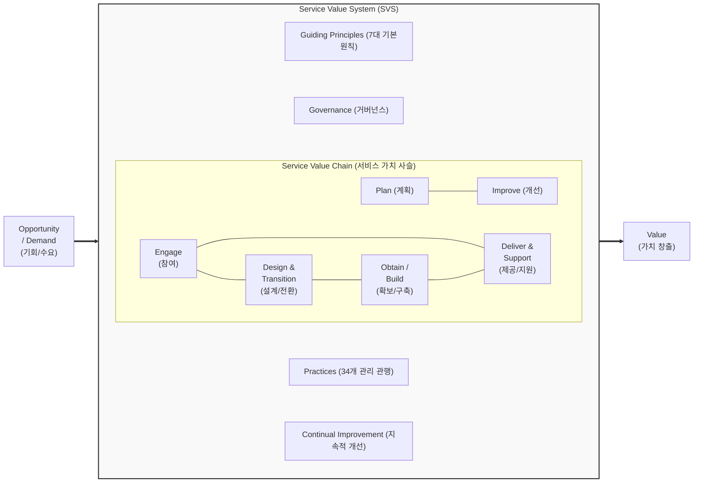

# ITIL 4.0 (IT Infrastructure Library 4.0)

---

## I. 디지털 시대의 가치 공동 창출을 위한 ITSM 프레임워크, ITIL 4.0의 개요

* **정의**: 디지털 트랜스포메이션 환경에서 비즈니스와 IT의 통합을 통해 이해관계자 간의 서비스 가치 공동 창출(Co-creation)을 지원하는 최신 IT 서비스 관리([[ITSM(Information Technology Service Management)|ITSM]]) [[프레임워크]]
* **등장배경**: 기존 ITIL v3의 선형적 [[프로세스]](Lifecycle) 한계 극복, 애자일([[Agile]]), 데브옵스([[DevOps]]), 린([[린 방법론|Lean]]) 등 최신 IT 개발 및 운영 트렌드의 유연한 수용 필요성 대두
* **특징**: 서비스 가치 시스템(SVS) 중심 아키텍처, 34개 프랙티스(Practices)로의 확장, 서비스 제공자와 소비자 간의 가치 공동 창출(Value Co-creation) 강조

---

## II. ITIL 4.0의 개념도 및 핵심 구성 요소

### 가. ITIL 4.0의 서비스 가치 시스템(SVS) 개념도

* 조직의 모든 구성요소와 활동이 유기적으로 결합하여, 수요와 기회(Demand/Opportunity)를 기반으로 비즈니스 가치(Value)를 창출하는 엔드투엔드([[End-to-End]]) 시스템 구조임

### 나. ITIL 4.0의 핵심 기술 및 구성 요소

| 구분 | 요소기술(키워드) | 세부 설명 |
| --- | --- | --- |
| **핵심 체계** | SVS (Service Value System) | 조직의 활동과 구성요소가 시스템적으로 연계되어 가치를 창출하는 핵심 프레임워크 |
| **핵심 체계** | SVC (Service Value Chain) | PIEDOD(계획, 개선, 참여, 설계/전환, 확보/구축, 제공/지원)로 구성된 6가지 가치 창출 활동 |
| **운영 모델** | Four Dimensions (4차원 모델) | 조직/사람, 정보/기술, 파트너/공급자, 가치스트림/프로세스의 4가지 통합 관리 차원 |
| **의사결정 지침** | Guiding Principles (7대 원칙) | 가치 집중, 현 상태에서 시작, 피드백 기반 반복 등 조직 변화 관리의 핵심 행동 지침 |
| **실행 관행** | 34 Practices | 기존 v3의 26개 프로세스를 일반(14), 서비스(17), 기술(3) 관리의 34개 관행으로 재편 및 확장 |
| **핵심 철학** | Value Co-creation (공동 창출) | 일방적인 가치 전달(Delivery)이 아닌, 공급자와 소비자의 상호작용을 통한 가치 공동 창출 |
| **통제 체계** | Governance (거버넌스) | IT 활동이 조직의 비즈니스 전략과 일치하도록 방향을 설정하고, 모니터링 및 통제하는 체계 |
| **개선 체계** | Continual Improvement | 서비스, 관행, SVS 전반의 효율성과 효과성을 지속적으로 향상시키기 위한 반복적 개선 활동 |

---

## III. ITIL v3와 ITIL 4.0 비교 및 활용 전망

### 가. ITIL v3와 ITIL 4.0의 핵심 비교

| 비교 항목 | ITIL v3 (2011) | ITIL 4.0 (2019~) |
| --- | --- | --- |
| **핵심 아키텍처** | 서비스 수명주기 (Service Lifecycle) | **서비스 가치 시스템 (SVS)** |
| **가치(Value) 관점** | 가치 전달 (Value Delivery) | **가치 공동 창출 (Value Co-creation)** |
| **프로세스 구조** | 26개 프로세스 (Process), 4개 기능 | **34개 관리 관행 (Practices)** |
| **수행 및 접근방식** | [[워터폴|폭포수]](Waterfall) 모델, 선형적 접근 | **애자일(Agile), 데브옵스(DevOps), 린(Lean) 결합** |
| **관심 영역** | IT 운영 및 서비스 데스크 중심 | **전사적 비즈니스 및 디지털 트랜스포메이션(DX)** |

### 나. 최신 기술 환경에서의 ITIL 4.0 적용 전망

* **AIOps 기반 지능형 ITSM 통합**: 머신러닝 기반 장애 예측(AIOps) 및 챗봇 연계를 통해 34개 관행(Practices) 중 '인시던트 관리' 및 '서비스 데스크' 영역의 초자동화(Hyperautomation) 구현
* **[[클라우드 네이티브]] 거버넌스 확립**: 멀티/하이브리드 클라우드 환경에서 빠른 서비스 배포(CI/CD)를 지원하면서도, 안정성과 컴플라이언스를 보장하는 최적의 IT 운영 프레임워크로 지속 발전 중

---

### 🔗 연관 토픽

- **소속 도메인**: [[00_경영전략_MOC|📈 경영전략]]
- **세부 분류**: `2. IT 거버넌스 & 엔터프라이즈 아키텍처 (EA/ISP)`
- **핵심 연관 토픽**:
  - [[ITSM(Information Technology Service Management)]]
  - [[클라우드 네이티브]]
  - [[린 방법론|린 (Lean) 방법론]]
  - [[Agile]]
  - [[DevOps|데브옵스 (DevOps)]]
