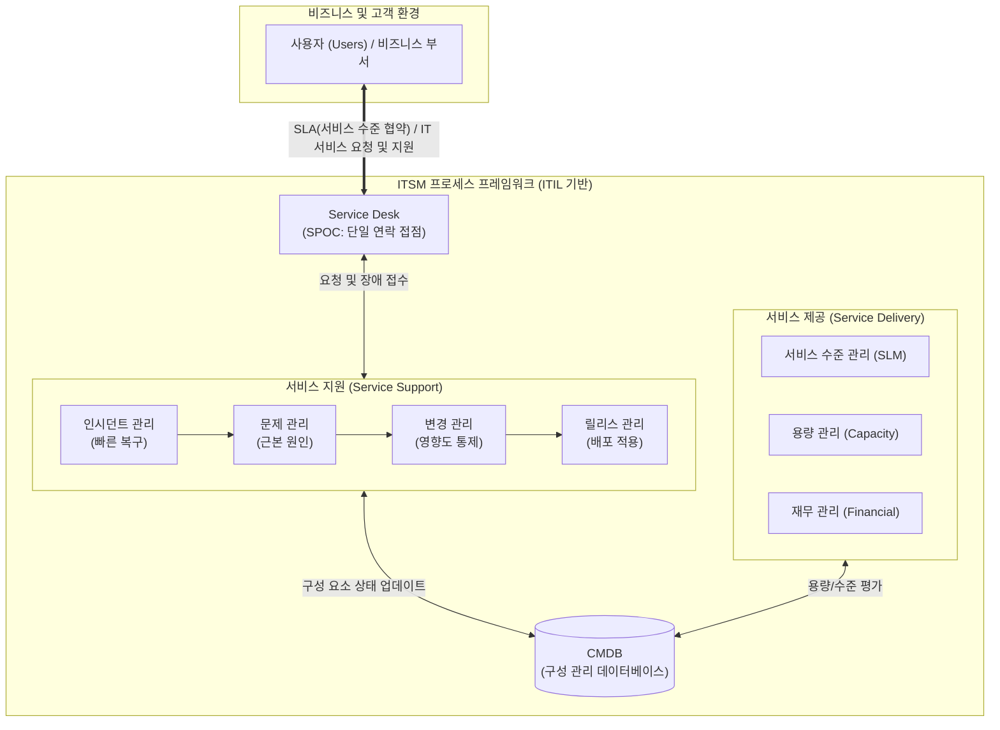

# ITSM (Information Technology Service Management)

---

## I. 비즈니스 가치 창출을 위한 IT 서비스 중심 관리 체계, ITSM의 개요

* **정의**: 기업의 비즈니스 목표를 지원하기 위해 고객(내부/외부)에게 제공되는 IT 서비스를 기획, 설계, 제공, 운영, 그리고 지속적으로 개선하는 [[프로세스]] 기반의 종합 IT 관리 체계
* **배경 및 필요성**: 과거 IT 인프라/기술 중심의 관리에서 비즈니스/고객 관점의 서비스 제공으로 패러다임 전환, IT 서비스 품질 보장(SLA) 및 비용 효율성 확보 요구 증대
* **특징**: 프로세스 중심(Process-oriented)의 통제, 단일 접점(SPOC) 제공, 지속적 서비스 개선(CSI: Continual Service Improvement)을 통한 IT와 비즈니스의 연계 강화

---

## II. ITSM의 개념도 및 핵심 구성 요소

### 가. ITSM의 논리적 아키텍처 및 동작 원리

* 사용자와의 단일 접점인 서비스 데스크(Service Desk)를 통해 요청을 접수하고, 구성 관리 DB(CMDB)를 기반으로 서비스 지원 및 제공 프로세스가 유기적으로 상호작용하여 IT 서비스 품질을 유지함

### 나. ITSM의 핵심 기술 및 프로세스 요소

| 분류 | 요소기술(키워드) | 세부 설명 |
| --- | --- | --- |
| **운영 [[프레임워크]]** | ITIL (IT Infrastructure Library) | ITSM 구현을 위한 세계적인 최고 실무 관행(Best Practice) 집대성 프레임워크 |
| **품질/표준 통제** | [[SLA|SLA (Service Level Agreement)]] | IT 서비스 제공자와 고객 간에 서비스의 수준을 명확히 정의하고 합의한 공식 문서 |
| **고객 접점** | Service Desk (서비스 데스크) | 장애 신고, 서비스 요청 등 사용자와 IT 조직 간의 모든 커뮤니케이션을 담당하는 단일 접점(SPOC) |
| **핵심 DB** | CMDB (구성 관리 [[데이터베이스]]) | 하드웨어, 소프트웨어, 문서 등 모든 IT 구성 요소(CI)의 정보와 상호 관계를 저장하는 중앙 리포지토리 |
| **서비스 지원** | Incident Mgt. (인시던트 관리) | 장애 발생 시 서비스 중단 시간을 최소화하고 최대한 빨리 정상 상태로 복구하는 프로세스 |
| **서비스 지원** | Problem Mgt. (문제 관리) | 인시던트의 근본 원인(Root Cause)을 찾아 제거하여 유사한 장애의 재발을 방지하는 프로세스 |
| **서비스 지원** | Change Mgt. (변경 관리) | IT 환경의 변경 사항을 승인하고 통제하여 비즈니스 서비스에 미치는 위험과 영향을 최소화 |
| **국제 인증 표준** | ISO/IEC 20000 | IT 서비스 관리(ITSM) 체계에 대한 국제 인증 표준 규격 (ITIL 기반으로 설계됨) |

---

## III. ITSM과 IT 거버넌스의 비교 및 최신 동향

### 가. ITSM과 IT 거버넌스(IT Governance)의 비교

| 비교 항목 | ITSM (IT 서비스 관리) | [[IT 거버넌스]] (IT Governance) |
| --- | --- | --- |
| **핵심 목적** | 고품질 **IT 서비스 제공** 및 운영 효율성 극대화 | 비즈니스 목표 달성을 위한 **IT 방향 제시 및 리스크 통제** |
| **주요 관점** | Bottom-Up (운영 중심, 실무적 접근) | Top-Down (경영 중심, 전략적 접근) |
| **주요 주체** | IT 실무자, IT 서비스 관리자 | 최고경영진(CEO), 이사회(BOD), [[CIO]] |
| **핵심 프로세스** | 인시던트, 문제, 변경 관리, SLM | [[EDM]] (평가, 지휘, 모니터링), 가치 전달, 위험 관리 |
| **대표 프레임워크** | ITIL, ISO 20000 | COBIT, ISO 38500 |

### 나. 최근 ITSM 패러다임 변화 및 동향

* **ITIL 4.0으로의 진화**: 기존 수명주기(Lifecycle) 중심에서 애자일([[Agile]]), 데브옵스([[DevOps]]), 린([[린 방법론|Lean]])을 통합한 '서비스 가치 시스템(Service Value System)' 및 가치 공동 창출 중심으로 전환
* **지능형 ITSM (AIOps 결합)**: 머신러닝 모델을 CMDB 및 모니터링 로그에 적용하여, 장애를 사전에 예측하고 자동으로 인시던트를 처리하는 초자동화(Hyperautomation) 환경으로 발전 중

---

### 🔗 연관 토픽

- **소속 도메인**: [[00_경영전략_MOC|📈 경영전략]]
- **세부 분류**: `2. IT 거버넌스 & 엔터프라이즈 아키텍처 (EA/ISP)`
- **핵심 연관 토픽**:
  - [[IT 거버넌스]]
  - [[CIO]]
  - [[ISO 38500 2024|ISO 38500:2024]]
  - [[ITIL(IT Infrastructure Library) 4.0]]
  - [[DevOps|데브옵스 (DevOps)]]
