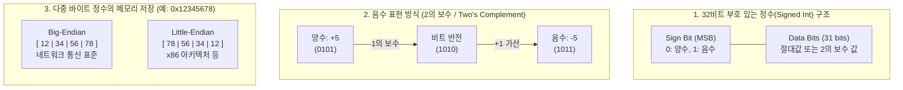

# Int Type(정수형)

---

## I. 데이터 표현의 기본 단위, Int Type(정수형)의 개요

* **정의**: 컴퓨터 시스템에서 소수점이 없는 숫자(양수, 0, 음수)를 표현하기 위해 고정된 크기(비트 수)의 메모리 공간을 할당하여 데이터를 저장하고 연산하는 기본 원시 자료형(Primitive [[Data Type]])
* **등장배경 및 특징**:
* **연산 효율성**: 부동소수점(Floating-point) 연산 대비 ALU(산술논리연산장치)를 통한 고속 산술 연산 및 주소 계산에 최적화
* **정확성 보장**: 근사치를 사용하는 부동소수점과 달리 표현 범위 내에서는 정밀도 오차(Rounding Error) 없이 정확한 값을 보장
* **시스템 아키텍처 종속성**: [[CPU]] 레지스터 크기 및 OS 아키텍처(32비트/64비트)에 따라 기본 크기(Word Size)가 결정되며, 엔디안(Endianness)에 따른 바이트 정렬 고려 필요

---

## II. Int Type의 개념도 및 핵심 기술 요소

### 가. Int Type의 메모리 표현 원리 및 바이트 정렬 개념도

* 컴퓨터는 뺄셈 연산을 가산기로 통합 처리하기 위해 음수를 **2의 보수**로 표현함.
* 다중 바이트 정수는 시스템에 따라 메모리에 저장되는 바이트 순서(Endianness)가 다르므로 네트워크 통신 시 주의가 필요함.

### 나. Int Type의 핵심 기술 요소

| 분류 | 요소기술(키워드) | 세부 설명 |
| --- | --- | --- |
| **메모리 표현** | **2의 보수 (Two's Complement)** | 가산기를 이용해 뺄셈을 덧셈으로 처리하기 위한 컴퓨터의 표준 음수 표현법 (1의 보수 + 1) |
| **메모리 표현** | **MSB (Sign Bit)** | 최상위 비트(Most Significant Bit)를 부호 식별에 사용 (0: 양수, 1: 음수) |
| **표현 범위** | **Signed / Unsigned** | 부호 비트 유무. Unsigned는 모든 비트를 데이터로 사용하여 양수 표현 범위를 2배로 확장 |
| **크기 체계** | **고정 크기 정수 (Fixed-width)** | 플랫폼 종속성 해결을 위해 크기를 명시한 자료형 (C/C++의 `<stdint.h>`, 예: `int32_t`, `uint64_t`) |
| **데이터 결함** | **오버플로우 (Overflow)** | 연산 결과가 할당된 비트가 표현할 수 있는 최대/최소 범위를 초과하여 랩어라운드(Wrap-around)되는 현상 |
| **데이터 변환** | **부호 확장 (Sign Extension)** | 작은 크기의 정수를 큰 크기의 자료형으로 캐스팅할 때 빈 공간을 원래의 부호 비트로 채워 값을 유지하는 기법 |
| **데이터 저장** | **엔디안 (Endianness)** | 연속된 바이트를 메모리에 저장하는 순서. 최상위 바이트를 먼저 저장(Big)하거나 최하위 바이트를 먼저 저장(Little) |
| **확장 기술** | **BigInt (임의 정밀도 정수)** | 고정된 비트 한계를 넘어 동적 메모리 할당 알고리즘을 통해 무한대에 가까운 큰 정수를 연산하는 기술 (Python 기본 지원) |

---

## III. Int Type과 부동소수점(Float Type) 비교 및 활용 시 고려사항

### 가. Int Type과 Float Type의 비교

| 비교 항목 | Int (정수형) | Float (부동소수점형) |
| --- | --- | --- |
| **저장 포맷** | 2의 보수 (부호 비트 + 데이터 비트) | IEEE 754 표준 (부호 비트 + 지수부 + 가수부) |
| **표현의 정확성** | 표현 범위 내에서 100% **정확한 값(Exact)** 보장 | 근사치 표현 (정밀도 한계로 인한 **Rounding Error** 발생) |
| **연산 방식/속도** | CPU의 ALU 이용 / **매우 빠름** | FPU (Floating Point Unit) 연산 / 상대적으로 느림 |
| **주요 한계점** | 표현 범위의 한계 (**오버플로우/언더플로우** 취약) | 해상도의 한계 (정보의 손실, 엡실론 오차 발생) |
| **주요 활용처** | 반복문 카운터, 배열 인덱스, 암호학, 비트 연산 | 과학 계산, 3D 그래픽 렌더링, 통계적 분석 |

### 나. 개발 및 활용 시 시사점(보안 측면)

* **정수형 오버플로우 공격 방어**: 반복문 인덱스나 버퍼 크기 계산 시 발생하는 정수 오버플로우/언더플로우는 버퍼 오버플로우(BOF) 등 심각한 보안 취약점의 원인이 되므로, 시큐어 코딩 규칙(예: 연산 전 범위 체크) 적용 필수.
* **시스템 호환성 확보**: 분산 시스템이나 이기종 아키텍처 간 데이터 통신 직렬화 시, 반드시 명시적 크기를 가지는 타입(`int32_t`)과 네트워크 바이트 오더(Big-Endian) 변환 함수(`htonl()`, `ntohl()`)를 사용하여 데이터 정합성을 보장해야 함.

---

### 🔗 연관 토픽

- **소속 도메인**: [[00_컴퓨터구조_MOC|💻 컴퓨터구조]]
- **세부 분류**: `2. 캐시 & 메모리 계층 구조 · 스토리지`
- **핵심 연관 토픽**:
  - [[Data Type]]
  - [[CPU]]
  - [[Stack]]
  - [[가상 메모리]]
  - [[메모리 관리]]
