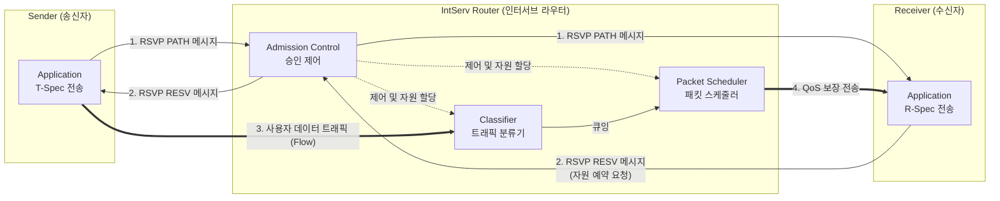

# IntServ (Integrated Services)

---

## I. 종단 간 확정적 QoS 보장 모델, IntServ의 개요

* **정의**: IP 네트워크에서 어플리케이션의 트래픽을 전송하기 전에 RSVP 프로토콜을 사용하여 종단 간([[End-to-End]]) 경로 상의 라우터에 개별 플로우(Flow) 단위로 대역폭 자원을 사전에 예약하는 절대적(Hard) [[QoS]] 보장 모델
* **등장 배경 및 필요성**:
* **Best-Effort 기반 IP 망의 한계**: 지연(Delay), 지터(Jitter), 패킷 손실로 인해 실시간 트래픽(음성, 화상회의 등)의 통신 품질 저하 발생
* **보장형 서비스 요구**: 멀티미디어 서비스 확대로 트래픽 낭비 없이 대역폭을 독점적으로 할당받을 수 있는 엄격한 트래픽 제어 메커니즘 필요

* **특징**:
* **Per-Flow State 유지**: 라우터가 통신 중인 각 플로우의 상태 정보를 메모리에 유지(Stateful)
* **사전 시그널링(Signaling)**: 데이터 패킷 전송 전 RSVP(Resource Reservation Protocol)를 통한 네트워크 자원 예약 절차 선행

---

## II. IntServ의 개념도 및 핵심 구성요소

### 가. IntServ의 동작 개념도

* 송신자가 PATH 메시지로 트래픽 특성을 알리면 수신자가 RESV 메시지로 예약을 요청하고, 경로상 라우터는 Admission Control을 통해 가용 자원을 확인 후 자원을 예약함.

### 나. IntServ의 핵심 기술 요소

| 분류 | 핵심 기술(키워드) | 세부 설명 |
| --- | --- | --- |
| **시그널링** | **RSVP** (Resource Reservation Protocol) | 데이터 전송 전 종단 간 라우터에 대역폭, 버퍼 등 자원을 예약하기 위한 단방향 기반 제어 [[프로토콜]] |
| **트래픽 정의** | **T-Spec** (Traffic Specification) | 송신자가 발생시킬 트래픽의 특성(최대 데이터 전송률, 토큰 버킷 크기 등)을 명시하는 매개변수 |
| **품질 요구** | **R-Spec** (Reservation Specification) | 수신자가 네트워크 라우터에 요구하는 QoS 수준(대역폭, 패킷 지연 한계 등)을 명시하는 매개변수 |
| **[[라우터]] 제어** | **Admission Control** (승인 제어) | 라우터가 수신자의 요구(R-Spec)를 처리할 충분한 가용 자원이 있는지 판단하여 예약을 승인/거절하는 기능 |
| **라우터 제어** | **Classifier** (분류기) | 라우터로 유입되는 패킷의 헤더(IP, Port 등)를 분석하여 해당 패킷이 예약된 플로우(Flow)에 속하는지 식별 |
| **라우터 제어** | **Packet Scheduler** ([[스케줄러]]) | 식별된 패킷들을 큐([[Queue]])에 배치하고 예약된 QoS 요구사항에 맞춰 우선순위 기반으로 포워딩([[WFQ]] 등 활용) |
| **상태 관리** | **Soft State** (소프트 상태) | 예약된 정보는 영구적이지 않으며, 주기적인 RSVP 메시지로 갱신되지 않으면 일정 시간([[Timeout]]) 후 예약 해제됨 |
| **제어 단위** | **Flow** (플로우) | 동일한 송수신 IP, 포트번호, 프로토콜(5-Tuple)을 가지는 단일 통신 [[세션]] (IntServ의 QoS 보장 최소 단위) |

---

## III. IntServ와 DiffServ 비교 및 향후 전망

### 가. IntServ와 DiffServ(Differentiated Services) 비교

| 비교 항목 | IntServ (Integrated Services) | [[DiffServ (Differentiated Services)]] |
| --- | --- | --- |
| **QoS 보장 단위** | **개별 플로우 (Per Flow) 기반** | **트래픽 [[클래스]] (Per Class) 기반** |
| **QoS 보장 수준** | 절대적 품질 보장 (Hard QoS) | 상대적 우선순위 보장 (Soft QoS) |
| **시그널링 유무** | RSVP를 통한 사전 자원 예약 수행 | 사전 예약 없음 (트래픽 마킹(DSCP) 방식) |
| **라우터 상태** | Stateful (모든 플로우의 상태 정보 유지) | Stateless (플로우 상태 유지 불필요) |
| **네트워크 확장성** | **낮음** (대규모 망 적용 시 라우터 오버헤드 극심) | **높음** (대규모 코어 망 적용에 적합) |
| **시스템 복잡도** | 망 내 모든 라우터에 과부하 집중 우려 | 엣지 라우터에 복잡성 집중, 코어 라우터는 단순화 |

### 나. 향후 전망 및 활용 시사점

* **확장성 한계 극복을 위한 혼합 아키텍처**: IntServ는 코어 망 라우터에 심각한 병목 현상을 유발하므로, 가입자 엑세스/엣지 망에서는 IntServ를 적용하고 백본(코어) 망에서는 DiffServ를 적용하는 **IntServ over DiffServ** 하이브리드 모델이 산업계 표준으로 정착됨.
* **진화 방향**: 개별 플로우의 사전 자원 예약 및 경로 제어 개념은 5G/6G 환경의 **[[네트워크 슬라이싱]](Network Slicing)** 및 [[SDN(Software Defined Network)|SDN]](Software Defined Networking) 기반의 동적 트래픽 엔지니어링 기술로 계승 및 발전하여 초저지연(URLLC) 서비스 보장에 활용되고 있음.

---

### 🔗 연관 토픽

- **소속 도메인**: [[00_네트워크_MOC|🌐 네트워크]]
- **세부 분류**: `1. OSI 7계층 & 데이터링크 계층 (L1/L2)`
- **핵심 연관 토픽**:
  - [[DiffServ (Differentiated Services)]]
  - [[QoS|QoS (Quality of Service)]]
  - [[네트워크 슬라이싱]]
  - [[프로토콜]]
  - [[라우터]]
