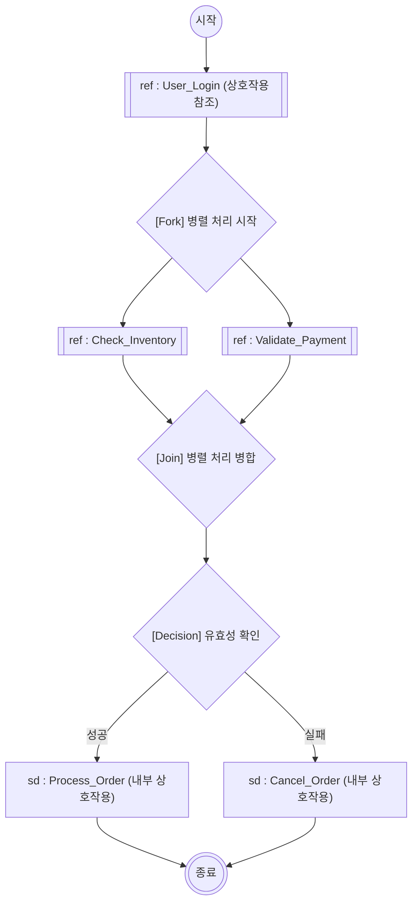

# Interaction Overview Diagram

---

## I. 복잡한 상호작용의 거시적 제어, Interaction Overview Diagram의 개요

* **정의**: 시스템 상호작용의 복잡성을 줄이기 위해 활동 다이어그램(Activity Diagram)의 제어 흐름(Control Flow) 구조 내에 상호작용 다이어그램(Sequence, Communication 등)을 결합하여, 전체 시스템의 상호작용 흐름을 조감도처럼 모델링하는 [[UML]] 2.0 행위(Behavioral) 다이어그램
* **등장 배경 및 필요성**:
* 단일 순차 다이어그램의 복잡성 한계: 조건 분기(if-else)나 병렬 처리(루프)가 많은 복잡한 시나리오를 하나의 다이어그램으로 표현 시 가독성 저하
* 하향식(Top-Down) 설계 지원: 시스템의 거시적 흐름을 먼저 정의하고, 각 단계를 세부 상호작용으로 모듈화하여 설계의 [[추상화]] 수준 향상

* **특징**: 상호작용 [[모듈화]](참조 [[재사용]]), 활동 다이어그램 기반의 명확한 제어 로직(조건/병렬) 시각화

---

## II. Interaction Overview Diagram의 개념도 및 핵심 기술 요소

### 가. Interaction Overview Diagram의 동작 개념도

* 활동 다이어그램의 제어 노드(Fork, Join, Decision)를 활용하여 상호작용 묶음 간의 실행 순서, 분기, 병렬 처리를 시각적으로 명세함.

### 나. Interaction Overview Diagram의 핵심 구성 요소

| 구분 | 구성 요소 (키워드) | 세부 설명 및 표기법 |
| --- | --- | --- |
| **상호작용 요소** | **Interaction Use (`ref`)** | 외부에 별도로 정의된 상호작용 다이어그램을 호출하여 재사용 / 사각형 안에 `ref` 키워드 표기 |
| **상호작용 요소** | **Inline Interaction (`sd`)** | 다이어그램 내부에서 직접 상호작용(예: Sequence) 흐름을 정의 / 사각형 안에 `sd` 키워드 표기 |
| **제어 노드** | **Initial / Final Node** | 전체 상호작용 흐름의 시작점(채워진 원)과 종료점(이중 원)을 나타냄 |
| **제어 노드** | **Decision / Merge** | 조건에 따른 제어 흐름 분기(Decision) 및 분기된 흐름의 병합(Merge) / 마름모로 표기 |
| **제어 노드** | **Fork / Join** | 동시(병렬)에 실행되는 상호작용의 분할(Fork) 및 동기화 병합(Join) / 굵은 가로(세로) 선으로 표기 |
| **연결 요소** | **Control Flow** | 상호작용 간의 제어 실행 순서를 나타내는 방향성 있는 실선 (화살표) |
| **경계 요소** | **Frame** | 다이어그램 전체를 둘러싸는 외곽선으로, 좌측 상단에 `int` 키워드와 함께 다이어그램 이름 명시 |

---

## III. Activity Diagram과의 비교 및 활용 전망

### 가. Activity Diagram과 Interaction Overview Diagram 비교

| 비교 항목 | Activity Diagram (활동 다이어그램) | Interaction Overview Diagram (상호작용 개요 다이어그램) |
| --- | --- | --- |
| **핵심 목적** | 비즈니스 [[프로세스]] 및 알고리즘의 절차적 모델링 | 시스템 내부 컴포넌트/객체 간 상호작용 시나리오의 거시적 요약 |
| **기본 실행 단위** | **Action** (개별 작업/행위) | **Interaction** (상호작용 묶음: Sequence, Communication 등) |
| **포커스 관점** | 데이터 및 제어 흐름 중심 (What to do) | 메시지 교환 기반의 통신 흐름 중심 (How to interact) |
| **UML 분류** | 행위(Behavioral) 다이어그램 | 행위(Behavioral) > 상호작용(Interaction) 다이어그램 |
| **재사용성** | Sub-Activity 호출 방식 | `ref` 키워드를 통한 다이어그램 단위 재사용성 극대화 |

### 나. 향후 전망 및 활용 시사점

* **[[MSA (Micro Service Architecture)|MSA]] 통신 흐름 설계**: 마이크로서비스 아키텍처(MSA) 환경에서 서비스 간 복잡한 Choreography 및 Orchestration 통신 시나리오를 설계하고 문서화하는 거시적 표준 도구로 활용 가치 증대.
* **[[Agile]] 및 시스템 고도화**: 레거시 시스템 분석 시 복잡한 순차 다이어그램을 역공학하여 하나의 Overview로 통합함으로써, 도메인 주도 설계([[DDD (Domain Driven Design)|DDD]])의 컨텍스트 맵(Context Map) 및 비즈니스 워크플로우 분석을 위한 브릿지 역할을 수행함.

---

### 🔗 연관 토픽

- **소속 도메인**: [[00_소프트웨어공학_MOC|🏗️ 소프트웨어공학]]
- **세부 분류**: `3. 요구사항 공학 & UML 객체지향 분석/설계`
- **핵심 연관 토픽**:
  - [[추상화|추상화 (Abstraction)]]
  - [[모듈화|모듈화 (Modularity)]]
  - [[UML|UML (정적, 동적 다이어그램)]]
  - [[MSA (Micro Service Architecture)]]
  - [[Agile]]
