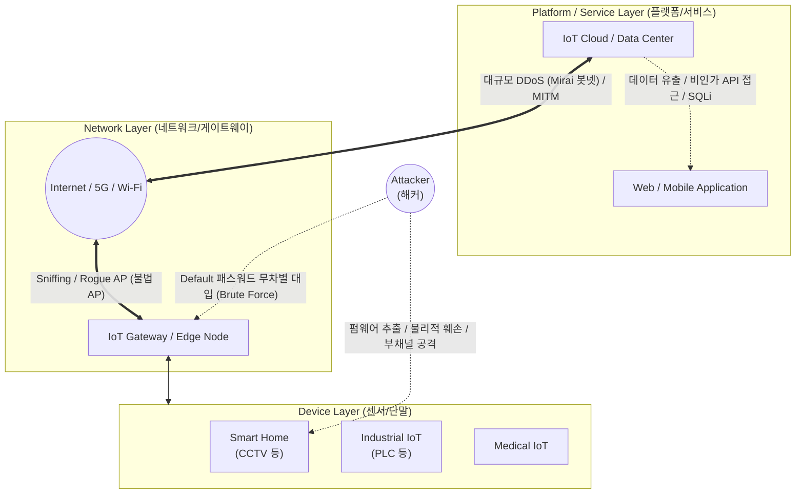

# IoT 보안 위협

---

## I. 초연결 시대의 양날의 검, IoT 보안 위협의 개요

* **정의**: 제한된 컴퓨팅 자원([[CPU]], 메모리)을 가진 다수의 기기가 개방된 네트워크로 연결된 IoT 환경에서, 디바이스-네트워크-플랫폼 전 계층을 표적으로 발생하는 물리적/논리적 보안 취약점 및 침해 시도
* **발생 배경 및 특징**:
* **경량 기기의 보안 한계**: 저전력·경량 특성으로 인해 고성능 [[암호화]] 모듈이나 백신(Anti-Virus) 탑재 등 전통적인 보안 솔루션 적용 불가
* **공격 표면(Attack Surface) 극대화**: 수많은 연결 지점으로 인해 공격 벡터가 기하급수적으로 증가하며, 좀비 PC화(Mirai 봇넷 등)로 인한 대규모 [[DDOS|DDoS]] 공격의 진원지로 악용
* **물리적 위협 직결**: 자율주행차, 스마트 팩토리, 의료기기 등 사이버 위협이 사용자의 생명과 직결되는 물리적(Physical) 안전 문제로 전이

---

## II. IoT 아키텍처 계층별 보안 위협의 개념도 및 핵심 기술 요소

### 가. IoT 아키텍처 기반 보안 위협의 개념도

* 사물인터넷 환경은 단말(Device) - 네트워크(Network) - 플랫폼(Platform)의 3계층으로 구성되며, 각 계층의 취약점을 노리는 복합적이고 [[다형성]] 있는 공격이 발생함.

### 나. IoT 계층별 핵심 보안 위협 요소

| 구분 | 위협 요소(키워드) | 세부 설명 |
| --- | --- | --- |
| **디바이스 계층** | **펌웨어 위/변조** | 디버깅 포트(JTAG, UART)가 열려있거나 [[무결성]] 검증이 없는 점을 악용하여 악성 펌웨어로 교체 |
| **디바이스 계층** | **물리적 훼손 (Tampering)** | 기기 자체를 절취하거나 분해하여 내부에 하드코딩된 암호화 키나 인증 정보를 추출 |
| **디바이스 계층** | **[[부채널 공격]] (Side-Channel)** | 암호화 연산 시 발생하는 전력 소모량, 전자파, 연산 시간 등의 물리적 누출 정보를 분석하여 암호키 유추 |
| **[[네트워크 계층]]** | **DDoS (봇넷 악용)** | 출고 초기(Default) 관리자 비밀번호를 방치한 기기를 웜 바이러스로 감염시켜 대규모 좀비 봇넷(Mirai 등) 구성 |
| **네트워크 계층** | **중간자 공격 (MITM)** | 암호화되지 않은 평문 통신(HTTP, [[MQTT (Message Queuing Telemetry Transport)|MQTT]] 등)의 취약점을 노려 통신 패킷을 탈취하거나 변조 |
| **네트워크 계층** | **Rogue AP (불법 AP)** | 정상적인 IoT 게이트웨이나 AP로 위장하여 센서 데이터 및 연결 [[세션]] 권한을 탈취 |
| **플랫폼 계층** | **Insecure API** | 플랫폼과 연동하는 백엔드 API의 인증/인가 결여를 악용하여 기기 제어권 탈취 및 [[데이터베이스]] 무단 접근 |
| **관리적/운영** | **패치 관리 부재** | 제품 수명 주기(Lifecycle) 동안 보안 업데이트 기능이 제공되지 않아 취약점이 영구적으로 방치되는 문제 |

---

## III. IoT 보안 위협 대응 방안 및 동향

### 가. 일반 IT 보안과 IoT 보안의 대응 기술 비교

| 비교 항목 | 전통적 IT 보안 | IoT 환경 보안 (대응 방안) |
| --- | --- | --- |
| **암호화 기술** | 표준 암호화 ([[AES]], [[RSA (Rivest Shamir Adleman)|RSA]] 등 고성능 요구) | **초경량 암호화 [[알고리즘]] (LWC)** 적용 (국내 LEA, HIGHT 등) |
| **보안 아키텍처** | 경계 기반 방어 ([[방화벽]], IPS) | **[[제로 트러스트 보안모델|Zero Trust]] 기반** 상호 인증 및 마이크로 [[세그멘테이션]] 적용 |
| **인증 방식** | ID/PW, OTP, PKI 인증서 | **PUF (물리적 복제 방지 기능)** 반도체 칩 기반 하드웨어 인증 |
| **개발 방법론** | 사후 보안 패치 중심 | **Security by Design** (설계 단계부터 보안 내재화) |

### 나. 향후 전망 및 시사점

* **AI 결합 공격 및 방어**: 해커의 IoT 취약점 스캐닝 및 봇넷 확산에 AI가 적용(Offensive AI)됨에 따라, 엣지([[EDGE|Edge]]) 단위에서 비정상 트래픽을 탐지하는 경량 AI 기반 머신러닝 보안 솔루션 도입 필수.
* **보안 법제화 및 인증 의무화**: 글로벌 사이버 복원력 법(CRA), 미국의 IoT 사이버보안 개선법, 국내 'IoT 보안인증제도' 등 기기 출시 전 최소한의 보안 요구사항(기본 패스워드 제거, 펌웨어 업데이트 기능 등) 탑재가 법적 의무화되는 추세임.

---

### 🔗 연관 토픽

- **소속 도메인**: [[00_보안_MOC|🛡️ 보안]]
- **세부 분류**: `2. 현대 암호학 & 키 관리 · 전자서명`
- **핵심 연관 토픽**:
  - [[RSA (Rivest Shamir Adleman)]]
  - [[AES]]
  - [[부채널 공격|부채널 공격(Side Channel Attack)]]
  - [[암호화|암호화 (Encryption)]]
  - [[제로 트러스트 보안모델|제로 트러스트 (Zero Trust) 보안모델]]
