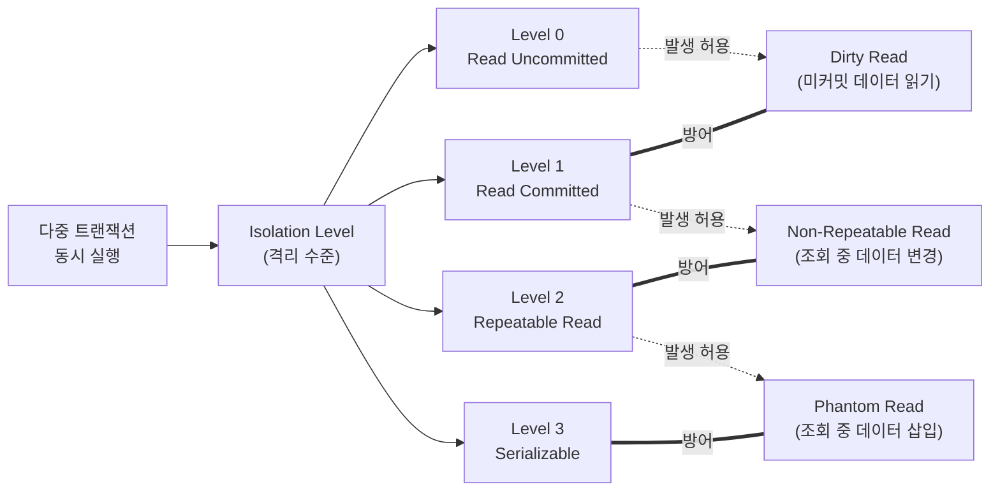

# Isolation Level (격리 레벨/고립성 수준)

---

## I. 동시성과 일관성의 트레이드오프, Isolation Level의 개요

* **정의**: 복수의 DB 트랜잭션이 동시 실행될 때, 데이터 접근을 제어하여 ACID 특성 중 고립성(Isolation)을 보장하기 위한 ANSI/ISO [[SQL(Structured Query Language)|SQL]] 표준 4단계 격리 수준
* **필요성**: 데이터 무결성을 위해 완벽한 고립성 보장 시 대기 상태 증가로 인한 동시 처리 성능 저하 방지
* **특징**: 고립성(일관성)과 동시성(성능) 간의 명확한 Trade-off 관계, 3대 이상 현상(Dirty/Non-Repeatable/[[Phantom Read]])의 허용 범위로 단계 정의

---

## II. Isolation Level의 동작 개념도 및 핵심 기술 요소

### 가. Isolation Level과 이상 현상(Anomaly) 발생 관계도

* 격리 수준이 높아질수록 데이터 정합성을 해치는 이상 현상은 완벽히 방지되나, Lock 점유 시간 증가로 DB의 동시성(Concurrency)은 저하됨

### 나. Isolation Level의 4단계 및 핵심 구성 요소

| 구분 | 요소기술(키워드) | 세부 설명 |
| --- | --- | --- |
| **격리 수준** | Read Uncommitted (Level 0) | 다른 트랜잭션이 커밋하지 않은 데이터의 읽기를 허용함 |
| **격리 수준** | Read Committed (Level 1) | 커밋이 완료된 데이터만 읽기 허용 (Oracle, PostgreSQL 기본값) |
| **격리 수준** | Repeatable Read (Level 2) | [[트랜잭션]] 종료 시까지 동일한 결과의 Read 일관성 보장 (MySQL 기본값) |
| **격리 수준** | Serializable (Level 3) | 트랜잭션을 순차적으로 실행하는 것과 같은 완벽한 데이터 격리 보장 |
| **이상 현상** | [[Dirty Read]] | A 트랜잭션이 수정한 미커밋 데이터를 B가 읽은 후 A가 롤백할 때 발생하는 논리적 오류 |
| **이상 현상** | Non-Repeatable Read | 한 트랜잭션 내 같은 쿼리 반복 실행 시, 타 트랜잭션의 **Update**로 인해 조회 결과가 달라짐 |
| **이상 현상** | Phantom Read | 한 트랜잭션 내 같은 쿼리 반복 실행 시, 타 트랜잭션의 **Insert/Delete**로 인해 레코드 수가 달라짐 |
| **제어 기술** | MVCC (Multi-Version Concurrency Control) | Lock을 배제하고 Undo Log 기반 데이터의 다중 버전을 유지하여 Read 일관성을 보장하는 동시성 제어 기법 |

---

## III. Isolation Level의 한계 극복 및 최신 적용 동향

### 가. 최신 동시성 제어 및 DB 아키텍처 적용 동향

| 구분 | 주요 특징 및 트렌드 | 핵심 키워드 / 기술 |
| --- | --- | --- |
| **MVCC 튜닝 및 확장** | 기존 비관적 락(Pessimistic Lock)의 성능 한계를 극복하기 위해 최신 RDBMS는 Snapshot Isolation을 결합하여 Lock-Free 읽기 구현 | Snapshot Isolation, Undo Log |
| **엔진별 갭락 방어** | MySQL(InnoDB)은 Repeatable Read 환경에서도 Next-Key Lock(Record Lock + Gap Lock)을 적용하여 Phantom Read를 내부적으로 방지 | Next-Key Lock, Gap Lock |
| **분산 DB 격리 수준** | [[New SQL|NewSQL]](Google Spanner 등)은 원자 시계와 GPS를 활용하여 글로벌 분산 환경에서도 데이터 지연 없는 엄격한 직렬화(Strict Serializable) 보장 | TrueTime API, NewSQL |

* 서비스 특성에 따라 단순 조회와 트래픽이 높은 서비스는 동시성을(Level 1 이하), 금융/결제 등 데이터 정합성이 필수적인 시스템은 고립성을(Level 2 이상) 우선하는 최적화 설계(Trade-off 분석)가 요구됨

---

### 🔗 연관 토픽

- **소속 도메인**: [[00_데이터베이스_MOC|🗄️ 데이터베이스]]
- **세부 분류**: `1. 데이터 모델링 & 관계형 DB 설계`
- **핵심 연관 토픽**:
  - [[Phantom Read]]
  - [[Dirty Read]]
  - [[New SQL]]
  - [[고립화 수준]]
  - [[데이터베이스]]
