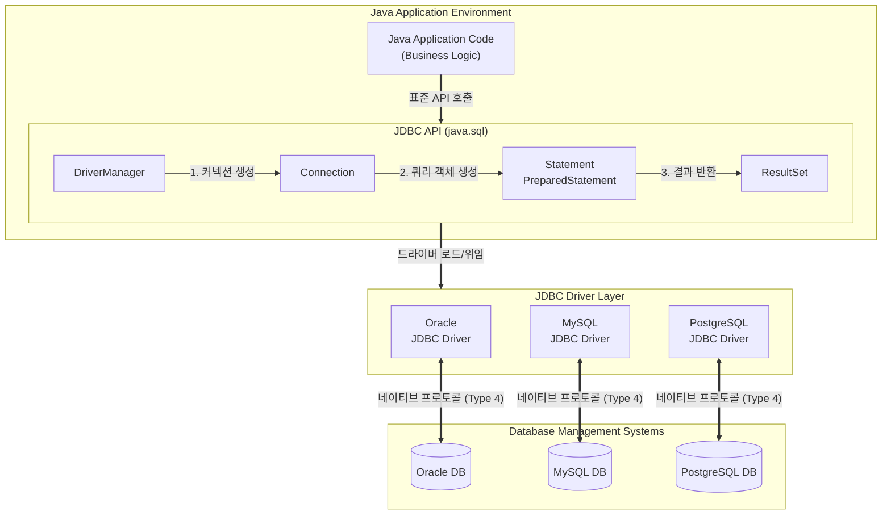

# JDBC (Java Database Connectivity)

---

## I. RDBMS 독립적인 자바 표준 데이터베이스 접근 인터페이스, JDBC의 개요

* **정의**: 자바(Java) 애플리케이션에서 다양한 종류의 관계형 [[데이터베이스]](RDBMS)에 접속하여 [[SQL(Structured Query Language)|SQL]] 문을 실행하고 데이터를 처리하기 위해 제공되는 자바 표준 API (Application Programming Interface)
* **필요성**: 특정 [[DBMS]] 벤더에 종속되지 않는 일관된 데이터베이스 연동 환경 필요, 데이터베이스 변경 시 애플리케이션 코드 수정 최소화
* **특징**: 드라이버 매니저(DriverManager) 기반의 추상화된 접근 구조, [[어댑터 패턴]](Adapter Pattern)을 활용한 각 DBMS 벤더별 전용 드라이버 지원, Type 1~4까지의 다양한 접속 구조 제공

---

## II. JDBC의 개념도 및 핵심 구성 요소

### 가. JDBC의 아키텍처 및 동작 원리

* `Class.forName()`을 통한 드라이버 로드 → `DriverManager.getConnection()`으로 DB [[세션]] 연결 → `Statement` 객체를 통해 SQL 실행 → `ResultSet`으로 결과 커서 처리 후 자원 반환(Close) 흐름으로 동작함

### 나. JDBC의 핵심 기술 요소

| 분류 | 요소기술(키워드) | 세부 설명 |
| --- | --- | --- |
| **연결 관리** | DriverManager | 다양한 JDBC 드라이버를 관리하고, 애플리케이션의 요청에 맞는 `Connection` 객체를 생성하여 반환 |
| **세션 제어** | Connection | 특정 데이터베이스와의 물리적 연결 세션을 표현하며, [[트랜잭션]] 제어(Commit, Rollback) 기능 제공 |
| **쿼리 실행** | Statement | 매번 컴파일이 수행되는 정적 SQL 쿼리를 실행하기 위한 기본 인터페이스 ([[DDL]] 등에 주로 사용) |
| **보안/성능** | PreparedStatement | 사전에 컴파일된 SQL을 실행하며 캐싱을 통해 성능을 향상시키고, 바인딩 변수(?)를 통해 **[[SQL Injection]]을 방지** |
| **[[프로시저]]** | CallableStatement | 데이터베이스 내부에 저장된 Stored Procedure(저장 프로시저) 및 함수를 호출하기 위한 인터페이스 |
| **결과 처리** | ResultSet | SELECT 쿼리의 실행 결과인 테이블 형태의 데이터를 유지하며, 커서(Cursor)를 통해 데이터를 순차적으로 탐색 |
| **아키텍처** | Type 4 Driver | 자바 코드로만 작성되어 직접 DBMS 고유의 네트워크 프로토콜로 통신하는 Thin 드라이버 (현재 표준적으로 사용됨) |
| **성능 최적화** | Connection Pool | 커넥션 생성의 오버헤드를 줄이기 위해 커넥션을 미리 생성(Pooling)해두고 재사용하는 기법 (HikariCP, DBCP 등) |

---

## III. 데이터베이스 연동 기술 비교 및 발전 동향

### 가. JDBC와 주요 데이터 접근 기술 비교

| 비교 항목 | JDBC (Java Database Connectivity) | SQL Mapper (MyBatis) | ORM (JPA / Hibernate) |
| --- | --- | --- | --- |
| **핵심 개념** | 자바 표준 DB 접근 로우레벨 API | SQL 문과 자바 객체(VO/DTO) 매핑 | 관계형 DB 테이블과 자바 객체(Entity) 매핑 |
| **[[추상화]] 수준** | 낮음 (Low-Level) | 중간 (SQL 작성 필요) | 높음 (High-Level, SQL 자동 생성) |
| **개발 생산성** | 코드 중복 많음, 예외/자원 처리 복잡 | SQL 쿼리 분리([[XML]])로 유지보수성 향상 | 단순 CRUD 쿼리 작성 불필요로 생산성 최고 |
| **성능 튜닝** | 개발자가 직접 100% 튜닝 가능 | 복잡한 쿼리 및 통계 쿼리 최적화 용이 | 복잡한 연관관계 쿼리 작성 시 N+1 문제 주의 |
| **데이터 독립성** | DBMS 종속적 쿼리 발생 가능 | DBMS 벤더별 쿼리 문법 종속성 존재 | Dialect(방언) 설정을 통한 완벽한 DB 독립성 |

* **발전 동향**: 순수 JDBC API를 직접 호출하는 방식은 코드 중복 및 자원 누수 위험으로 지양되며, 현재 엔터프라이즈 환경에서는 스프링 [[프레임워크]] 기반의 **JPA(ORM)** 와 복잡한 통계 쿼리를 위한 **MyBatis/QueryDSL** 을 혼용하여 사용하는 아키텍처가 주류를 이루고 있음. 모든 상위 프레임워크의 근간에는 항상 JDBC가 백엔드 드라이버로 동작함.

---

### 🔗 연관 토픽

- **소속 도메인**: [[00_데이터베이스_MOC|🗄️ 데이터베이스]]
- **세부 분류**: `6. SQL 표준 문법 & 쿼리 성능 튜닝`
- **핵심 연관 토픽**:
  - [[SQL(Structured Query Language)]]
  - [[데이터베이스]]
  - [[DBMS]]
  - [[DDL]]
  - [[트랜잭션]]
