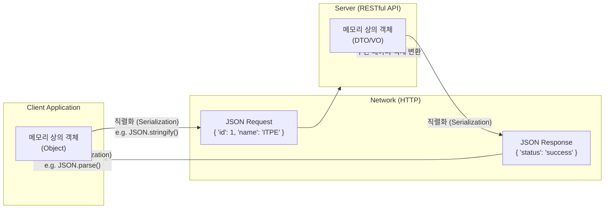

# JSON (JavaScript Object Notation)

---

## I. 이기종 시스템 간 경량 데이터 교환 표준, JSON의 개요

* **정의**: 웹 및 네트워크 환경에서 데이터를 교환하기 위해 속성-값 쌍(Name-Value Pairs)과 배열(Array)로 이루어진 텍스트 기반의 경량 개방형 데이터 포맷
* **필요성**: 기존 [[XML]]의 복잡성 및 파싱 오버헤드 극복, RESTful API 및 마이크로서비스([[MSA (Micro Service Architecture)|MSA]]) 간의 빠르고 효율적인 통신 표준 필요
* **특징**: 특정 프로그래밍 언어에 종속되지 않음(Language Independent), 사람과 기계 모두 이해하기 쉬운 뛰어난 가독성, 적은 용량으로 인한 네트워크 대역폭 절감

---

## II. JSON의 개념도 및 핵심 기술 요소

### 가. JSON의 데이터 교환 개념도 및 동작 원리

* 클라이언트와 서버 간 데이터 통신 시, 메모리 상의 객체를 네트워크 전송을 위해 JSON 문자열로 직렬화(Serialization)하고 수신 측에서 다시 객체로 역직렬화(Deserialization)하여 처리함

### 나. JSON의 핵심 기술 요소 및 데이터 타입

| 분류 | 요소기술(키워드) | 세부 설명 |
| --- | --- | --- |
| **기본 구조** | Object (객체) | 속성(Key)과 값(Value)의 쌍으로 구성된 데이터 집합으로, 중괄호 `{ }`를 사용하여 표현함 |
| **기본 구조** | Array (배열) | 순서가 있는 값(Value)들의 리스트이며, 대괄호 `[ ]`를 사용하여 표현함 |
| **데이터 타입** | String, Number | 큰따옴표(`" "`)로 묶인 유니코드 문자열과 정수/실수 형태의 숫자형(Number) 지원 |
| **데이터 타입** | Boolean, Null | 참/거짓을 나타내는 논리형(`true`, `false`)과 빈 값을 의미하는 `null` 지원 |
| **파싱 기술** | Serialization (직렬화) | 데이터 구조나 객체 상태를 JSON 포맷의 문자열로 변환 (예: JavaScript의 `JSON.stringify()`) |
| **파싱 기술** | Deserialization (역직렬화) | 수신된 JSON 문자열 포맷을 프로그램 내부에서 사용할 수 있는 객체로 복원 (예: `JSON.parse()`) |
| **확장 기술** | JSON Schema | JSON 데이터의 구조, 포맷, 필수 속성 등 유효성 검증(Validation)을 위한 메타데이터 규칙 정의서 |
| **확장 기술** | BSON (Binary JSON) | JSON을 이진(Binary) 형태로 인코딩하여 스토리지 공간을 절약하고 탐색 속도를 향상시킴 (MongoDB 등) |

---

## III. JSON과 XML의 비교 및 활용 동향

### 가. 데이터 교환 포맷 JSON과 XML의 비교

| 비교 항목 | JSON (JavaScript Object Notation) | XML (eXtensible Markup Language) |
| --- | --- | --- |
| **데이터 구조** | **Name-Value 쌍**, 배열 기반 | 사용자 정의 **태그(Tag) 트리** 구조 |
| **문법 및 가독성** | 간결하고 직관적, 가독성 우수 | 여는 태그와 닫는 태그 필수, 복잡함 |
| **파일 크기/성능** | 오버헤드가 적어 크기가 작고 파싱 속도 빠름 | 메타데이터(태그)로 인해 크기가 크고 파싱 느림 |
| **데이터 타입 지원** | 숫자, 문자열, 불리언, 배열, 객체 지원 | 모든 데이터를 문자열(String)로 취급 |
| **[[스키마]] / 검증** | JSON Schema (상대적으로 유연함) | DTD, XML Schema (엄격하고 정교한 검증) |
| **주요 활용 분야** | **RESTful API**, OpenAPI, 웹/모바일 통신 | **SOAP API**, 설정 파일, 복잡한 문서/데이터 표현 |

### 나. JSON의 최신 활용 동향

* **GraphQL 데이터 포맷**: REST의 오버페칭(Over-fetching)과 언더페칭(Under-fetching) 문제를 해결하는 GraphQL API의 기본 질의 및 응답 포맷으로 확고히 자리 잡음
* **[[NoSQL (CAP 이론 BASE 속성)|NoSQL]] 및 빅데이터 분석 활용**: MongoDB, ElasticSearch 등 Document 기반 데이터베이스에서 반정형(Semi-structured) 데이터를 유연하게 저장하고 쿼리하기 위한 핵심 표준으로 활용 영역 지속 확대 중

---

### 🔗 연관 토픽

- **소속 도메인**: [[00_소프트웨어공학_MOC|🏗️ 소프트웨어공학]]
- **세부 분류**: `4. 아키텍처 스타일 & 객체지향 설계 원리`
- **핵심 연관 토픽**:
  - [[스키마]]
  - [[XML]]
  - [[NoSQL (CAP 이론 BASE 속성)]]
  - [[MSA (Micro Service Architecture)]]
  - [[MVC 패턴 (Model-View-Controller Pattern)]]
