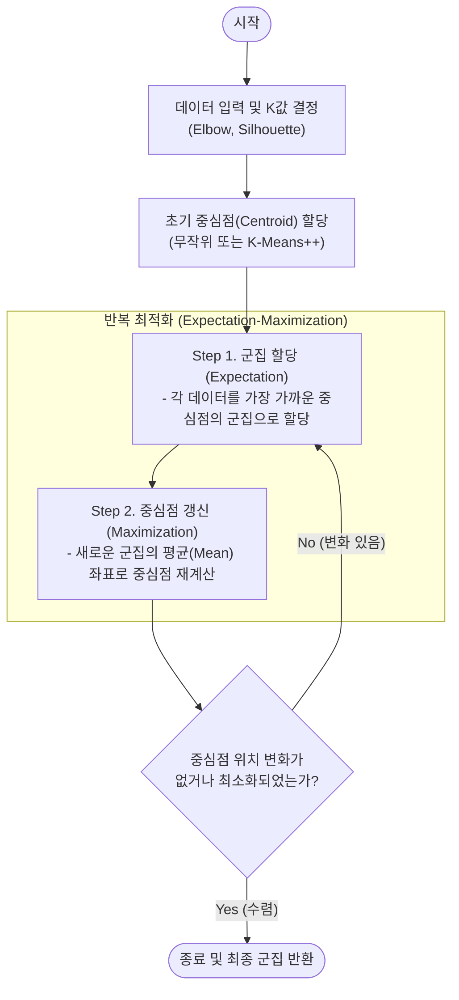

# K-평균 알고리즘 (K-Means Algorithm)

---

## I. 비지도 학습 기반의 분할적 군집화, K-평균 알고리즘의 개요

* **정의**: 주어진 데이터를 K개의 클러스터(군집)로 묶는 [[비지도 학습]] 알고리즘으로, 각 군집 내 데이터와 중심점(Centroid) 간의 거리 제곱합(SSE)을 최소화하도록 군집을 갱신하는 모델
* **필요성**: 데이터에 숨겨진 패턴 및 구조 발견, 타겟 마케팅을 위한 고객 세분화(Segmentation), [[차원 축소]] 및 이미지 압축 등 방대한 데이터의 요약 필요
* **특징**: 거리 기반(주로 유클리디안 거리) 군집화, EM(Expectation-Maximization) 최적화 메커니즘, 구현이 단순하고 대용량 데이터 처리 속도가 빠름

---

## II. K-평균 알고리즘의 동작 개념도 및 핵심 기술 요소

### 가. K-평균 알고리즘의 최적화 동작 메커니즘 (EM 알고리즘 기반)

* 초기 중심점을 설정한 후, 개별 데이터를 가까운 중심점에 할당(Expectation)하고, 할당된 데이터의 평균값으로 중심점을 이동(Maximization)하는 과정을 수렴할 때까지 반복함

### 나. K-평균 알고리즘의 핵심 기술 요소

| 구분 | 요소기술(키워드) | 세부 설명 |
| --- | --- | --- |
| **K값 최적화** | Elbow Method (엘보우 기법) | 군집 수 K를 증가시키며 SSE(오차제곱합)를 측정, 감소 폭이 급격히 줄어드는 꺾이는 지점(팔꿈치)을 K로 선정 |
| **K값 최적화** | Silhouette Score (실루엣 지수) | 군집 내 결속도([[응집도]])와 타 군집과의 분리도를 수치화(-1 ~ 1)하여 최적의 군집 수 평가 (1에 가까울수록 이상적) |
| **초기화 기법** | K-Means++ | 초기 중심점이 몰려있는 문제를 해결하기 위해, 첫 중심점을 랜덤 선택 후 기존 중심점과 가장 먼 데이터를 다음 중심점으로 선택 |
| **거리 척도** | 유클리디안 거리 (Euclidean) | 두 객체 간의 직선 최단 거리를 계산 (L2 Norm), 연속형 데이터에서 K-평균 군집화의 기본 척도 |
| **거리 척도** | 맨해튼 거리 (Manhattan) | 격자 구조 상에서 두 객체 간의 수직/수평 이동 거리의 합을 계산 (L1 Norm) |
| **최적화 원리** | EM [[알고리즘]] | 잠재 변수(중심점)의 기대치(E-Step)를 계산하고, 이를 기반으로 파라미터를 최대화(M-Step)하는 반복 통계 기법 |
| **분할 특성** | 보로노이 다이어그램 (Voronoi) | 평면을 특정 점(Centroid)들과 가장 가까운 구역으로 분할한 기하학적 형태 (K-평균의 군집 경계면과 동일) |
| **평가 지표** | SSE (Sum of Squared Errors) | 클러스터 내 데이터 포인트와 중심점 간의 유클리디안 거리 제곱의 총합 (군집화의 응집도 평가 지표) |

---

## III. K-평균 알고리즘의 한계점 및 극복을 위한 타 알고리즘 비교

### 가. K-Means와 타 군집화 알고리즘 비교 (한계점 극복 관점)

| 비교 항목 | K-Means (분할 기반) | K-Medoids (PAM) | [[DBSCAN(밀도 기반 클러스터링)|DBSCAN]] (밀도 기반) |
| --- | --- | --- | --- |
| **군집 형성 원리** | 데이터의 **평균(Mean)** 중심 | 실제 존재하는 **데이터(대푯값)** 중심 | 특정 반경 내 데이터의 **밀도(Density)** 기준 |
| **사전 K값 지정** | 필수 (사용자가 지정) | 필수 (사용자가 지정) | 불필요 (알고리즘이 자동 탐색) |
| **군집 형태** | 구형(Spherical) 군집에 적합 | 구형 군집에 적합 | 초승달, 도넛형 등 비정형 군집에 강함 |
| **[[이상치]](Outlier) 민감도** | **매우 민감함** (평균이 왜곡됨) | 둔감함 (실제 데이터를 중심으로 삼음) | 노이즈(Noise)로 자동 분류하여 강건함 |

* 연속형 데이터를 주로 처리하는 K-평균의 한계를 극복하기 위해, 범주형 데이터에는 최빈값을 사용하는 K-Modes, 혼합형 데이터에는 K-Prototypes 알고리즘이 실무적으로 확장 적용되고 있음

---

### 🔗 연관 토픽

- **소속 도메인**: [[00_인공지능_MOC|🤖 인공지능]]
- **세부 분류**: `1. 수학 · 통계학 & 데이터 전처리`
- **핵심 연관 토픽**:
  - [[비지도 학습]]
  - [[DBSCAN(밀도 기반 클러스터링)]]
  - [[이상치]]
  - [[차원 축소|차원 축소(Dimensionality Reduction)]]
  - [[PCA(Principal Component Analysis)]]
