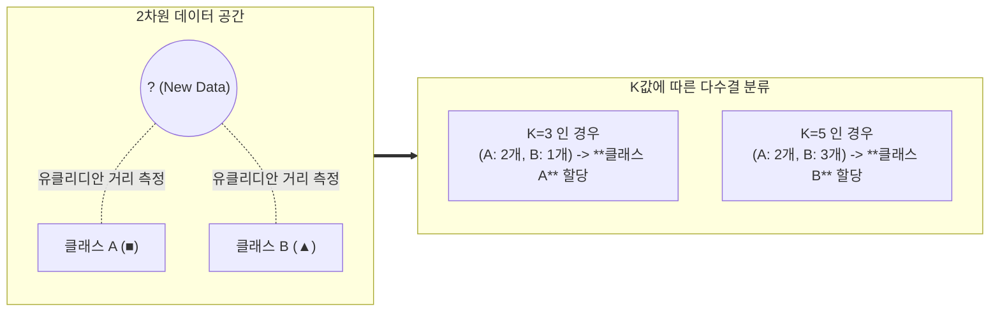

# K-NN (K-Nearest Neighbor) 알고리즘

---

## I. 거리 기반의 직관적 지도 학습 모델, K-NN의 개요

* **정의**: 새로운 데이터 포인트를 분류할 때, 가장 가까운 거리에 있는 K개의 기존 훈련 데이터 포인트들의 [[클래스]] 비율을 다수결로 판별하여 예측하는 게으른 학습(Lazy Learning) [[알고리즘]]
* **필요성**: 데이터의 분포를 모르는 비모수적(Non-parametric) 환경에서의 분류, 단순하고 직관적인 추천 시스템 및 패턴 인식 모델 필요
* **특징**: 훈련 단계에 연산을 수행하지 않음(Lazy Learning), 데이터의 지역적 구조에 민감, K값의 크기와 거리 측정 방식에 따라 성능이 크게 좌우됨

---

## II. K-NN의 동작 개념도 및 핵심 기술 요소

### 가. K-NN의 분류 원리 및 동작 메커니즘

* 새로운 데이터 입력 시 훈련 데이터 전체와의 거리를 계산하고, 오름차순으로 정렬하여 상위 K개 이웃의 다수결(Majority Voting)로 최종 클래스를 할당함

### 나. K-NN 알고리즘의 핵심 기술 요소

| 구분 | 요소기술(키워드) | 세부 설명 |
| --- | --- | --- |
| **핵심 파라미터** | K 값 설정 | 탐색할 이웃의 수. K가 너무 작으면 과적합(Overfitting, 노이즈 민감), 너무 크면 과소적합(Underfitting) 발생 |
| **학습 방식** | Lazy Learning | 모델을 사전 학습하지 않고, 예측 요청이 들어올 때마다 전체 훈련 데이터와의 거리를 계산하여 예측 |
| **거리 척도** | 유클리디안 (Euclidean) | 두 점 사이의 최단 직선 거리 (L2 Norm), 연속형 데이터의 기본 거리 척도로 가장 많이 사용됨 |
| **거리 척도** | 맨해튼 (Manhattan) | 축에 평행하게 이동하는 블록 거리 합 (L1 Norm), 고차원 데이터나 이상치에 덜 민감함 |
| **거리 척도** | 코사인 [[유사도]] (Cosine) | 두 벡터 간의 사잇각을 기반으로 방향성을 측정, 텍스트 분석 및 추천 시스템에서 주로 사용 |
| **분류 방식** | 다수결 (Majority Voting) | K개의 이웃 중 가장 많이 출현한 클래스로 최종 라벨을 결정 (동률 방지를 위해 K는 주로 홀수 사용) |
| **분류 방식** | 가중 거리 합산 | 거리가 가까운 이웃에게 더 높은 가중치(1/거리)를 부여하여 다수결의 신뢰도를 높이는 기법 |
| **[[데이터 전처리]]** | 정규화 (Normalization) | 변수 간 스케일 차이가 거리 계산을 왜곡하므로, 모든 변수의 범위를 [0, 1]로 맞추는 Min-Max 스케일링 필수 |

---

## III. K-NN의 장단점 및 최신 활용 동향

### 가. K-NN의 장단점 분석

| 구분 | 주요 특징 및 설명 | 대응 방안 (해결책) |
| --- | --- | --- |
| **장점** | 알고리즘이 매우 단순하고 직관적이며, 데이터의 분포 가정이 불필요함 | 텍스트/이미지 기반 단순 추천 시스템의 베이스라인 모델로 활용 |
| **단점 (시간/공간)** | 예측 시 모든 데이터와의 거리를 계산하므로 시간 복잡도(O(ND))와 메모리 소모가 극심함 | 탐색 트리인 **KD-Tree** 또는 **Ball-Tree**를 구성하여 계산 복잡도를 O(D log N)으로 감축 |
| **단점 (차원의 저주)** | 차원이 증가할수록 데이터 공간의 부피가 기하급수적으로 커져 거리의 변별력이 상실됨 | [[PCA(Principal Component Analysis)|PCA]](주성분 분석) 등을 통해 [[차원 축소]] 수행 후 K-NN 적용 |

### 나. 최근 활용 동향

* **근사 최근접 이웃(ANN, Approximate Nearest Neighbor) 기술 결합**: 고차원의 텍스트 임베딩이나 이미지 벡터를 탐색하는 생성형 AI(RAG, 벡터 DB) 환경에서, 100%의 정확도를 일부 포기하는 대신 검색 속도를 획기적으로 높인 ANN(예: FAISS, HNSW) 알고리즘으로 발전하여 핵심 검색 기술로 폭넓게 활용되고 있음

---

### 🔗 연관 토픽

- **소속 도메인**: [[00_인공지능_MOC|🤖 인공지능]]
- **세부 분류**: `1. 수학 · 통계학 & 데이터 전처리`
- **핵심 연관 토픽**:
  - [[PCA(Principal Component Analysis)]]
  - [[차원 축소|차원 축소(Dimensionality Reduction)]]
  - [[유사도|유사도(Similarity)]]
  - [[데이터 전처리]]
  - [[비지도 학습]]
