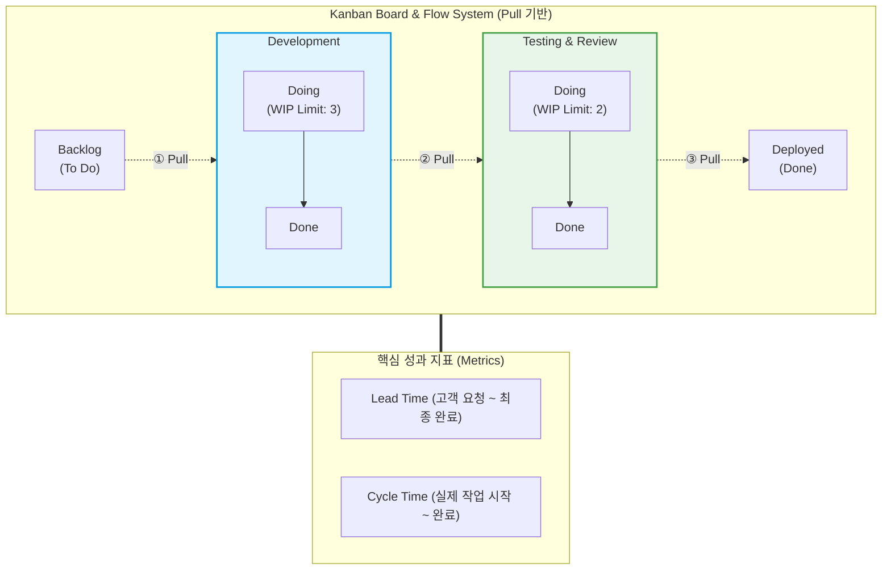

# 칸반 (Kanban) 개발 프로세스

---

## I. 지속적 가치 흐름과 WIP 제한을 통한 애자일 최적화 방법론, 칸반의 개요

* **정의**: 워크플로우를 시각화하고 진행 중인 작업(WIP, Work In Progress)을 제한하여, 병목 현상을 최소화하고 소프트웨어 가치 전달의 흐름(Flow)을 최적화하는 애자일([[Agile]]) 기반의 풀(Pull) 시스템 개발 [[프로세스]]
* **등장배경**: 도요타 생산 방식(TPS)의 JIT(Just-In-Time)와 린([[린 방법론|Lean]]) 제조 철학을 소프트웨어 개발에 적용하여 낭비를 제거하고 효율성을 극대화하기 위해 등장함
* **특징**: 타임박스(Time-box)가 없는 연속적 흐름, 유연한 변화 수용, 기존 조직의 역할(Role)이나 프로세스 변경 최소화 (진화적이고 점진적인 변화 추구)

---

## II. 칸반 개발 프로세스의 동작 개념도 및 핵심 구성 요소

### 가. 칸반의 프로세스 개념도 및 동작 원리

* 후행 단계에 여유 리소스(Capacity)가 생길 때 선행 단계에서 작업을 당겨오는(Pull) 메커니즘으로 동작하며, WIP(재공품) 제한을 통해 컨텍스트 스위칭 낭비를 방지함

### 나. 칸반 프로세스의 핵심 기술 및 구성 요소

| 구분 | 요소기술(키워드) | 세부 설명 |
| --- | --- | --- |
| **시각화 도구** | Kanban Board (칸반 보드) | 작업의 상태(Backlog, Doing, Done 등)와 흐름을 카드 형태로 시각화한 대시보드 |
| **흐름 통제** | WIP Limit (재공품 제한) | 각 워크플로우 단계에서 동시에 진행할 수 있는 최대 작업(Card) 수를 제한하여 병목 방지 |
| **작업 방식** | Pull System (당김 방식) | 중앙의 작업 할당(Push)이 아닌, 작업자가 현재 작업을 완료한 후 다음 작업을 가져오는 방식 |
| **성과 지표** | Lead Time (리드 타임) | 고객의 요구사항 접수 시점부터 릴리스(최종 가치 전달)까지 소요되는 총 시간 |
| **성과 지표** | Cycle Time (사이클 타임) | 개발자가 실제로 작업에 착수한 시점부터 해당 작업이 완료될 때까지의 소요 시간 |
| **모니터링** | CFD (누적 흐름도) | 시간에 따른 작업 상태별 누적 개수를 그래프로 표현하여 병목(Bottleneck) 구간을 식별 |
| **운영 원칙** | Explicit Policy (명시적 정책) | 완료의 기준(DoD, Definition of Done), 작업 우선순위 등 팀의 프로세스 규칙을 명문화 |
| **개선 메커니즘** | 피드백 루프 (Feedback Loop) | 일일 스탠드업 미팅, 서비스 전달 리뷰 등을 통해 지속적으로 프로세스를 점검하고 최적화 |

---

## III. 주요 애자일 방법론 비교 및 최신 동향

### 가. 애자일의 양대 산맥, Scrum과 Kanban 비교

| 비교 항목 | [[SCRUM|Scrum]] ([[스크럼]]) | Kanban (칸반) |
| --- | --- | --- |
| **진행 주기** | 정해진 기간의 스프린트 (Time-box, 보통 1~4주) | 연속적인 작업 흐름 (No Time-box) |
| **작업 제한 방식** | 스프린트 내 수행할 작업량 고정 (Velocity 기반) | 각 상태별 WIP Limit으로 동시 작업 제한 |
| **역할 및 조직** | PO(Product Owner), Scrum Master, Team 등 역할 명확 | 기존 조직 체계 유지, 특정 역할 강제 없음 |
| **변화 수용성** | 스프린트 진행 중에는 원칙적으로 목표 및 작업 변경 지양 | WIP 여유 용량 내에서 언제든 새로운 우선순위 작업 추가 가능 |
| **적합한 프로젝트** | 명확한 릴리스 목표가 있는 신규 제품 개발 | [[유지보수]], 운영 업무([[ITSM(Information Technology Service Management)|ITSM]]), 요구사항 변화가 극심한 환경 |

### 나. 칸반 프로세스의 최근 발전 동향 및 전망

* **Scrumban (스크럼반)의 확산**: 스크럼의 의식(Ceremonies) 및 롤(Role) 구조와 칸반의 WIP 제한, 연속 흐름 처리의 장점을 결합한 하이브리드 방법론 채택 증가
* **[[DevOps]] 및 VSM과의 통합**: CI/CD 파이프라인의 배포 현황을 칸반 보드와 연동하고, DORA 지표 등과 결합하여 조직 전체의 가치 흐름 관리(Value Stream Management) 프레임워크로 진화 중

---

### 🔗 연관 토픽

- **소속 도메인**: [[00_프로젝트관리_MOC|📋 프로젝트관리]]
- **세부 분류**: `5. 애자일 프로젝트 관리 & 개발 운영 (Agile PM)`
- **핵심 연관 토픽**:
  - [[스크럼|스크럼 (SCRUM)]]
  - [[린 방법론|린 (Lean) 방법론]]
  - [[SCRUM]]
  - [[ITSM(Information Technology Service Management)]]
  - [[Agile]]
