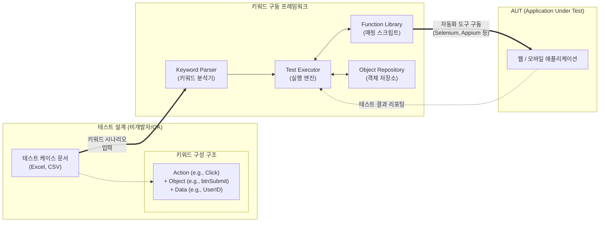

# 키워드 주도 테스트 (Keyword Driven Testing)

---

## I. 테스트 자동화의 유지보수성 극대화, 키워드 주도 테스트의 개요

* **정의**: 테스트 케이스의 수행 동작을 모듈화된 키워드(Action Word)로 추상화하여 정의하고, 이를 기반으로 테스트 설계와 자동화 스크립트 구현을 분리하는 테스트 자동화 기법
* **필요성**: 잦은 UI 변경으로 인한 자동화 스크립트 [[유지보수]] 비용 증가 극복, 프로그래밍 지식이 부족한 도메인 전문가(BA) 및 수동 테스터의 자동화 참여 필요성 대두
* **특징**: 테스트 로직의 완벽한 추상화([[추상화|Abstraction]]), 테스트 스크립트와 케이스의 분리로 인한 높은 재사용성, 초기 [[프레임워크]] 구축 비용은 높으나 장기적 유지보수 비용은 낮음

---

## II. 키워드 주도 테스트의 개념도 및 핵심 구성 요소

### 가. 키워드 주도 테스트의 개념도 및 동작 원리

* 사용자가 작성한 명세(키워드, 객체, 데이터)를 프레임워크가 파싱(Parsing)하여, Function Library에 미리 정의된 실제 프로그래밍 코드와 매핑해 대상 애플리케이션(AUT)을 구동함

### 나. 키워드 주도 테스트의 핵심 기술 및 구성 요소

| 구분 | 요소기술(키워드) | 세부 설명 |
| --- | --- | --- |
| **테스트 설계** | Keyword (Action Word) | Click, Input, Verify 등 애플리케이션의 특정 동작이나 검증 로직을 추상화한 단어 |
| **테스트 설계** | Test Case Data | 키워드(Action), 대상 UI 객체(Object), 입력 데이터(Value)의 조합으로 구성된 시나리오 문서 |
| **프레임워크** | Keyword Parser | 엑셀, CSV 등으로 작성된 외부 테스트 케이스 파일에서 키워드와 데이터를 읽고 해석하는 모듈 |
| **프레임워크** | Function Library | 각 키워드에 1:1로 매핑되어 실제 브라우저/기기를 제어하는 자동화 코드(Java, Python 등) 모음 |
| **프레임워크** | Object Repository | 화면 내 UI 요소(버튼, 텍스트박스 등)의 식별자(XPath, ID 등)를 중앙 집중적으로 관리하는 저장소 |
| **실행 환경** | Test Executor | 파싱된 키워드와 라이브러리를 연결하여 테스트를 순차적으로 실행하고 예외를 처리하는 엔진 |
| **실행 환경** | Automation Tool | 실제 UI를 제어하기 위한 하부 구동 도구 (Selenium WebDriver, Appium, QTP/UFT 등) |
| **관리 체계** | Test Reporting | 실행된 키워드의 성공/실패 여부, 소요 시간, 스크린샷 등을 수집하여 결과 보고서를 생성 |

---

## III. 키워드 주도 테스트와 데이터 주도 테스트 비교 및 발전 동향

### 가. 테스트 자동화 기법 비교 (DDT vs KDT)

| 비교 항목 | 데이터 주도 테스트 (Data Driven Testing) | 키워드 주도 테스트 (Keyword Driven Testing) |
| --- | --- | --- |
| **핵심 분리 대상** | 자동화 스크립트와 **입력 데이터** 분리 | 테스트 설계(키워드)와 **자동화 스크립트** 분리 |
| **주요 작성 주체** | 개발자 및 전문 자동화 엔지니어 (SDET) | 도메인 전문가(BA), 수동 테스터, 현업 사용자 |
| **구축 복잡도** | 프레임워크 구현 난이도가 비교적 낮음 | 초기 키워드 라이브러리 및 파서 구축 비용이 높음 |
| **주요 적용 목적** | 동일 로직에 대해 다양한 입력값에 대한 커버리지 확보 | 비개발자의 자동화 참여 및 UI 변경에 따른 유지보수성 극대화 |

### 나. 키워드 주도 테스트의 최근 발전 동향

* **BDD(Behavior Driven Development)와의 결합**: 자연어 형태의 Gherkin 문법(Given-When-Then)과 결합한 프레임워크(Cucumber 등)로 발전하여 비즈니스 요구사항과 자동화 테스트를 일치시키는 트렌드 확산
* **AI/[[초거대 언어 모델|LLM]] 기반 키워드 생성 및 자가 치유(Self-Healing)**: 생성형 AI를 활용하여 요구사항 문서에서 키워드를 자동 추출하고, UI 변경 시 Object Repository의 식별자를 스스로 수정하는 지능형 테스트 자동화 솔루션 도입 증가

---

### 🔗 연관 토픽

- **소속 도메인**: [[00_소프트웨어공학_MOC|🏗️ 소프트웨어공학]]
- **세부 분류**: `4. 아키텍처 스타일 & 객체지향 설계 원리`
- **핵심 연관 토픽**:
  - [[프레임워크]]
  - [[추상화|추상화 (Abstraction)]]
  - [[유지보수]]
  - [[재사용]]
  - [[객체지향 설계 원리]]
