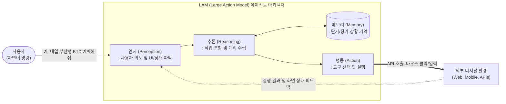

# LAM (Large Action Model)

---

## I. 텍스트 생성을 넘어 자율적 행동을 수행하는 AI, LAM의 개요

* **정의**: 대규모 언어 모델([[초거대 언어 모델|LLM]])의 인지 능력을 바탕으로, 사용자의 복잡한 자연어 의도를 파악하고 외부 디지털 환경(웹, 앱, API)에서 직접 상호작용(Action)하여 목표를 달성하는 행동 중심의 AI 모델
* **등장배경**: 기존 LLM의 텍스트 생성 중심 한계(환각, 수동적 응답) 극복 필요, 규칙 기반 RPA의 유연성 부족, 사용자 개입을 최소화하는 초자동화(Hyperautomation) 요구 증대
* **특징**: 목표 지향적 자율 실행(Autonomous Execution), 도구 사용 능력(Tool Use & API 호출), 환경 피드백을 수용하는 동적 상호작용, 신경망과 논리적 제어의 결합

---

## II. LAM의 개념도 및 핵심 구성 요소

### 가. LAM의 아키텍처 및 동작 원리

* 사용자의 명령을 인지(Perception)하고, 메모리(Memory)를 참조하여 실행 계획을 추론(Reasoning)한 뒤, 외부 환경의 도구를 직접 조작(Action)하며, 결과를 다시 피드백받아 목표 달성 시까지 반복하는 에이전트(Agentic) 구조임

### 나. LAM의 핵심 기술 및 구성 요소

| 구분 | 요소기술(키워드) | 세부 설명 |
| --- | --- | --- |
| **인지 및 이해** | UI-VLM / OmniParser | 텍스트뿐만 아니라 화면의 픽셀, 아이콘, DOM 트리 구조 등 GUI(그래픽 사용자 인터페이스)를 시각적으로 분석하고 이해하는 다중양식 모델 |
| **추론 및 계획** | ReAct (Reason + Act) | 모델이 목표 달성을 위해 '추론(생각)'과 '행동'을 교차로 수행하며 지속적으로 계획을 수정하는 [[프레임워크]] |
| **기억 장치** | Vector Database | 과거의 실행 성공/실패 사례 및 사용자 선호도 등을 임베딩하여 장기 기억(Long-term Memory)으로 활용하는 저장소 |
| **실행 제어** | Function Calling | 자연어 명령을 기반으로 외부 API, [[데이터베이스]] 쿼리, 스크립트를 정형화된([[JSON]] 등) 포맷으로 매핑하여 호출 |
| **실행 제어** | GUI Automation | API가 열려있지 않은 레거시 환경에서도 컴퓨터 비전과 좌표 매핑을 통해 직접 화면 클릭 및 키보드 입력을 제어 |
| **모델 아키텍처** | Neuro-Symbolic AI | 유연한 학습을 하는 신경망(Neural) 구조와 명확한 규칙/기호를 따르는 심볼릭(Symbolic) 제어를 결합하여 오작동 최소화 |
| **생태계 통합** | Agentic Workflow | 단일 모델에 의존하지 않고, 특화된 여러 AI 에이전트(Multi-Agent)들이 협업하여 복잡한 과업을 수행하는 체계 |
| **안전/통제** | AI Guardrails | LAM이 시스템에 직접 개입함에 따라 발생하는 보안 위협이나 권한 오남용을 방지하기 위한 [[샌드박스]] 및 규칙 기반 통제 장치 |

---

## III. LLM과 LAM의 비교 및 최근 적용 동향

### 가. LLM (대형 언어 모델)과 LAM (대형 행동 모델)의 비교

| 비교 항목 | LLM (Large Language Model) | LAM (Large Action Model) |
| --- | --- | --- |
| **핵심 목적** | 언어 이해 및 지식 기반의 **텍스트/콘텐츠 생성** | 복잡한 의도 파악 및 목표 달성을 위한 **자율적 과업 실행** |
| **주요 출력 형태** | 텍스트 대화, 코드 스니펫, 문서 요약 결과물 | 외부 시스템 API 호출, 워크플로우 제어, UI 직접 조작 |
| **작동 패러다임** | 정적 (사용자 질문 -> 답변 제공 후 [[세션]] 종료) | 동적 (행동 -> 피드백 모니터링 -> 재수정의 반복 루프) |
| **응용 분야** | 대화형 챗봇(ChatGPT), 번역기, 문서 보조 도구 | AI 에이전트(AI 비서), 자율형 RPA(RPA 2.0), 디바이스 자율 제어 |
| **기술적 한계** | 환각(Hallucination) 현상, 외부 세계 개입 불가 | 실행 결과에 대한 책임(Accountability), 시스템 보안 및 권한 문제 |

### 나. LAM의 최신 트렌드 및 산업 적용 전망

* **RPA 2.0으로의 진화 (Agentic AI)**: 기존 규칙(Rule) 기반의 정적인 RPA를 대체하여, 예외 상황이 발생해도 스스로 화면을 분석하고 대안을 찾아 처리하는 자율형 인지 자동화 솔루션으로 발전 중
* **디바이스 및 OS 내재화 (On-Device LAM)**: 모바일/PC 운영체제에 내장되어 사용자의 음성/텍스트 지시만으로 앱 간의 복잡한 연동 작업을 수행하는 '액션 중심 AI 비서(예: Apple Intelligence의 App Intents 연동)' 환경이 차세대 폼팩터의 핵심 경쟁력으로 대두됨

---

### 🔗 연관 토픽

- **소속 도메인**: [[00_인공지능_MOC|🤖 인공지능]]
- **세부 분류**: `4. 거대언어모델 (LLM) & 생성형 AI`
- **핵심 연관 토픽**:
  - [[LangGraph]]
  - [[GraphRAG (Graph Retrieval-Augmented Generation)]]
  - [[랭체인|랭체인(LangChain)]]
  - [[초거대 언어 모델|초거대 언어 모델(Large Language Model)]]
  - [[프레임워크]]
