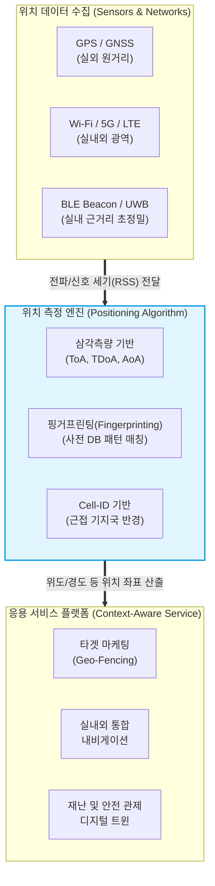

# LAS (Location Aware System)

---

## I. 실시간 문맥 인지형 맞춤 서비스의 기반, LAS의 개요

* **정의**: 사용자가 소지한 스마트 디바이스나 사물의 현재 위치를 실시간으로 파악(측위)하고, 이를 기반으로 사용자의 상황(Context)에 맞는 지능화된 정보와 맞춤형 서비스를 제공하는 위치 인식 시스템
* **배경 및 필요성**: 스마트폰 및 IoT(사물인터넷) 디바이스의 폭발적 증가, GPS가 닿지 않는 실내 공간에서의 정밀 위치 기반 서비스(LBS) 수요 급증
* **특징**: 단순한 좌표(Location) 정보 제공을 넘어 주변 환경과 상황을 결합한 상황 인지(Context-awareness) 서비스 제공, 실외(GPS)와 실내(BLE, UWB, Wi-Fi 등) 측위 기술의 융·복합 발전

---

## II. LAS의 구성도 및 핵심 측위 기술 요소

### 가. LAS의 아키텍처 및 측위 프로세스 개념도

* 다양한 센서/네트워크로부터 신호를 수집하고, 수학적/통계적 [[알고리즘]](엔진)을 통해 위치를 계산한 후 상황(Context)에 맞는 비즈니스 서비스로 매핑하는 구조임

### 나. LAS의 핵심 위치 측정 기술 및 구성 요소

| 분류 | 요소기술(키워드) | 세부 설명 |
| --- | --- | --- |
| **시간 기반 측위** | ToA (Time of Arrival) | 송신된 전파가 수신기에 **도달하는 시간**을 측정하여 거리를 산출하고, 3개 이상 기지국의 교점을 찾아 위치 결정 |
| **시간 기반 측위** | TDoA (Time Difference of Arrival) | 전파가 서로 다른 수신기에 **도달하는 시간의 차이**를 측정하여 쌍곡선의 교점을 구해 위치를 계산 |
| **각도 기반 측위** | AoA (Angle of Arrival) | 배열 안테나를 이용하여 수신된 전파의 **도달 각도(입사각)**를 측정, 방향선의 교점으로 위치 식별 |
| **DB 기반 측위** | Fingerprinting ([[핑거프린팅]]) | 실내 공간을 격자로 나누어 지점별 수신 신호 세기(RSS) 맵을 사전 구축 후, 현재 신호 패턴과 DB를 매칭하여 위치 추정 |
| **셀 기반 측위** | Cell-ID | 단말기가 접속되어 있는 기지국(Cell)의 위치 반경을 단말의 위치로 추정하는 가장 단순한 방식 (오차가 큼) |
| **센서/통신망** | BLE Beacon (비콘) | 블루투스 저전력(BLE) 기반의 송신기로, 실내 특정 위치 반경 내로 접근 시 알림(푸시)을 주는 마이크로 로케이션 기술 |
| **초정밀 통신망** | UWB (Ultra-Wideband) | 초광대역 주파수를 사용하여 장애물 투과율이 높고, 오차 범위가 cm 단위인 초정밀 실내 측위 기술 |
| **지리적 경계** | Geo-Fencing (지오펜싱) | 실제 지리적 구역에 가상의 울타리(경계)를 설정하여 디바이스가 진입/이탈할 때 이벤트를 발생시키는 기술 |

---

## III. LAS 주요 측위 기술 비교 및 최근 발전 동향

### 가. 실내외 환경에 따른 주요 LAS 측위 기술 비교

| 비교 항목 | GPS / GNSS | Wi-Fi (Fingerprinting) | UWB (Ultra-Wideband) |
| --- | --- | --- | --- |
| **주요 환경** | 실외 (Outdoor) 넓은 지역 | 실내 (Indoor) 상업 시설 | 실내 정밀 공간 (스마트홈 등) |
| **정확도 (오차)** | 약 5 ~ 20m (기상 환경 영향) | 약 1 ~ 5m (AP 밀집도 의존) | **수 cm 이내 (초정밀)** |
| **구축 비용** | 낮음 (기존 위성 활용) | 중간 (AP 및 DB 구축 필요) | 높음 (전용 센서 인프라 요구) |
| **전력 소모** | 높음 | 중간 | 매우 낮음 |
| **주요 서비스** | 내비게이션, 물류 트래킹 | 백화점 길안내, 자산 위치 관리 | 디지털 키, 무인 로봇 동선 제어 |

### 나. 최근 LAS 발전 동향 및 향후 전망

* **초정밀 측위 기술(UWB, RTK)의 대중화**: 스마트폰 기본 탑재 확대로 스마트카의 디지털 키(Digital Key), 실내 무인 배송 로봇 등 오차 범위 수 cm 이내의 초정밀 실내외 측위 생태계가 폭발적으로 성장 중
* **AI 및 공간 컴퓨팅(Spatial Computing) 결합**: 단순한 현재 위치 파악을 넘어 [[딥러닝]] 기반 이동 패턴 분석을 통한 사전 예측 서비스(Predictive LBS) 및 [[디지털 트윈]](Digital Twin) 기반의 실시간 3D 관제 시스템으로 진화하고 있음

---

### 🔗 연관 토픽

- **소속 도메인**: [[00_인공지능_MOC|🤖 인공지능]]
- **세부 분류**: `5. 컴퓨터 비전 · 음성 & 에이전트`
- **핵심 연관 토픽**:
  - [[딥러닝]]
  - [[PCA(Principal Component Analysis)]]
  - [[핑거프린팅|핑거프린팅(Fingerprinting)]]
  - [[알고리즘]]
  - [[차원 축소|차원 축소(Dimensionality Reduction)]]
