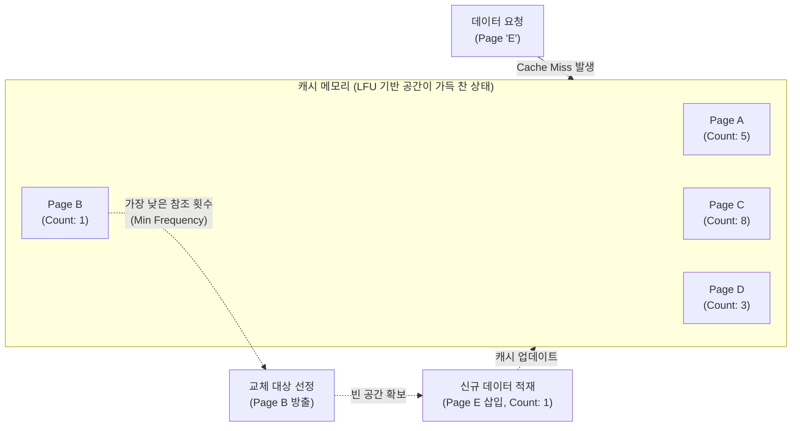

# LFU (Least Frequently Used)

---

## I. 참조 빈도 기반의 캐시 교체 알고리즘, LFU의 개요

* **정의**: 한정된 캐시(Cache) 메모리 공간에 새로운 데이터를 적재하기 위해 기존 데이터를 방출할 때, 과거 데이터 참조 횟수(Frequency)가 가장 적은 블록(페이지)을 우선적으로 교체하는 [[알고리즘]]
* **필요성**: 시간적 [[지역성]](최근성)만 고려하는 [[LRU]]의 한계 극복, 장기적으로 꾸준히 참조되는 핵심 데이터의 캐시 히트율(Hit Ratio) 보장
* **특징**: 데이터별 참조 횟수 카운터 유지 관리, 지속적인 참조 성향 반영, 최근에 적재된 페이지가 불리한 캐시 오염(Cache Pollution) 문제 내재

---

## II. LFU의 동작 개념도 및 핵심 기술 요소

### 가. LFU 알고리즘의 동작 개념도 및 원리

* 캐시 미스(Cache Miss) 발생 시, 모든 페이지의 참조 카운터를 비교하여 가장 카운트가 낮은 페이지를 방출하고, 신규 페이지를 적재한 뒤 카운트를 1로 초기화함

### 나. LFU의 핵심 기술 및 구성 요소

| 구분 | 요소기술(키워드) | 세부 설명 |
| --- | --- | --- |
| **상태 관리** | Frequency Counter (참조 카운터) | 각 데이터 블록이나 페이지가 접근될 때마다 1씩 증가하는 빈도수 추적 변수 |
| **자료 구조** | Min-Heap / Priority [[Queue]] | 최저 빈도수를 가진 데이터를 O(log N) 혹은 O(1) 시간 복잡도로 빠르게 탐색하기 위한 구조 |
| **정책 결정** | Tie-Breaking Rule (동률 처리) | 참조 횟수가 동일한 페이지가 다수일 경우, 가장 오래전에 참조된 데이터(LRU)를 우선 방출하는 규칙 |
| **한계 극복** | Aging (에이징/노화 기법) | 과거에 빈번히 사용되었으나 현재는 쓰이지 않는 데이터가 캐시를 점유하는 오염(Pollution) 방지를 위해, 주기적으로 카운트를 감소시키는 기술 |
| **한계 극복** | LRFU (Least Recently/Frequently Used) | LRU(최근성)와 LFU(빈도수)의 가중치를 결합하여 시간에 따른 참조 가치를 계산하는 혼합 알고리즘 |

---

## III. LFU와 LRU 알고리즘의 비교 및 최신 적용 동향

### 가. 캐시 교체 알고리즘 LFU와 LRU 비교

| 비교 항목 | LFU (Least Frequently Used) | LRU (Least Recently Used) |
| --- | --- | --- |
| **교체 기준** | **참조 횟수 (Frequency)** | **참조 시점 (Recency)** |
| **장점** | 장기적인 데이터 참조 패턴 및 인기도 반영에 유리함 | 최신 트렌드(시간적 지역성) 반영에 유리, 오버헤드가 적음 |
| **단점 (문제점)** | 최근 적재된 페이지가 쫓겨나는 **캐시 오염(Pollution)** 발생 | 반복적인 대규모 순차 탐색 시 캐시 히트율 급감 |
| **오버헤드** | 카운터 유지 및 정렬 연산으로 인해 상대적으로 높음 | 연결 리스트(Linked List)로 O(1) 처리가 가능하여 낮음 |

### 나. LFU 기반 알고리즘의 최근 적용 동향

* **W-TinyLFU 도입 (Caffeine Cache 등)**: 현대적인 로컬 캐시 라이브러리들은 LFU의 막대한 메모리 오버헤드와 캐시 오염을 극복하기 위해, Count-Min Sketch(확률적 카운터)와 Window(최근성) 개념을 결합한 **W-TinyLFU** 알고리즘을 표준으로 채택함
* **Redis의 LFU 정책(Eviction Policy)**: Redis 4.0 이후부터 24비트 공간을 활용한 확률적 로그 카운터(Probabilistic Logarithmic Counter) 기반의 정교한 LFU 축출 정책(`allkeys-lfu`, `volatile-lfu`)을 지원하여 글로벌 [[세션]] 및 핫 키(Hot Key) 관리에 적극 활용 중임

---

### 🔗 연관 토픽

- **소속 도메인**: [[00_운영체제_MOC|⚙️ 운영체제]]
- **세부 분류**: `5. 가상 메모리 관리 & 페이지 교체 알고리즘`
- **핵심 연관 토픽**:
  - [[LRU]]
  - [[OPT]]
  - [[NUR]]
  - [[페이지 교체 알고리즘|페이지 교체 알고리즘 (Paging Replacement Algorithm)]]
  - [[메모리 관리 정책]]
