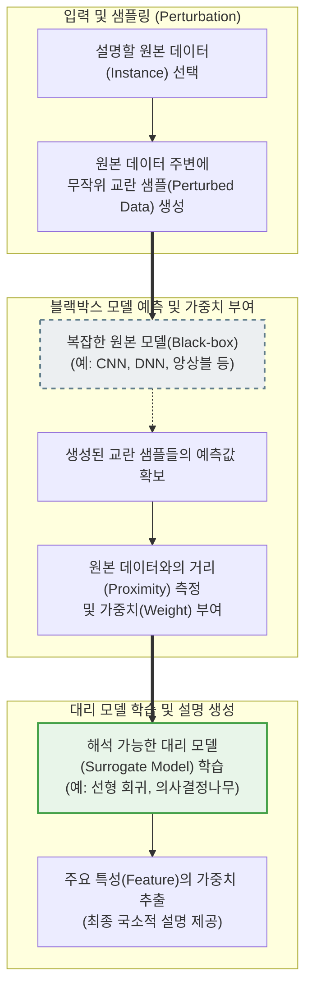

# LIME (Local Interpretable Model-agnostic Explanations)

---

## I. 블랙박스 AI의 신뢰성 확보를 위한 국소적 설명 모델, LIME의 개요

* **정의**: 복잡한 머신러닝/[[딥러닝]] 모델(Black-box)의 예측 결과를 특정 데이터(Local) 주변에서 단순한 해석 가능 모델(White-box)로 근사화하여 설명(Explanation)을 제공하는 모델 독립적(Model-agnostic) [[XAI]](설명 가능한 AI) 기법
* **필요성**: 딥러닝 모델의 내부 구조 파악 불가(Black-box 현상) 한계 극복, 의료/금융 등 고위험(High-Risk) 도메인에서의 의사결정 근거 확보, 글로벌 AI 규제(EU AI Act, GDPR 설명요구권) 준수
* **특징**: 모델 불가지성(어떠한 알고리즘에도 적용 가능), 국소적 충실성(전역적 설명 대신 특정 [[인스턴스]] 주변의 설명에 집중), 직관적 해석(선형 회귀 가중치, [[의사결정나무]] 형태 등) 제공

---

## II. LIME의 동작 프로세스 및 핵심 기술 요소

### 가. LIME의 알고리즘 동작 프로세스 개념도

* 설명하고자 하는 단일 데이터의 주변을 교란(Perturbation)하여 임의의 샘플들을 생성하고, 원본 모델의 예측값과 거리에 따른 가중치를 적용하여 단순한 선형 모델(대리 모델)을 학습시켜 해석 결과를 도출함

### 나. LIME의 핵심 기술 및 구성 요소

| 구분 | 요소기술(키워드) | 세부 설명 |
| --- | --- | --- |
| **핵심 원리** | 국소적 충실성 (Local Fidelity) | 전체 데이터(Global)에 대한 설명력은 낮더라도, 관심 있는 특정 예측(Local) 인스턴스 주변에서는 원본 모델과 유사하게 동작함을 보장 |
| **핵심 원리** | 모델 불가지성 (Model-Agnostic) | 원본 AI 모델의 [[알고리즘]] 내부 구조(파라미터, 아키텍처)를 몰라도 입력(Input)과 출력(Output) 쌍만으로 독립적인 설명 가능 |
| **데이터 처리** | 데이터 교란 (Perturbation) | 수치형 데이터에 노이즈를 추가하거나 텍스트/이미지의 특정 부분(단어, Superpixel)을 가려(Masking) 새로운 임의의 변형 샘플 생성 |
| **거리 측정** | [[유사도]] 가중치 (Proximity Weight) | 교란된 샘플과 원본 데이터 간의 유사도(유클리디안 거리 등)를 커널 함수([[커널|Kernel]] Function)로 계산하여 가까울수록 높은 학습 가중치 부여 |
| **해석 생성** | 대리 모델 (Surrogate Model) | 사람이 직관적으로 이해할 수 있는 백박스(White-box) 모델 (주로 Ridge Regression, Lasso 회귀 등 선형 모델 사용) 적용 |
| **해석 생성** | 피처 중요도 (Feature Importance) | 대리 모델이 학습한 선형 방정식의 계수(Coefficient) 크기를 통해 예측에 긍정/부정적 영향을 미친 주요 특징 식별 |

---

## III. 주요 XAI 기법 비교 및 최신 동향

### 가. LIME과 SHAP (대표적 XAI 기법) 비교

| 비교 항목 | LIME (Local Interpretable Model-agnostic Explanations) | SHAP (SHapley Additive exPlanations) |
| --- | --- | --- |
| **이론적 기반** | **국소적 대리 모델 (Local Surrogate Model)** | **게임 이론의 섀플리 값 (Shapley Value)** |
| **설명 관점** | **Local (국소적 특정 예측 설명에 최적화)** | **Local + Global (전역적 특성 중요도 동시 제공)** |
| **수학적 일관성** | 비교적 낮음 (샘플링 방법에 따라 결과가 달라질 수 있음) | 매우 높음 (피처의 기여도를 수학적으로 완벽히 분배) |
| **연산 속도** | **빠름 (단순 샘플링 및 선형 회귀 수행)** | **느림 (모든 피처 조합에 대한 계산 필요, 비용 큼)** |
| **주요 활용** | 개별 예측 결과에 대한 빠르고 직관적인 사용자 설명 | 모델 전체의 [[신뢰성]] 검증 및 피처 간의 상호작용 분석 |

### 나. LIME의 최신 활용 동향 및 전망

* **복합 양식(Multimodal) 및 [[초거대 언어 모델|LLM]] 설명력 부여**: 기존 정형 데이터 및 이미지를 넘어, 거대 언어 모델(LLM)이 생성한 텍스트의 근거(Grounding)를 추적하고, 모델 환각(Hallucination) 현상을 탐지하기 위한 핵심 도구로 확장 적용 중
* **[[MLOps]] 기반 XAI 자동화 파이프라인**: ML 모델 배포 시 모니터링 시스템과 결합하여, 편향성(Bias) 탐지 및 규제 기관 대응(Compliance)을 위한 실시간 해석 리포트 자동 생성 영역으로 활용도가 극대화되고 있음

---

### 🔗 연관 토픽

- **소속 도메인**: [[00_인공지능_MOC|🤖 인공지능]]
- **세부 분류**: `6. 설명가능한 AI (XAI) & AI 윤리 · 거버넌스`
- **핵심 연관 토픽**:
  - [[XAI]]
  - [[딥러닝]]
  - [[편향]]
  - [[의사결정나무]]
  - [[초거대 언어 모델|초거대 언어 모델(Large Language Model)]]
