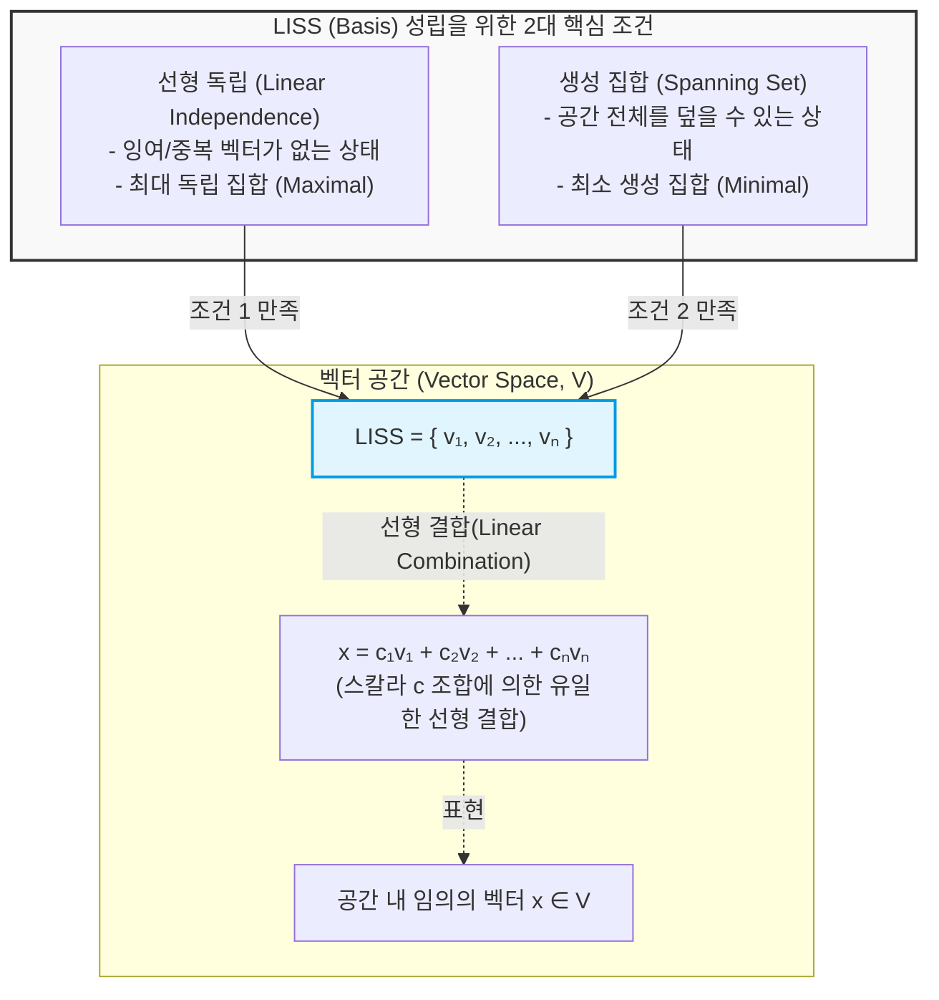

# LISS (Linearly Independent Spanning Set)

---

## I. 벡터 공간을 정의하는 최소·최적의 벡터 집합, LISS의 개요

* **정의**: 벡터 공간 내에서 모든 벡터들이 서로 선형 독립(Linearly Independent)을 유지하면서, 동시에 전체 벡터 공간을 생성(Span)할 수 있는 핵심 벡터들의 집합(즉, **기저(Basis)**)
* **필요성**: 무한한 벡터들로 구성된 벡터 공간을 유한한 개수의 벡터 연산(선형 결합)으로 완벽하게 표현하고 분석하기 위한 수학적 기준점(좌표계) 필요
* **특징**: 유일성(공간 내 임의의 벡터는 LISS의 선형 결합으로 단 한 가지로만 표현됨), 최소 생성 집합(Minimal Spanning Set)이자 최대 독립 집합(Maximal Independent Set)의 성질을 가짐

---

## II. LISS의 개념도 및 핵심 수학적 구성 요소

### 가. LISS의 2대 성립 조건 및 벡터 공간 생성 개념도

* 선형 독립과 공간 생성이라는 두 가지 조건을 완벽히 충족하는 집합(LISS)만이 벡터 공간의 기준이 될 수 있으며, 이를 통해 공간 내 모든 데이터를 중복 없이 유일한 좌표로 매핑함

### 나. LISS의 핵심 기술 및 수학적 구성 요소

| 구분 | 요소기술(키워드) | 세부 설명 |
| --- | --- | --- |
| **핵심 조건** | Linear Independence (선형 독립) | $c_1v_1 + \dots + c_nv_n = 0$을 만족하는 해가 오직 $c_1 = \dots = c_n = 0$ 뿐인 상태 (종속성 없음) |
| **핵심 조건** | Spanning (공간 생성) | 주어진 벡터 집합의 선형 결합(Linear Combination)을 통해 벡터 공간 $V$의 모든 원소를 만들어 낼 수 있는 특성 |
| **동의어** | Basis (기저) | LISS와 완전히 동일한 개념으로, 벡터 공간을 정의하는 기준이 되는 최소 필수 벡터 집합 |
| **공간 속성** | Dimension (차원) | LISS(기저)를 구성하는 독립 벡터의 총 개수 ($dim(V)$), 해당 벡터 공간의 고유한 크기를 의미 |
| **연산 방식** | Linear Combination (선형 결합) | 벡터들에 각각 스칼라(상수)값을 곱하여 더하는 연산으로, LISS를 통해 새로운 벡터를 합성하는 방식 |
| **집합 속성** | Minimal Spanning Set | 공간을 생성하는 집합 중, 벡터를 하나라도 제거하면 더 이상 공간을 생성하지 못하는 성질 |
| **집합 속성** | Maximal Independent Set | 선형 독립을 유지하는 집합 중, 벡터를 하나라도 추가하면 즉시 선형 종속이 되어버리는 성질 |
| **확장 개념** | Orthogonal Basis (직교 기저) | LISS를 구성하는 기저 벡터들이 서로 수직(내적이 0)인 상태로, 투영 연산 등 데이터 처리 편의성을 극대화 |

---

## III. 벡터 집합의 속성 비교 및 LISS의 최신 컴퓨팅 활용 동향

### 가. LISS(Basis) 관점에서의 벡터 집합 속성 비교

| 비교 항목 | 생성 집합 (Spanning Set) | 선형 독립 집합 (Linearly Independent Set) | **LISS (Basis / 기저)** |
| --- | --- | --- | --- |
| **핵심 목적** | 전체 공간의 포괄적 표현 | 데이터의 중복성 및 노이즈 제거 | **공간의 유일하고 완벽한 표현** |
| **벡터 수 (n)** | $n \ge \text{Dimension}(V)$ | $n \le \text{Dimension}(V)$ | **$n = \text{Dimension}(V)$** |
| **조건 만족 여부** | Span (O), Independent (X 가능) | Span (X 가능), Independent (O) | **Span (O), Independent (O)** |
| **특성 및 한계** | 잉여(Redundant) 벡터가 존재하여 비효율 발생 가능 | 전체 벡터 공간을 다 덮지 못하여 표현 불가능한 영역 존재 | **잉여 벡터 없이 모든 공간을 덮는 최적의 데이터 압축 표현** |

### 나. LISS의 컴퓨터 공학 및 AI 분야 최신 활용 동향

* **[[차원 축소]] 및 특징 추출 ([[PCA(Principal Component Analysis)|PCA]], [[SVD(Singular Value Decomposition)|SVD]])**: 고차원의 방대한 데이터(이미지, 텍스트)에서 노이즈를 제거하고 분산을 최대화하는 새로운 '직교 LISS(직교 기저)'를 찾아내어, 데이터의 본질적 특성만으로 차원을 축소하는 머신러닝의 핵심 수학적 원리로 활용됨
* **양자 컴퓨팅(Quantum Computing) 상태 표현**: 큐비트(Qubit)의 중첩 상태를 정의하는 힐베르트 공간(Hilbert Space)에서, 0과 1의 직교 기저(LISS) 벡터들의 선형 결합을 통해 양자 상태를 표현하고 연산 모델을 구축하는 데 필수적으로 적용됨

---

### 🔗 연관 토픽

- **소속 도메인**: [[00_경영전략_MOC|📈 경영전략]]
- **세부 분류**: `2. IT 거버넌스 & 엔터프라이즈 아키텍처 (EA/ISP)`
- **핵심 연관 토픽**:
  - [[PCA(Principal Component Analysis)]]
  - [[차원 축소|차원 축소(Dimensionality Reduction)]]
  - [[SVD(Singular Value Decomposition)]]
  - [[MECE와 LISS]]
  - [[데이터 거버넌스|데이터 거버넌스 (Data Governance)]]
