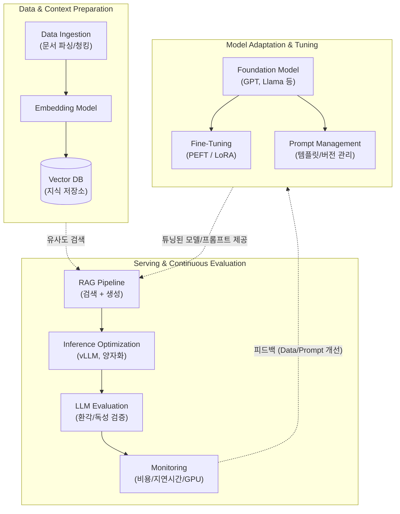

# LLMOps (Large Language Model Operations)

---

## I. 대규모 언어 모델의 생명주기 관리 프레임워크, LLMOps의 개요

* **정의**: [[파운데이션 모델|파운데이션 모델(Foundation Model)]] 기반의 대규모 언어 모델([[초거대 언어 모델|LLM]])을 개발, 미세조정([[Fine-Tuning]]), 배포, 평가 및 지속 모니터링하는 전체 생명주기를 자동화하고 최적화하기 위한 엔터프라이즈 운영 실무 체계
* **필요성**: 수십억 개 이상의 파라미터를 가진 모델 운영에 따른 천문학적 [[GPU]] 컴퓨팅 비용 통제, 환각(Hallucination) 및 편향성 문제 대응, 프롬프트 및 컨텍스트 중심의 새로운 파이프라인 관리 필요
* **특징**: [[MLOps]]의 확장 개념으로, [[프롬프트 엔지니어링]] 관리, RAG(검색 증강 생성) 및 벡터 DB(Vector DB) 통합, 사전 학습된 모델의 경량 튜닝([[PEFT]])에 중점을 둠

---

## II. LLMOps의 파이프라인 아키텍처 및 핵심 구성 요소

### 가. LLMOps의 라이프사이클 및 아키텍처 개념도

* 사전 학습된 거대 모델을 튜닝하고, 외부 지식(Vector DB)과 프롬프트를 결합하여 추론(Inference) 서비스로 제공하며, 그 품질과 인프라 비용을 지속적으로 평가하는 순환형 파이프라인임

### 나. LLMOps의 핵심 기술 및 구성 요소

| 구분 | 요소기술(키워드) | 세부 설명 |
| --- | --- | --- |
| **모델 튜닝** | PEFT (Parameter-Efficient FT) | 모델의 전체 가중치가 아닌 핵심 파라미터([[LoRA(Low-rank adaptation)|LoRA]] 등)만 미세조정하여 GPU 메모리와 학습 시간을 혁신적으로 절감 |
| **컨텍스트 강화** | RAG (Retrieval-Augmented Gen) | 답변 생성 전 최신/내부 데이터를 벡터 DB에서 검색하여 프롬프트에 주입, 모델의 환각(Hallucination) 현상 최소화 |
| **데이터 인프라** | Vector DB ([[벡터 데이터베이스]]) | 비정형 텍스트를 고차원 임베딩 벡터로 변환 및 저장하여, 코사인 [[유사도]] 기반의 초고속 의미 검색 지원 (예: Pinecone, Milvus) |
| **인터페이스 관리** | Prompt Management | 다양한 프롬프트 템플릿의 버전 관리, A/B 테스트 및 실험(Tracing) 이력을 관리하는 [[프레임워크]] (예: LangChain, PromptFlow) |
| **추론 최적화** | 양자화 (Quantization) | FP16/FP32 형태의 모델 가중치를 INT8/INT4 수준으로 압축하여 메모리 사용량을 줄이고 추론 속도를 극대화 |
| **추론 최적화** | PagedAttention (vLLM) | OS의 [[가상 메모리]] 페이징 기법을 차용하여 KV 캐시(Key-Value Cache)의 메모리 단편화를 제거, [[처리량]](Throughput) 향상 |
| **모델 평가** | LLM Evaluation Metrics | 정답이 없는 생성형 텍스트 품질을 평가하기 위한 지표 (BLEU, ROUGE, LLM-as-a-Judge 기법 적용) |
| **운영 모니터링** | Cost & GPU Monitoring | 토큰(Token) 단위의 API 사용 비용 산정, GPU 가동률 및 메모리 병목 현상 실시간 추적 |

---

## III. MLOps와 LLMOps의 비교 및 최신 동향

### 가. MLOps와 LLMOps의 차이점 비교

| 비교 항목 | MLOps (기존 머신러닝 운영) | LLMOps (거대 언어 모델 운영) |
| --- | --- | --- |
| **모델 획득 방식** | Scratch부터 직접 모델 학습 중심 | **Foundation Model 활용 및 튜닝 중심** |
| **데이터 파이프라인** | 정형 데이터 및 Feature Store 중심 | **비정형 텍스트 중심, Vector DB 및 Chunking** |
| **핵심 최적화 대상** | Hyperparameter 튜닝, 모델 경량화 | **Prompt Engineering, PEFT(LoRA), RAG 통합** |
| **평가 및 검증 지표** | Accuracy, F1-Score, RMSE 등 | **환각(Hallucination), 편향성, 유창성, 응답 지연(Latency)** |
| **인프라 비용 관리** | 학습 리소스([[CPU]]/GPU) 최적화 | **추론(Inference) 시 토큰 과금 및 고비용 GPU(VRAM) 통제** |

### 나. LLMOps의 최신 발전 동향 및 향후 전망

* **Agentic Workflow로의 진화**: 단일 질문-응답(QA) 수준을 넘어, 여러 특화 모델(Multi-Agent)이 도구(Tool)를 직접 호출하며 순환적으로 협업하는 **[[LangGraph]], AutoGen** 중심의 프레임워크로 LLMOps 관점이 확장 중임
* **SLM(Small Language Model) 기반 온디바이스 운영**: 막대한 클라우드 추론 비용을 절감하고 데이터 프라이버시를 확보하기 위해, 모델을 경량화하여 엣지 디바이스 단말에서 직접 실행·배포하는 On-Device LLMOps로의 전환이 가속화되고 있음

---

### 🔗 연관 토픽

- **소속 도메인**: [[00_인공지능_MOC|🤖 인공지능]]
- **세부 분류**: `4. 거대언어모델 (LLM) & 생성형 AI`
- **핵심 연관 토픽**:
  - [[MLOps]]
  - [[Fine-Tuning]]
  - [[프롬프트 엔지니어링|프롬프트 엔지니어링(Prompt Engineering)]]
  - [[PEFT|PEFT(Parameter-Efficient Fine-Tuning)]]
  - [[LangGraph]]
