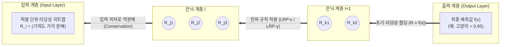

# LRP (Layer-wise Relevance Propagation)

---

## I. 딥러닝 블랙박스 해석을 위한 역전파 기반 XAI, LRP의 개요

* **정의**: 인공신경망의 최종 예측 결과(출력값)로부터 입력 계층 방향으로 [[역전파]](Backpropagation)하며, 각 뉴런이 최종 판단에 기여한 타당성 점수(Relevance Score)를 계층별로 분해 및 재분배하는 설명 가능한 [[인공지능]]([[XAI]]) 기술
* **등장 배경 및 필요성**:
* **블랙박스 문제(Black-box Problem)**: 심층 신경망(DNN)의 복잡한 비선형 구조로 인해 예측 결과에 대한 내부 판단 근거 추적 및 [[신뢰성]] 확보 불가
* **고위험 산업군 규제 대응**: 의료 진단, [[Smart Car(자율주행)|자율주행]], 금융 신용평가 등 의사결정의 설명 책임(Accountability)과 GDPR 등 인공지능 규제 준수 요구 증대

* **핵심 특징**:
* **보존 법칙(Conservation Property)**: 상위 계층 뉴런들이 받은 타당성 총합은 하위 계층으로 분배되는 총합과 동일하게 유지됨 ($\sum_j R_j = \sum_k R_k$)
* **화소 단위 해석(Pixel-wise Attribution)**: 최종 분류 점수를 원본 입력(이미지 픽셀, 단어 등) 수준의 히트맵(Heatmap) 형태로 시각화 가능

---

## II. LRP의 동작 원리 및 핵심 기술 요소

### 가. LRP의 역방향 전파 메커니즘 및 개념도

* 상위 계층($l+1$)의 뉴런 $k$가 가진 타당성 점수 $R_k$를 활성화 값($a_j$)과 가중치($w_{jk}$) 비율에 따라 하위 계층($l$)의 뉴런 $j$로 역방향 분배함.
* 테일러 급수(Taylor Decomposition)를 기반으로 하여, 입력층까지 역분배된 최종 $R_i$의 총합은 모델의 최종 예측값 $f(x)$와 일치함.

### 나. LRP의 핵심 기술 및 전파 규칙(Rules) 요소

| 분류 | 요소기술(키워드) | 세부 설명 |
| --- | --- | --- |
| **수학적 원리** | 보존 법칙 (Conservation) | 키르히호프 법칙과 유사하게, 이전 계층에서 전달받은 타당성 점수의 합이 다음 계층의 합과 완벽히 일치하는 성질 ($\sum_i R_i = f(x)$) |
| **수학적 원리** | 딥 테일러 전개 (DTD) | 비선형 신경망의 국소 지점(Reference Point) 근방에서 1차 테일러 급수로 근사하여 타당성을 분해하는 수학적 기반 |
| **기본 전파 규칙** | LRP-0 ($z$-Rule) | 입력 활성화와 가중치의 곱($z_{jk} = a_j w_{jk}$)에 비례하여 단순 분배 ($R_j = \sum_k \frac{a_j w_{jk}}{\sum_j a_j w_{jk}} R_k$) |
| **잡음 억제 규칙** | LRP-$\epsilon$ ($\epsilon$-Rule) | 분모에 미세 상수 $\epsilon$을 추가하여 분모가 0이 되는 수치 불안정성을 해소하고 노이즈 및 미미한 기여도를 제거 |
| **양수 강조 규칙** | LRP-$\gamma$ ($\gamma$-Rule) | 양의 가중치 기여분에 가중치 $\gamma$를 추가 부여하여, 판정에 긍정적인 영향을 준 핵심 피처를 더욱 두드러지게 강조 |
| **경계 입력 규칙** | LRP-$z^\beta$ ($z^\beta$-Rule) | 픽셀 입력값의 상한/하한 경계 범위($[l_i, u_i]$)를 고려하여 입력 계층 전용으로 안전하게 기여도를 역전파 |
| **시각화 기법** | 히트맵 (Heatmap) | 각 픽셀 또는 텍스트 토큰의 타당성 점수를 색상(Red: 긍정 기여, Blue: 부정 기여)으로 변환하여 직관적 근거 제공 |
| **기여도 해석** | Attribution Method | 특정 출력 결과를 도출하는 데 입력 데이터의 각 성분이 미친 영향력을 사후(Post-hoc) 분석하는 해석 기법 |

---

## III. XAI 주요 기여도 분석 기법 비교 및 향후 동향

### 가. 대표적 사후(Post-hoc) XAI 기법 비교 (LRP vs CAM vs SHAP)

| 비교 항목 | LRP (Layer-wise Relevance) | Grad-CAM | [[커널|Kernel]] SHAP |
| --- | --- | --- | --- |
| **접근 방식** | **계층별 역전파 분해 (Decomposition)** | 최종 합성곱 계층 그래디언트 기반 시각화 | 협동 게임이론 (Shapley Value) 기반 추정 |
| **내부 구조 의존성** | 화이트박스 (신경망 가중치/구조 필요) | 화이트박스 (주로 [[CNN]] 계층에 특화) | 블랙박스 (입출력 인터페이스만으로 가능) |
| **해상도 및 세밀도** | **화소 단위 고해상도 (Pixel-level)** | 특징 맵 단위 저해상도 (Coarse Heatmap) | 특징 단위 (Feature-level) |
| **연산 속도** | **빠름 (단일 역전파 1회 수행)** | 빠름 (그래디언트 1회 연산) | 느림 (경우의 수 샘플링으로 다량 연산 필요) |
| **적용 모델** | MLP, CNN, Transformer 등 [[딥러닝]] 전반 | 합성곱 신경망 (CNN 계층 필수) | 모델 비의존적 (Model-Agnostic, 모든 모델) |

### 나. 한계점 극복 및 향후 발전 전망

* **Transformer(ViT, [[초거대 언어 모델|LLM]]) 모델로의 확장**: 초기 CNN 중심의 이미지 해석에서 나아가 Multi-Head Attention의 복잡한 상호작용과 Layer Normalization을 반영할 수 있는 **Transformer-LRP(AttnLRP)** 알고리즘으로 진화 중임.
* **[[적대적 공격]] 취약성 보완**: 가중치 조작이나 미세 노이즈 추가 시 설명 결과(히트맵)가 왜곡될 수 있는 취약점을 방어하기 위해 설명 강건성(Explanation Robustness) 검증 기술과 결합되는 추세임.
* **규제 대응 및 실무 신뢰성 확보**: EU AI Act 등 고위험 AI 규제 대응을 위해 의료 영상 병변 판독 근거 제시, 자율주행 센서 오작동 원인 규명 등의 실무 감사(Audit) 파이프라인의 핵심 도구로 정착 중임.

---

### 🔗 연관 토픽

- **소속 도메인**: [[00_인공지능_MOC|🤖 인공지능]]
- **세부 분류**: `3. 딥러닝 핵심 아키텍처 & 신경망`
- **핵심 연관 토픽**:
  - [[딥러닝]]
  - [[인공지능]]
  - [[초거대 언어 모델|초거대 언어 모델(Large Language Model)]]
  - [[XAI]]
  - [[CNN|CNN (Convolutional Neural Network)]]
