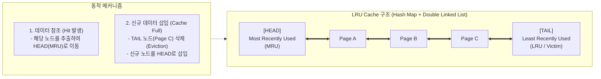

# LRU (Least Recently Used)

---

## I. 시간 지역성 기반 자원 교체 알고리즘, LRU의 개요

* **정의**: 메모리나 캐시 공간이 부족할 때, 가장 오랫동안 참조되지 않은(Least Recently Used) 데이터 블록 또는 페이지를 교체 대상(Victim)으로 선정하여 새로운 데이터로 교체하는 페이지/캐시 교체 [[알고리즘]]
* **등장 배경 및 필요성**:
* 미래의 참조 정보를 완벽히 예측해야 하는 최적 교체 알고리즘([[OPT]], Bélády's Algorithm)의 비실현성 극복
* 한정된 캐시 및 주기억장치 자원에서 페이지 부재(Page Fault)율을 최소화하고 적중률(Hit Ratio)을 극대화하기 위해 고안됨

* **핵심 특징**:
* **시간 [[지역성]](Temporal Locality) 활용**: 최근에 참조된 데이터는 가까운 미래에 다시 참조될 가능성이 높다는 원리에 기반함
* **Belady의 모순([[Belady's Anomaly]]) 없음**: 할당된 프레임 수가 증가할 때 페이지 부재가 오히려 늘어나는 현상이 발생하지 않는 스택 알고리즘([[Stack]] Algorithm)의 특성을 가짐

---

## II. LRU의 동작 원리 및 핵심 구현 기법

### 가. LRU의 동작 개념도 및 더블 링크드 리스트 기반 구조

* 데이터 참조가 발생할 때마다 해당 페이지를 가장 최근에 사용된 위치(MRU / Head)로 갱신함.
* 캐시가 가득 찬 상태에서 신규 참조가 발생하면 가장 오랫동안 참조되지 않은 말단(LRU / Tail)의 페이지를 즉시 축출(Evict)함.

### 나. LRU의 핵심 기술 및 구현 메커니즘

| 분류 | 요소기술(키워드) | 세부 설명 |
| --- | --- | --- |
| **자료구조** | Doubly Linked List | 노드의 삽입 및 삭제 연산을 $O(1)$의 일정한 시간 복잡도로 처리하기 위한 양방향 연결 리스트 |
| **자료구조** | Hash Map | 페이지 번호(Key)로 캐시 내 노드(Value) 주소를 $O(1)$만에 즉시 검색하기 위한 인덱스 구조 |
| **시간 복잡도** | $O(1)$ 연산 (Lookup/Update) | Hash Map과 Doubly Linked List를 결합하여 조회, 갱신, 삭제의 시간 복잡도를 상수로 보장 |
| **하드웨어 지원** | 하드웨어 카운터 (Counter) | 메모리 참조 시마다 클록 레지스터 값을 페이지 테이블에 기록하여 가장 작은 값을 희생자로 선정 |
| **하드웨어 지원** | 참조 스택 (Reference Stack) | 페이지 참조 시 해당 페이지를 스택의 Top으로 이동시키고, 바닥(Bottom)에 있는 페이지를 교체 |
| **근사 알고리즘** | Clock Algorithm (Second Chance) | LRU의 하드웨어 오버헤드를 줄이기 위해 참조 비트(Reference Bit) 1개를 순환 큐 방식으로 검사하는 기법 |
| **근사 알고리즘** | Aging Algorithm (노화 기법) | 참조 비트를 일정 주기마다 오른쪽으로 시프트(Shift)하여 최근 사용 이력을 비트열 크기로 정밀 추적 |
| **이론적 특성** | Stack Algorithm | 임의 시점에서 프레임 수가 $n$개일 때의 캐시 내용이 $n+1$개일 때의 부분집합이 되는 수학적 보장 특성 |

---

## III. 캐시 교체 알고리즘 비교 및 현대적 발전 동향

### 가. 대표 캐시/페이지 교체 알고리즘 비교

| 비교 항목 | [[FIFO]] | LRU | [[LFU]] | [[NUR]] (Clock) |
| --- | --- | --- | --- | --- |
| **교체 기준** | 가장 먼저 적재된 페이지 | **가장 오랫동안 미사용된 페이지** | 참조 횟수가 가장 적은 페이지 | 참조/변형 비트 기반 근사 교체 |
| **판단 근거** | 적재 시간 (Arrival Time) | **최근 참조 시점 (Recency)** | 누적 참조 횟수 (Frequency) | 최근 참조 여부 (Reference Bit) |
| **Belady 모순** | **발생함** | **발생 안 함 (Stack 구조)** | 발생 안 함 | 발생 안 함 |
| **구현 오버헤드** | 매우 낮음 (단순 큐) | 보통~높음 (시간/순서 추적) | 높음 (빈도 카운터 유지 비용) | **낮음 (하드웨어 친화적)** |
| **실제 적용처** | 초기 시스템, 버퍼 | 일반 [[캐시 메모리]], Redis, Web | 특수 목적 빈도 분석 시스템 | **OS 가상메모리 관리 (Linux 등)** |

### 나. 한계 극복 및 최신 발전 동향

* **대규모 스캔 공격(Scan Pollution) 한계**: 한 번만 읽고 버리는 대용량 순차 데이터(Full Table Scan 등)가 유입될 때 기존의 고빈도 캐시 데이터가 모두 밀려나는 취약점이 존재함.
* **LRU-K 및 2Q(Two-[[Queue]]) 기법**:
* 최근 1회가 아닌 최근 $K$번째 참조 시점 간격을 측정하는 **LRU-K**로 발전하여 일회성 스캔에 의한 캐시 오염을 방어함.
* 임시 FIFO 큐와 메인 LRU 큐를 분리하는 **2Q 알고리즘**을 통해 첫 참조 시에는 임시 큐에 두고 재참조가 발생할 때만 정규 캐시로 승격시키는 구조가 OS [[커널]] 및 [[데이터베이스]] 버퍼 풀에 널리 활용됨.

* **현대적 적응형 캐시(ARC, W-TinyLFU)**:
* IBM의 **ARC(Adaptive Replacement Cache)**: LRU와 LFU의 장점을 결합하여 워크로드 변화에 따라 캐시 크기를 자율 동적 조정.
* 최신 캐시 라이브러리(Caffeine, Redis 등)는 카운트-민 스케치(Count-Min Sketch) 기반의 **W-TinyLFU**를 채택하여 극소량의 메모리로 LRU의 신선도와 LFU의 빈도 보존을 동시에 달성함.

---

### 🔗 연관 토픽

- **소속 도메인**: [[00_운영체제_MOC|⚙️ 운영체제]]
- **세부 분류**: `5. 가상 메모리 관리 & 페이지 교체 알고리즘`
- **핵심 연관 토픽**:
  - [[OPT]]
  - [[LFU]]
  - [[NUR]]
  - [[Belady's Anomaly]]
  - [[캐시 메모리]]
