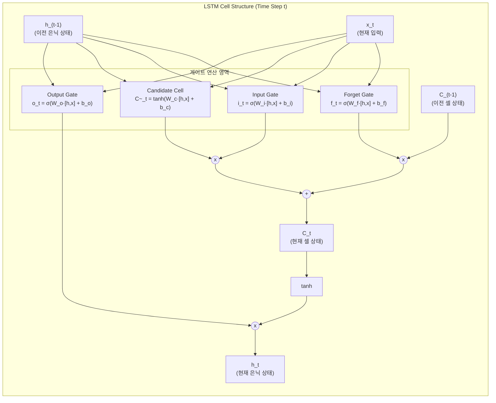

# LSTM (Long Short-Term Memory)

---

## I. 순환 신경망의 장기 의존성 한계 극복, LSTM의 개요

* **정의**: 표준 순환 신경망(Vanilla [[RNN (Recurrent Neural Network)|RNN]])의 기울기 소실(Vanishing Gradient) 문제를 해결하기 위해, 셀 상태(Cell State)와 3개의 게이트(Gate) 제어 메커니즘을 도입하여 시계열 데이터의 장기 의존성(Long-term Dependency)을 보존하는 [[딥러닝]] 아키텍처
* **등장 배경 및 필요성**:
* 기본 RNN은 시퀀스 길이가 길어질수록 과거 정보가 소실되거나 [[역전파]] 시 그래디언트가 소실/폭주하는 한계 존재
* 텍스트 번역, 음성 인식, 시계열 예측 등 시간적 간격이 큰 문맥(Context) 정보를 장기간 온전히 유지·전달할 수 있는 메모리 셀 구조 필요

* **핵심 특징**:
* **셀 상태(Cell State)**: 컨베이어 벨트 역할을 수행하여 과거 정보를 선형적으로 손실 없이 장거리 전달
* **게이트 구조(Gate Mechanism)**: 시그모이드($\sigma$)와 점곱($\odot$) 연산을 통해 정보의 유입·보존·방출 비율(0~1)을 능동적으로 제어

---

## II. LSTM의 아키텍처 및 핵심 기술 요소

### 가. LSTM 셀 내부 구조 및 동작 원리

* **삭제 단계 (Forget Gate)**: 과거 정보($C_{t-1}$) 중 버릴 정보의 비율($f_t$)을 결정
* **기억 단계 (Input Gate & Candidate)**: 현재 입력에서 새로운 정보($\tilde{C}_t$)를 얼마나 반영할지($i_t$) 계산하여 셀 상태를 덧셈 연산으로 갱신 ($C_t = f_t \odot C_{t-1} + i_t \odot \tilde{C}_t$)
* **출력 단계 (Output Gate)**: 갱신된 셀 상태($C_t$)를 비선형 변환($\tanh$)한 뒤 최종 출력($h_t$)으로 방출할 비율($o_t$)을 결정

### 나. LSTM의 핵심 기술 요소

| 분류 | 요소기술(키워드) | 세부 설명 |
| --- | --- | --- |
| **핵심 통로** | 셀 상태 (Cell State, $C_t$) | 타임스텝 전체를 관통하는 핵심 메모리 경로로, 덧셈 기반 선형 연산으로 그래디언트 소실을 방지 |
| **은닉 상태** | 히든 상태 (Hidden State, $h_t$) | 현재 시점의 최종 예측값 도출 및 다음 시점 입력으로 전달되는 필터링된 단기 표현 벡터 |
| **게이트 제어** | 망각 게이트 (Forget Gate, $f_t$) | 이전 시점 정보의 유지 비율($0 \sim 1$)을 결정하여 불필요한 과거 맥락을 초기화 및 제거 |
| **게이트 제어** | 입력 게이트 (Input Gate, $i_t$) | 현재 시점의 새로운 입력 정보 중 셀 상태에 새롭게 추가할 정보의 비중을 결정 |
| **상태 생성** | 후보 셀 (Candidate Cell, $\tilde{C}_t$) | 활성화 함수 $\tanh$를 통해 $[-1, 1]$ 범위로 정규화된 신규 잠재 정보 벡터 |
| **게이트 제어** | 출력 게이트 (Output Gate, $o_t$) | 갱신된 셀 상태 중에서 외부로 노출(출력)할 요소를 선택적으로 제어하는 필터 |
| **수학적 연산** | 점곱 (Hadamard Product, $\odot$) | 게이트 값과 벡터 간의 원소별 곱셈(Element-wise multiplication)으로 신호 통과율 조절 |
| **학습 기법** | BPTT (Backpropagation Through Time) | 시계열을 따라 시간 축 역방향으로 손실 함수의 기울기를 전파하여 파라미터를 최적화 |

---

## III. 시계열 순환 신경망 모델 비교 및 기술적 진화

### 가. 순환 신경망 계열 모델 비교 (Vanilla RNN vs LSTM vs GRU)

| 비교 항목 | Vanilla RNN | LSTM | GRU (Gated Recurrent Unit) |
| --- | --- | --- | --- |
| **내부 상태 수** | 1개 ($h_t$) | **2개 ($C_t, h_t$)** | 1개 ($h_t$) |
| **게이트 구성** | 게이트 없음 | **3개 (Forget, Input, Output)** | 2개 (Reset, Update) |
| **파라미터 수/연산량** | 매우 적음 (기준) | 많음 (약 4배 파라미터 요구) | 중간 (LSTM 대비 약 25% 경량화) |
| **장기 의존성 해결** | 해결 불가 (그래디언트 소실 발생) | **완전 해결 (장거리 문맥 유지 탁월)** | 우수하게 해결 |
| **학습 속도** | 빠름 | 상대적으로 느림 | LSTM 대비 빠른 수렴 |

### 나. 한계 극복 및 최신 딥러닝 발전 동향

* **순차 처리의 병목과 Transformer로의 대체**: LSTM은 시간 축($t$)에 따른 순차적 순전파/역전파 구조를 취하므로 [[GPU]] 병렬 처리에 한계가 존재함. 자연어 처리(NLP) 분야에서는 Self-Attention 기반의 Transformer([[BERT]], GPT)로 주도권이 완전히 전환됨.
* **경량/실시간 시계열 도메인의 지속 활용**: 센서 데이터 분석, 온디바이스 IoT 시계열 예측, 음성 스트리밍 등 저전력·저지연 실시간 순차 처리가 요구되는 환경에서는 경량화된 양방향 LSTM(Bi-LSTM) 및 GRU가 여전히 실무 표준으로 널리 운용 중임.

---

### 🔗 연관 토픽

- **소속 도메인**: [[00_인공지능_MOC|🤖 인공지능]]
- **세부 분류**: `3. 딥러닝 핵심 아키텍처 & 신경망`
- **핵심 연관 토픽**:
  - [[딥러닝]]
  - [[RNN (Recurrent Neural Network)]]
  - [[초거대 언어 모델|초거대 언어 모델(Large Language Model)]]
  - [[트랜스포머|트랜스포머(Transformer)]]
  - [[자기 집중]]
