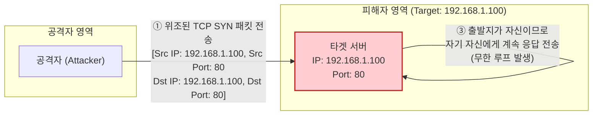

# Land Attack (랜드 어택)

---

## I. 자원 고갈을 유발하는 자기 참조 루프형 DoS 공격, Land Attack의 개요

* **정의**: 공격자가 [[TCP]] SYN 패킷의 출발지 IP 주소와 포트를 타겟 시스템의 목적지 IP 주소와 포트와 동일하게 위조(Spoofing)하여 전송함으로써, 타겟 시스템이 자신에게 무한 응답하게 만들어 자원을 고갈시키는 [[DoS (Denial of Service)|DoS(Denial of Service)]] 공격 기법
* **필요성(방어 관점)**: [[방화벽]] 및 라우터의 인바운드 패킷 검증 정책 부재 시 시스템 마비 위험, 레거시 시스템 및 보안 패치가 미흡한 IoT 기기에서의 치명적 장애 예방
* **특징**: IP 스푸핑(Spoofing) 기반, TCP 3-Way Handshake 취약점 악용, 시스템 자기 참조(Self-Referencing)에 의한 [[CPU]] 및 메모리 부하 가중

---

## II. Land Attack의 동작 원리 및 핵심 구성 요소

### 가. Land Attack의 공격 메커니즘 및 동작 원리

* 출발지와 목적지가 동일한 패킷을 수신한 타겟 서버는 응답 패킷(SYN/ACK)을 자신에게 다시 보내고, 이를 받은 서버가 다시 응답하는 과정을 반복하며 가용성을 상실함

### 나. Land Attack의 핵심 구성 요소 및 대응 기술

| 분류 | 요소기술(키워드) | 세부 설명 |
| --- | --- | --- |
| **공격 기법** | IP Spoofing (주소 위조) | 공격자가 자신의 IP를 숨기고, 패킷의 출발지 IP를 타겟의 IP와 동일하게 조작 |
| **공격 기법** | TCP SYN Flooding 원리 | 정상적인 3-Way Handshake를 완료하지 못하고 [[세션]] 대기 상태를 유지하도록 유도 |
| **피해 현상** | Self-Referencing Loop | 출발지와 목적지가 같아 시스템 내부에서 응답 패킷이 무한히 순환하는 논리적 오류 |
| **피해 현상** | Resource Exhaustion | 무의미한 루프 처리 및 빈 세션 유지로 인해 CPU 사용률 100% 도달 및 메모리 고갈 |
| **대응 기술** | Ingress Filtering | [[라우터]]/방화벽에서 외부망으로부터 유입되는 패킷 중 출발지 IP가 내부망 IP인 경우 차단 |
| **대응 기술** | OS Security Patch | 최신 운영체제의 TCP/IP 스택에서 출발지와 목적지가 동일한 패킷을 식별 즉시 Drop(폐기) 처리 |
| **대응 기술** | Stateful Inspection | 방화벽에서 세션의 상태(State)를 추적하여 비정상적인 연결 요청(자기 자신 연결) 차단 |

---

## III. 유사 DoS 공격과의 비교 및 보안 동향

### 가. IP Spoofing 기반 주요 DoS 공격 비교 (Land Attack vs Smurf Attack)

| 비교 항목 | Land Attack (랜드 어택) | Smurf Attack (스머프 어택) |
| --- | --- | --- |
| **주요 활용 [[프로토콜]]** | TCP (연결 지향, SYN 패킷) | [[ICMP]] (비연결형, Echo Request) |
| **주소 위조(Spoofing) 방식** | **출발지 IP = 목적지 IP (타겟 IP)** | 출발지 IP = 타겟 IP, **목적지 IP = 브로드캐스트** |
| **피해 발생 메커니즘** | 타겟 시스템 스스로 무한 응답 (Self-Loop) | 다수의 호스트(반사체)가 타겟에게 일제히 응답 (Reflection) |
| **핵심 대응 방안** | Src IP와 Dst IP가 동일한 패킷 차단 | 라우터 설정에서 Direct Broadcast 기능 비활성화 |

### 나. Land Attack 관련 최신 보안 동향

* **레거시/IoT 디바이스 위협 지속**: Windows, Linux 등 현대의 최신 OS는 TCP/IP 스택 레벨에서 Land Attack 패킷을 기본적으로 필터링하지만, 업데이트가 지원되지 않는 **구형 산업용 제어 시스템(ICS/OT) 및 소형 IoT 기기**에서는 여전히 치명적인 서비스 거부 취약점으로 작용할 수 있음
* **[[DDOS|DDoS]]로의 진화**: 단일 Land Attack은 쉽게 차단되나, 최근에는 수많은 봇넷(Botnet)을 동원하여 다양한 IP 대역에서 변형된 Land Attack과 SYN Flood를 혼합 전송하는 복합 [[다형성]] 공격(Multi-Vector Attack) 형태로 진화하여 보안 장비의 탐지/차단 부하를 유발함

---

### 🔗 연관 토픽

- **소속 도메인**: [[00_보안_MOC|🛡️ 보안]]
- **세부 분류**: `2. 현대 암호학 & 키 관리 · 전자서명`
- **핵심 연관 토픽**:
  - [[DoS (Denial of Service)]]
  - [[DDOS]]
  - [[방화벽]]
  - [[ICMP]]
  - [[프로토콜]]
