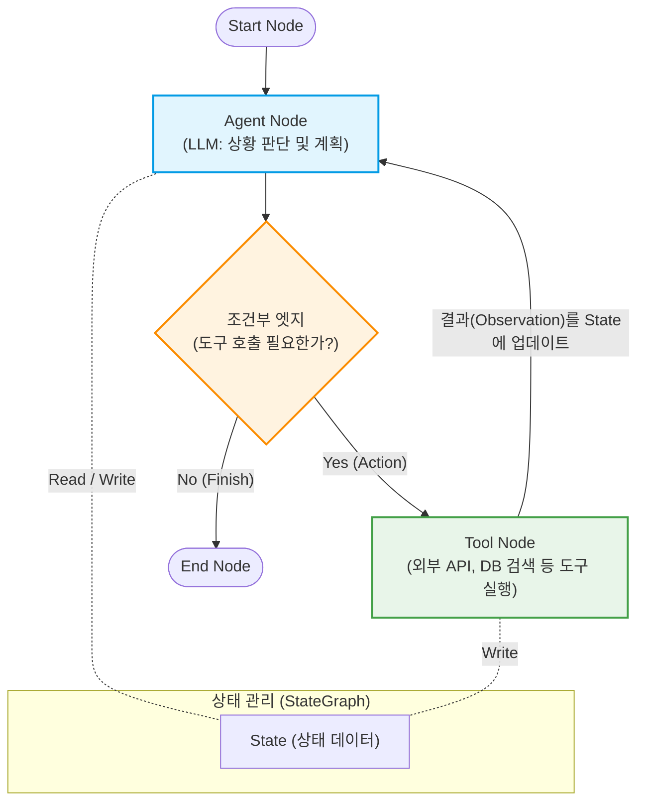

# LangGraph

---

## I. 자율형 AI 에이전트 구축을 위한 상태 기반 순환 프레임워크, LangGraph의 개요

* **정의**: 대규모 언어 모델([[초거대 언어 모델|LLM]])을 활용하여 상태 유지(Stateful) 및 다중 에이전트(Multi-Agent) 기반의 복잡한 애플리케이션을 구축하기 위해 설계된 LangChain의 순환형(Cyclic) 그래프 확장 [[프레임워크]]
* **배경**: 기존 LangChain의 단방향(DAG, [[방향성 비순환 그래프|Directed Acyclic Graph]]) 파이프라인이 가진 제약을 극복하고, 인간의 사고 과정과 유사한 반복(Loop) 및 조건부 분기(Feedback)가 필수적인 에이전틱(Agentic) 워크플로우 지원 필요
* **특징**: 그래프 기반(Node와 [[EDGE|Edge]])의 직관적 모델링, 내장된 상태(State) 관리, 끊김 없는 체크포인트(Checkpointer) 지원 및 Human-in-the-loop(HITL) 개입 기능 제공

---

## II. LangGraph의 아키텍처 개념도 및 핵심 구성 요소

### 가. LangGraph의 상태 순환(Cyclic) 아키텍처 개념도

* 그래프를 순회하는 동안 **State(상태)** 객체가 계속해서 업데이트되며, 에이전트(Agent) 노드가 도구(Tool)를 호출하고 그 결과를 바탕으로 다시 판단(추론)하는 **순환(Loop) 구조**를 가짐

### 나. LangGraph의 핵심 기술 요소 및 구성 요소

| 구분 | 요소기술(키워드) | 세부 설명 |
| --- | --- | --- |
| **그래프 구조** | StateGraph | 그래프 내의 모든 노드가 공유하고 업데이트할 수 있는 전역 상태(State) 스키마를 정의하는 핵심 [[클래스]] |
| **작업 단위** | Node (노드) | LLM 호출, 파이썬 함수 실행, API 연동 등 실제 연산 로직이 수행되는 그래프의 정점(Vertex) |
| **흐름 제어** | Edge (엣지) | 한 노드에서 다른 노드로의 실행 흐름 및 데이터 전달 방향을 정의하는 연결선 |
| **흐름 제어** | Conditional Edge | 현재 상태(State)나 LLM의 응답 결과에 따라 다음 실행할 노드를 동적으로 결정(If-Else)하여 순환을 가능하게 함 |
| **기억/지속성** | Checkpointer | 매 노드 실행(Step)마다 상태를 DB에 저장하여, 시스템 장애 시 복구하거나 대화 이력을 장기 기억하는 기능 |
| **개입 체계** | Human-in-the-loop | 에이전트가 특정 도구를 실행하기 전에 사람의 승인(Approval)을 대기하도록 그래프 실행을 일시 중지하는 기능 |
| **동시성 제어** | Multi-Agent | 여러 특화된 에이전트 노드들이 하나의 그래프 안에서 협력하거나 상태를 주고받으며 복잡한 과업을 수행 |
| **호환성** | LCEL 연동 | LangChain Expression Language와 완벽히 통합되어 기존 Runnable 객체들을 노드로 즉시 활용 가능 |

---

## III. 프레임워크 비교 및 향후 활용 전망

### 가. LLM 기반 주요 애플리케이션 프레임워크 비교

| 비교 항목 | LangChain (기본) | LangGraph | AutoGen (Microsoft) |
| --- | --- | --- | --- |
| **워크플로우 형태** | 단방향 파이프라인 (DAG) | **순환형 루프 (Cyclic Graph)** | 다중 에이전트 간 대화(Chat) 흐름 |
| **실행 제어 방식** | 체인(Chain) 기반 순차 실행 | **노드/엣지 및 상태(State) 기반 제어** | 에이전트 간 메시지 패싱(Message Passing) |
| **강점** | 단순 RAG, QA 시스템 구축 용이 | **복잡한 비즈니스 로직, 상태 추적 통제** | 코딩 자동화, 에이전트 자율 협업 |
| **사용자 개입(HITL)** | 제어하기 어려움 | **체크포인터 기반 정교한 개입 지원** | 대화 프롬프트를 통한 자연스러운 개입 |

### 나. LangGraph의 적용 전망 및 발전 동향

* **Agentic Workflow의 사실상 표준(De Facto Standard)**: 단순 챗봇을 넘어 스스로 계획하고 행동하는 자율형 AI([[LAM(Large Action Model)|LAM]]) 시스템을 기업 환경에 도입하기 위한 핵심 제어 엔진으로 채택이 급증함
* **복잡한 비즈니스 [[프로세스]] 자동화**: 멀티 에이전트 아키텍처와 정교한 상태 제어(Conditional Edge)를 통해 소프트웨어 개발(Dev Agent), 데이터 분석(Data Agent), 고객 응대(CS Agent) 등 RPA 수준의 비즈니스 자동화 파이프라인을 구현하는 주축으로 활용될 전망임

---

### 🔗 연관 토픽

- **소속 도메인**: [[00_인공지능_MOC|🤖 인공지능]]
- **세부 분류**: `4. 거대언어모델 (LLM) & 생성형 AI`
- **핵심 연관 토픽**:
  - [[LAM(Large Action Model)]]
  - [[랭체인|랭체인(LangChain)]]
  - [[LLMOps]]
  - [[초거대 언어 모델|초거대 언어 모델(Large Language Model)]]
  - [[지식 증류|지식 증류 (Knowledge Distillation)]]
