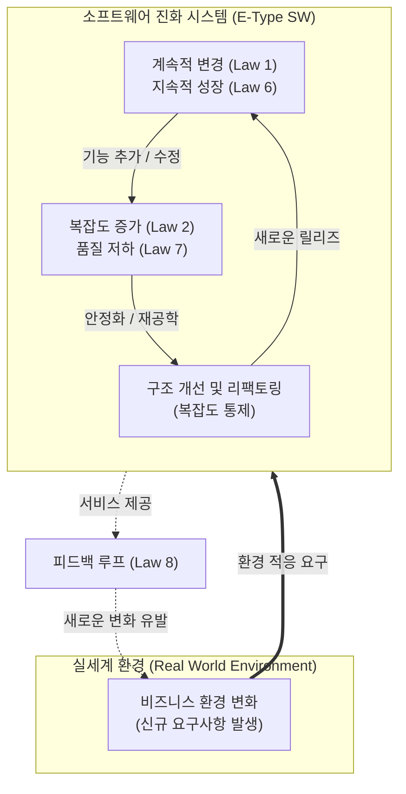

# Lehman의 Software 변화의 원리 (소프트웨어 진화의 법칙)

---

## I. 소프트웨어 노후화 방지와 진화적 통제를 위한, Lehman의 변화 원리 개요

* **정의**: 실세계 환경에서 운영되는 소프트웨어(E-Type)는 지속적으로 변화해야 하며, 이 과정에서 발생하는 소프트웨어 진화의 본질적인 특성과 생명주기 메커니즘을 정의한 8가지 경험적 법칙
* **등장배경**: 소프트웨어 배포 이후 발생하는 필연적인 [[유지보수]] 비용의 급증 현상 설명, [[기술 부채]](Technical Debt) 누적에 따른 품질 저하 및 시스템 마비(Aging) 현상 사전 방지
* **특징**: E-Type(환경 의존적) 소프트웨어 대상, 진화의 불가피성 강조, 복잡도 통제와 리팩토링의 논리적 당위성 제공

---

## II. Lehman의 Software 변화 원리 개념도 및 핵심 8법칙

### 가. E-Type 소프트웨어의 진화 및 피드백 순환 개념도

* 실세계의 요구사항 변화에 대응하여 소프트웨어는 계속 변경 및 성장하지만, 필연적으로 복잡도 증가와 품질 저하가 수반되므로 지속적인 유지보수(리팩토링)와 피드백이 필요함을 시각화함

### 나. Lehman의 Software 진화 8가지 원리

| 구분 | 요소기술(법칙명) | 세부 설명 및 핵심 키워드 |
| --- | --- | --- |
| **변화** | 1. 계속적 변경 (Continuing Change) | E-type 시스템은 사용 환경에 맞게 지속적으로 **변경(적응)**되어야 하며, 그렇지 않으면 점차 유용성이 떨어짐 |
| **구조** | 2. 복잡도 증가 (Increasing Complexity) | 프로그램이 진화함에 따라 구조적 **복잡도는 증가**하며, 이를 줄이거나 유지하기 위한 추가적인 작업이 필수적임 |
| **통제** | 3. 프로그램 진화의 자기 규제 (Self Regulation) | 시스템 진화 프로세스는 통계적으로 정규 분포에 가까운 제품 및 [[프로세스]] 측정치를 보이며 **스스로를 규제**함 |
| **조직** | 4. 조직 안정성 유지 (Conservation of Organizational Stability) | 소프트웨어 생명주기 동안 시스템을 개발/유지보수하는 조직의 **평균적인 작업률(생산성)은 일정**하게 유지됨 |
| **인지** | 5. 친숙성 유지 (Conservation of Familiarity) | 시스템이 진화하더라도 모든 관련자(개발자, 사용자)는 만족스러운 운영을 위해 시스템 내용과 동작에 **친숙함을 유지(점진적 성장)**해야 함 |
| **성장** | 6. 지속적 성장 (Continuing Growth) | 시스템은 사용자를 만족시키기 위해 기능적 한계를 넓히며 기능과 규모가 **지속적으로 성장**해야 함 |
| **품질** | 7. 품질 저하 (Declining Quality) | 운영 환경의 변화를 엄격히 반영하여 유지보수하지 않으면 시스템의 **품질은 점차 저하**되는 것처럼 보임 |
| **순환** | 8. 피드백 시스템 (Feedback System) | 진화 프로세스는 다단계, 다중 루프, 다중 에이전트의 **피드백 시스템**으로 취급되어야 성공적인 개선이 가능함 |

---

## III. Lehman 원리 관점의 문제점 및 최신 소프트웨어 공학적 대응 방안

### 가. Lehman 원리에 기반한 소프트웨어 유지보수 대응 및 해결 전략
|**변화 원리 발생 현상**|**발생 문제점 (현상)**|**최신 SW 공학 기반 대응 기술 및 방안**|
|---|---|---|
|**복잡도 증가 / 품질 저하**      (Law 2, 7)|스파게티 코드 양산      아키텍처 노후화, 기술 부채|**리팩토링(Refactoring) 및 재공학(Re-engineering)**      [[MSA (Micro Service Architecture)|MSA]](마이크로서비스) 전환을 통한 모듈 간 [[결합도]] 최소화|
|**계속적 변경 / 지속적 성장**      (Law 1, 6)|릴리즈 주기 지연      잦은 배포로 인한 장애 위험|**CI/CD 파이프라인 (지속적 통합/배포)** 구축      [[DevOps]]/[[DevSecOps]] 환경 내재화를 통한 자동화 배포|
|**친숙성 유지 / 피드백 시스템**      (Law 5, 8)|블랙박스화 (지식 유실)      요구사항과 구현의 괴리|**애자일([[Agile]]) 방법론** 적용 (지속적인 스프린트 피드백)      [[DDD (Domain Driven Design)|DDD]](도메인 주도 설계) 및 지속적인 문서화([[KMS]])|

* **향후 동향**: 최근 [[클라우드 네이티브]] 환경 및 생성형 AI 기반의 코드 어시스턴트(Copilot 등)가 도입되면서, 레거시 시스템의 복잡도(Law 2)를 AI가 분석하고 자동으로 리팩토링 및 모듈화를 제안함으로써 Lehman의 변화 원리가 유발하는 유지보수 한계를 획기적으로 극복해 나가는 추세임

---

### 🔗 연관 토픽

- **소속 도메인**: [[00_소프트웨어공학_MOC|🏗️ 소프트웨어공학]]
- **세부 분류**: `1. 소프트웨어 개발 생명주기(SDLC) & 방법론`
- **핵심 연관 토픽**:
  - [[유지보수]]
  - [[Agile]]
  - [[MSA (Micro Service Architecture)]]
  - [[결합도]]
  - [[클라우드 네이티브]]
