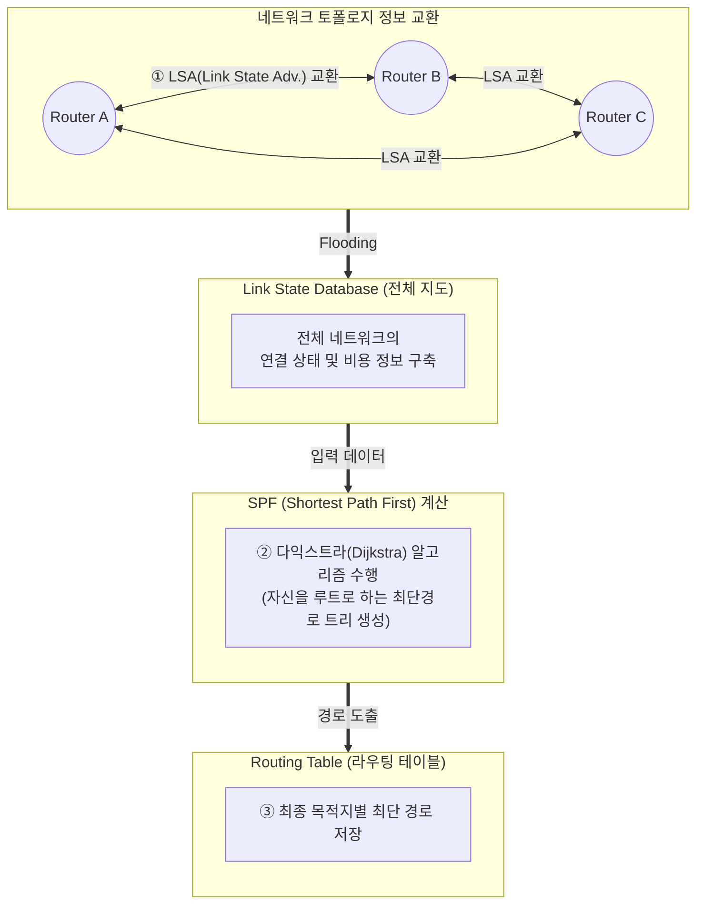

# 링크 상태 라우팅 알고리즘 (Link State Routing Algorithm)

---

## I. 전체 네트워크 토폴로지를 파악하는 동적 라우팅 알고리즘, 링크 상태 알고리즘의 개요

* **정의**: 네트워크 내의 모든 라우터가 링크 상태 정보(LSA)를 상호 교환하여 전체 네트워크의 토폴로지 [[데이터베이스]](LSDB)를 구축한 후, 다익스트라([[다익스트라 알고리즘|Dijkstra]]) 알고리즘을 사용해 최단 경로를 계산하는 동적 라우팅 기법
* **배경 및 필요성**: 거리 벡터(Distance Vector) 라우팅의 느린 수렴(Convergence) 시간, 무한 루핑(Routing Loop/Count-to-Infinity) 문제 극복 및 대규모 네트워크 적용 필요
* **특징**: 변화 발생 시에만 즉각적인 멀티캐스트 전송(Event-driven), 전체 네트워크의 완벽한 맵(Map) 보유, 다익스트라 최단 경로(SPF) 트리를 통한 빠른 경로 계산

---

## II. 링크 상태 알고리즘의 개념도 및 핵심 구성 요소

### 가. 링크 상태 알고리즘의 라우팅 동작 원리 및 개념도

* 라우터들이 주변 링크의 대역폭 등 상태 정보(LSA)를 전체 네트워크에 플러딩(Flooding)하여 동일한 지도(LSDB)를 만들고, 다익스트라 알고리즘으로 루프 없는 최단 경로 트리를 생성함

### 나. 링크 상태 알고리즘의 핵심 기술 요소

| 분류 | 요소기술(키워드) | 세부 설명 |
| --- | --- | --- |
| **정보 단위** | LSA (Link State Advertisement) | 인접한 라우터와의 연결 유무, 인터페이스 비용(대역폭), 상태 등의 정보를 담은 패킷 |
| **정보 전송** | Flooding (플러딩) | 변화가 감지된 LSA를 즉시 네트워크의 모든 라우터로 브로드캐스트/멀티캐스트하는 방식 |
| **저장소** | LSDB (Link State Database) | 수집된 LSA를 기반으로 구성한 네트워크 전체의 상세한 토폴로지 지도 (모든 라우터가 동일하게 보유) |
| **경로 계산** | Dijkstra Algorithm (다익스트라) | LSDB를 바탕으로 특정 노드(자신)에서 다른 모든 노드까지의 최단 경로(SPF Tree)를 산출하는 [[알고리즘]] |
| **상태 감지** | Hello 패킷 | 인접 라우터와의 이웃 관계(Neighbor)를 형성하고 주기적으로 링크의 활성 상태를 확인하는 패킷 |
| **계층적 구조** | Area (영역 분할) | 대규모 네트워크에서 LSDB 크기 및 SPF 계산 부하를 줄이기 위해 네트워크를 논리적 영역(Area)으로 분할 관리 |
| **대표 [[프로토콜]]** | OSPF (Open Shortest Path First) | AS(자율 시스템) 내부에서 사용되는 대표적인 링크 상태 라우팅 프로토콜 (IGP) |
| **대표 프로토콜** | IS-IS (Intermediate System) | OSI 참조 모델을 위해 개발되었으나 IP 환경(통신사 망 등)에서 OSPF와 함께 널리 쓰이는 링크 상태 프로토콜 |

---

## III. 라우팅 알고리즘 비교 및 주요 라우팅 기술 동향

### 가. Link State 알고리즘과 Distance Vector 알고리즘 비교

| 비교 항목 | Link State Algorithm (링크 상태) | [[Distance Vector Algorithm]] (거리 벡터) |
| --- | --- | --- |
| **정보 교환 범위** | **네트워크 내의 모든 [[라우터]] (Flooding)** | **직접 연결된 인접 라우터 (Neighbor)** |
| **교환하는 정보** | **자신의 링크 상태 (대역폭, 지연 등)** | **자신의 전체 라우팅 테이블** |
| **교환 주기** | 변화 발생 시 즉시 (Event-driven) | 주기적 (예: RIP는 30초마다) |
| **네트워크 인식** | 전체 네트워크 구성도(LSDB) 파악 | 목적지와 방향, 거리 정보만 파악 (Topology 모름) |
| **루핑(Looping)** | 거의 발생하지 않음 (SPF Tree 구성) | 루핑 문제 발생 (Count to Infinity) |
| **대표 프로토콜** | **OSPF, IS-IS** | **RIP, IGRP, [[BGP]]** (Path Vector) |

### 나. 라우팅 알고리즘의 최신 적용 동향

* **[[SDN(Software Defined Network)|SDN]] (Software Defined Networking) 통제**: 기존 분산형(Distributed) 방식의 링크 상태 라우팅 한계를 극복하기 위해, SDN 컨트롤러가 전체 네트워크 뷰(View)를 중앙에서 수집하여 경로를 일괄 통제하는 중앙 집중식(Centralized) 라우팅 체계로 전환 중
* **SR (Segment Routing) 도입 확산**: OSPF/IS-IS 프로토콜을 확장하여(SR-OSPF/SR-ISIS), 출발지 노드가 패킷 헤더에 경로 목록(Segment)을 삽입하는 방식(Source Routing)을 통해 네트워크 코어 라우터의 상태 유지 부하를 대폭 줄이는 차세대 트래픽 엔지니어링 기술이 확산되고 있음

---

### 🔗 연관 토픽

- **소속 도메인**: [[00_네트워크_MOC|🌐 네트워크]]
- **세부 분류**: `2. 네트워크 계층 & 라우팅 프로토콜 (L3)`
- **핵심 연관 토픽**:
  - [[SDN(Software Defined Network)]]
  - [[Distance Vector Algorithm]]
  - [[라우터]]
  - [[BGP|BGP(Border Gateway Protocol)]]
  - [[다익스트라 알고리즘|다익스트라 (Dijkstra) 알고리즘]]
