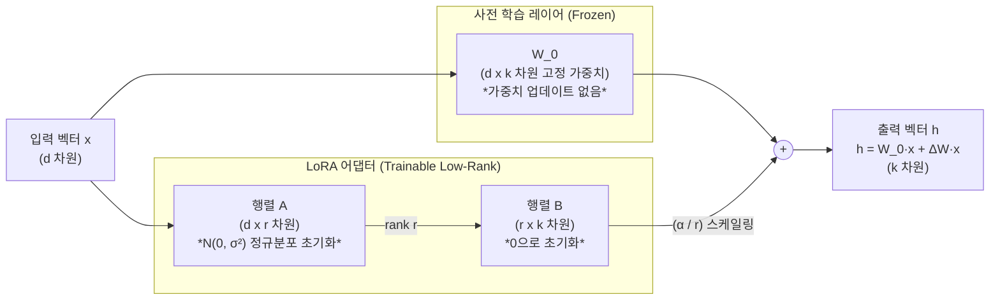

# LoRA (Low-Rank Adaptation)

---

## I. 파라미터 효율적 미세조정(PEFT)의 핵심, LoRA의 개요

* **정의**: 거대 언어 모델([[초거대 언어 모델|LLM]])의 사전 학습된 가중치(Pre-trained Weights)는 고정(Freeze)한 채, 다운스트림 태스크를 위한 가중치 변화량($\Delta W$)을 두 개의 저차원 행렬(Low-Rank Matrices)로 분해하여 학습시키는 매개변수 효율적 파인튜닝([[PEFT]]) 기술
* **등장 배경 및 필요성**:
* **Full [[Fine-Tuning]]의 한계**: 수백억~수천억 파라미터 모델 전체를 재학습할 경우 막대한 [[GPU]] VRAM, 연산 비용 및 태스크별 중복 저장 공간 문제 발생
* **본질적 차원(Intrinsic Dimension) 가설**: 모델 파라미터가 매우 크더라도 실제 특정 하위 태스크 학습에 필요한 변화량은 저차원 공간(Low-rank subspace)에 존재한다는 원리 활용

* **특징**: 기존 사전 학습 가중치 불변 유지, 추론 지연 시간(Inference Latency) 제로(Zero 추가 레이턴시), 학습 파라미터 99% 이상 절감 및 어댑터 교체의 경량성

---

## II. LoRA의 아키텍처 및 핵심 기술 요소

### 가. LoRA의 구조 및 순전파(Forward Pass) 메커니즘

* 원본 가중치 $W_0 \in \mathbb{R}^{d \times k}$는 동결하고, 가중치 변화량 $\Delta W = B \cdot A$ ($A \in \mathbb{R}^{d \times r}$, $B \in \mathbb{R}^{r \times k}$, $r \ll \min(d, k)$)만을 학습함.
* 초기 학습 시점에는 $B=0$으로 설정되어 $\Delta W = 0$이므로, 원본 사전 학습 모델의 출력과 완전히 동일한 상태에서 안정적으로 학습을 시작함.

### 나. LoRA의 핵심 기술 요소

| 분류 | 요소기술(키워드) | 세부 설명 |
| --- | --- | --- |
| **수학적 모델링** | 저순위 행렬 분해 (Low-Rank) | 고차원 변화량 $\Delta W(d \times k)$를 랭크 $r$ 크기의 두 행렬 곱($B \times A$)으로 분해하여 학습 대상 파라미터 수 최소화 |
| **파라미터 초기화** | 초기화 기법 ($B=0, A=\mathcal{N}$) | 행렬 $A$는 가우시안 [[정규분포]], 행렬 $B$는 0으로 초기화하여 훈련 시작 시 $\Delta W = 0$ 보장 |
| **하이퍼파라미터** | Rank ($r$) | 축소 차원의 크기 (보통 $r=4, 8, 16, 64$ 설정; 작을수록 연산 효율 증가, 충분한 표현력 유지) |
| **하이퍼파라미터** | Alpha 스케일링 ($\alpha$) | 어댑터 출력에 적용되는 가중 상수 ($\frac{\alpha}{r} \Delta W$). $r$ 변경 시 학습률(Learning Rate) 재조정 부담 완화 |
| **추론 최적화** | 가중치 병합 (Weight Merge) | 배포 시 $W_{final} = W_0 + \frac{\alpha}{r}(BA)$로 사전 합산(Merge)하여 서비스 시 추가 연산 및 레이턴시 오버헤드 원천 제거 |
| **배포 유연성** | 어댑터 스위칭 (Adapter Swapping) | 동일한 기반 모델($W_0$) 위에 태스크별로 수십 MB 수준의 LoRA 어댑터 가중치만 교체 탑재하여 다중 도메인 서빙 지원 |
| **적용 계층** | 어텐션 가중치 적용 ($W_q, W_v$) | 일반적으로 Transformer Self-Attention의 Query, Value 투영 행렬에 우선 적용하여 적은 비용으로 최대 효율 달성 |
| **메모리 최적화** | [[옵티마이저]] 메모리 절감 | [[역전파]] 시 $W_0$의 그래디언트 및 옵티마이저 상태(Adam의 $m, v$)를 저장하지 않아 VRAM 사용량 대폭 감소 |

---

## III. 미세조정 방식 비교 및 파생 발전 기술

### 가. LLM 튜닝 방식 비교 (Full Fine-Tuning vs Prefix Tuning vs LoRA)

| 비교 항목 | Full Fine-Tuning (전체 파인튜닝) | Prefix / Prompt Tuning | LoRA (Low-Rank Adaptation) |
| --- | --- | --- | --- |
| **학습 파라미터** | 모델 전체 (100%) | 가상 토큰 임베딩 (0.1% 미만) | 저순위 분해 행렬 (0.1% ~ 1%) |
| **추론 추가 지연** | 없음 | **있음** (시퀀스 길이 점유로 입력 토큰 감소) | **없음 (가중치 사전 병합 가능)** |
| **GPU VRAM 소모** | 매우 높음 (수백 GB 이상 요구) | 낮음 | 매우 낮음 (단일 컨슈머 GPU 구동 가능) |
| **태스크별 저장량** | 모델 크기 전체 (수십~수백 GB) | 매우 작음 (수 KB~MB) | 작음 (수십 MB 수준) |
| **성능 (정확도)** | 기준선 (최고 성능) | 태스크 난이도에 따라 성능 저하 발생 | **Full Fine-Tuning과 동등한 수준 달성** |

### 나. LoRA의 파생 및 최신 발전 동향

* **QLoRA (Quantized LoRA)**: 기본 모델을 4-bit NormalFloat(NF4)로 양자화(Quantization)하고 이중 양자화 및 페이징 메모리 기법을 결합하여, 단일 24GB VRAM GPU(RTX 3090/4090 등)에서 65B~70B 규모 LLM의 미세조정을 가능하게 한 기술
* **DoRA (Weight-Decomposed Low-Rank Adaptation)**: 가중치를 크기(Magnitude)와 방향(Direction)으로 분해하여 방향 성분에만 LoRA를 적용함으로써 Full Fine-Tuning의 학습 동역학에 더욱 근접시킨 진화형 모델
* **MoA / Multi-LoRA 서빙 최적화**: vLLM, S-LoRA 등의 최신 서빙 프레임워크와 결합하여 단일 GPU 인스턴스에서 하나의 베이스 모델로 수십~수백 개의 서로 다른 사용자 맞춤형 LoRA 어댑터를 동적 배치(Batching) 처리하는 인프라 구조로 정착 중

---

### 🔗 연관 토픽

- **소속 도메인**: [[00_인공지능_MOC|🤖 인공지능]]
- **세부 분류**: `1. 수학 · 통계학 & 데이터 전처리`
- **핵심 연관 토픽**:
  - [[Fine-Tuning]]
  - [[초거대 언어 모델|초거대 언어 모델(Large Language Model)]]
  - [[PEFT|PEFT(Parameter-Efficient Fine-Tuning)]]
  - [[SVD(Singular Value Decomposition)]]
  - [[정규분포|정규분포(Normal Distribution)]]
